This page is the mathematical model of the case: objective, specifications, geometry, derivation, conditions, domain and explorer. The idea is told on the entry page, and the case is read through, with its numbers, on the technical page.

Writing rules: every geometric quantity and every force is shown in a figure before it enters a formula; stiffnesses, material constants and limits are defined in the quantities table. Equations are cited as eq. (N); a bare number always denotes an element of the patent, written with its name ("arm pivot 16"). A number used before its derivation says where it is derived.

## 1. Objective

The clamp belongs to a fixture for machining. Its task is to keep the workpiece in the position given by the fixture supports against the cutting forces. It presses the piece onto the supports: the friction produced by that force resists the component of the cutting force along the supports, and the force itself holds down the component that tends to lift the piece. It must do so for every workpiece within the thickness tolerance, without re-adjustment of the clamp. The reference case is the first machining operation on hot-rolled plate to EN 10029, nominal thickness 8–15 mm, whose thickness tolerance spans $T = 1.4$ mm in every class (for example class A −0.5/+0.9 mm, class C 0/+1.4 mm).

## 2. Specifications

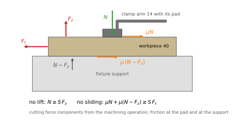

*Figure 1. The workpiece 40 between the clamping pad and the fixture support. The cutting force has a component $F_t$ along the support and a component $F_z$ that lifts the piece; the clamp presses with $N$; friction acts under the pad ($\mu N$) and on the support ($\mu(N-F_z)$). Below the drawing, the two conditions S1 must meet: the piece does not lift and does not slide, with a safety factor $S$ on the cutting force ($S = 2$, assumed).*

**S1 — The thinnest piece does not move.** The cutting force has a component $F_t$ parallel to the support, which the clamp must resist by friction, and a component $F_z$ that tends to lift the piece, which the clamp must hold down. Both require a minimum clamping force $N_{min}$; the thinnest piece is the critical one, because it imposes the smallest shortening on the link.

**S2 — The thickest piece is not marked.** The clamping force on the thickest piece must stay below a value $N_{max}$ set by the admissible contact pressure under the clamping pad. S1 and S2 together are the force band.

**S3 — The cylinder closes and locks the clamp on every piece.** If the cylinder force is insufficient, the yoke stops before the dead centre: the piece is held while the cylinder is pressurized, but the clamp is not locked and opens when the cylinder is unpressurized. The thickest piece is the critical one.

**S4 — The cylinder opens the clamp.** Past the dead centre the spring link pushes the yoke against its stop. To open, the cylinder must pull the yoke back to the dead centre against the component of the link force along the tracks and against the friction on the tracks, with the smaller force available on the rod side: at the same pressure the rod takes part of the piston area, and $P_{ret} = (1 - d^2/D^2)\,P_{ext}$ = 0.84 $P_{ext}$. The pull required to open is of the same order as the thrust required to close, both proportional to the force in the link, so a pressure sufficient to close may not be sufficient to open: in the default case closing needs at least 3.9 bar and opening 4.1 bar; with the rigid link, 15.1 and 17.6 bar. Both are proportional to the force in the link: with a rigid link and a thick piece the pull required can exceed the cylinder force, and the clamp stays jammed closed. The spring link lowers the force needed to shorten the link by the amount the workpiece imposes, and with it the pull; this is the sense in which the patent says that the spring link permits unlocking. Once back past the dead centre, the link pushes the yoke and assists the opening. The thickest piece is the critical one.

**S5 — The spring link returns to its shape at every cycle.** The deflection of the spring link must stay within its elastic range; otherwise it takes a permanent set, its free length changes and the clamp loses its setting. The thickest piece is the critical one, at the dead centre.

A sixth requirement is a design check, not a specification of use: **D1 — the pins and the frame carry the peak link force**, reached at the dead centre on the thickest piece.

## 3. Elements and patent references

Element names are fixed here and used unchanged in the documents, figures and explorer. References are those of figures 2 and 3 of US 5,676,357 (patent figure 4 for the wire variant); they allow the reader to follow the mechanism on the patent drawings.

*Figure 2. US 5,676,357, figure 2 (Aladdin Engineering & Manufacturing, 1995): side elevation of the clamp, partly cut away, closed on the workpiece 40. The dashed outline of the clamp arm 14 is its retracted position. The label 16 is not printed on the original drawing and has been added here.*

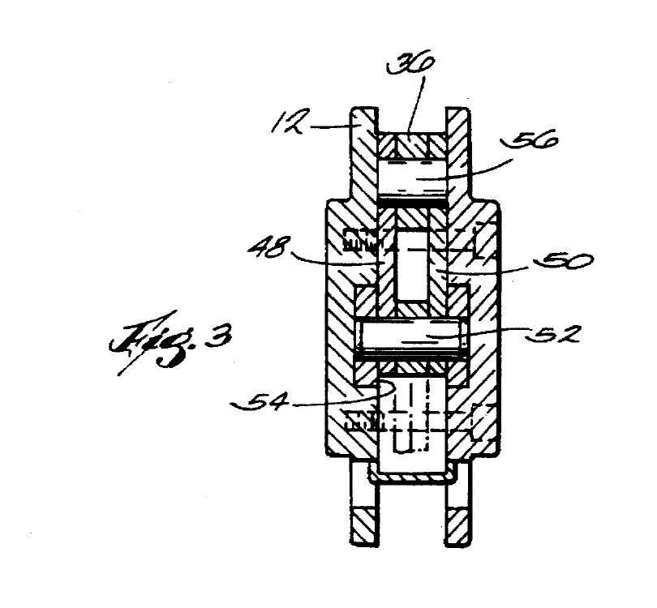

*Figure 3. US 5,676,357, patent figure 3: cross-section along the line 3-3 of patent figure 2. The two links 48 and 50 of the spring link lie side by side, one on each side of the rear lever 36, on the arm pin 56 and on the yoke pin 52; frame 12.*

| Element     | Patent reference                        | Note                                                  |
| ----------- | --------------------------------------- | ----------------------------------------------------- |
| frame       | 12                                      |                                                       |
| clamp arm   | 14                                      |                                                       |
| arm pivot   | 16                                      | pin fixed in the frame                                |
| rear lever  | 36                                      | rear end of the clamp arm 14                          |
| spring link | 48, 50 (assembly 42); spring portion 62 | two links in parallel (patent figure 3); patent figure 4: wire spring 70, spring portion 72 |
| yoke pin    | 52                                      | joins the spring link to the yoke                     |
| arm pin     | 56                                      | joins the spring link to the rear lever               |
| yoke        | 30                                      | guided by the tracks 32, 34                           |
| cylinder    | 20                                      | piston 22, assembly 18                                |
| workpiece   | 40                                      |                                                       |
| yoke stop   | none                                    | assumed by the model; the patent does not identify it |

The thin strip without reference number in patent figures 2 and 4, wrapped round two pins on the workpiece side and running along the bottom of the frame, is treated as a cosmetic part and is not in the model.

For comparison the model also uses the **rigid link**: the link of a conventional toggle clamp, which does not deform. It does not appear in the patent figures; in the model it is the case $k = k_c$ (§7.5).

## 4. The closing stroke

The cylinder 20 pushes the piston 22 and the yoke 30 along the tracks 32, 34; in figure 2 the yoke advances to the left, toward the clamp arm. Until the clamp arm 14 touches the workpiece 40, the spring link carries almost no load: it transmits only the force needed to rotate the arm about the arm pivot 16, and the linkage moves as a rigid mechanism. When the arm rests on the workpiece, the arm stops and the arm pin 56 stops with it. The yoke keeps moving, and the yoke pin 52 travels along a straight line past the arm pin. The spring link turns about the arm pin: the distance between the two pins first decreases, reaches its minimum when the link is perpendicular to the tracks (the dead centre), and then increases again. Over this stretch the spring link is forced to be shorter than its free length: its spring portion 62 bends, and the force it develops presses the arm on the workpiece and resists, then assists, the motion of the yoke. The yoke stops against the yoke stop a short distance past the dead centre; there the link is still shortened, and its force holds the workpiece with the cylinder unpressurized.

## 5. From the mechanism to the model

The model keeps what decides the six conditions and leaves out the rest. Every exclusion is listed here, with the condition it would act on, an estimate of its weight for the values of the table (§6.2) and its direction: *optimistic* when leaving it out makes the clamp look better than it is, *neutral* when it moves the results by a few percent either way.

| element | acts on | estimated weight | direction | in the model |
|---|---|---|---|---|
| bending of the spring link | everything | it is the mechanism | — | yes, §7.4 |
| curvature and axial force at the crown | C5 | +13 % on the stress ($K$ = 1.13) | — | yes, eq. (7) |
| axial and shear deformation of the spring link | $k_s$ | 0.5 % and 1.6 % of the deflection | neutral | no |
| large deflection of the spring link | $k_s$ | deflection/radius = 5 % at the default | neutral | no |
| rest of the force loop: pins, clamp arm 14, rear lever 36, contact, frame | $k$ | arm and lever ≈ 400 kN/mm on the pin line, 1 % on $k$ | neutral | lumped in $k_c$, §7.5 |
| rotation of the clamp arm after contact | geometry | inside the compliance of the loop | neutral | in $k_c$ |
| displacement of the arm pin 56 along the tracks with the thickness | origin of $x$ | 0.003 mm against $x_s$ = 2 mm | neutral | no |
| friction on the tracks 32, 34 | C3, C4 | $\mu_g$ = 0.10, dominant near the dead centre | — | yes, §7.6 |
| **friction in the pins 52, 56** | C3, C4 | thrust +12 %, pull +16 % | optimistic | no; switch in the explorer |
| friction at the arm pivot 16 | — | the arm does not turn after contact | neutral | no |
| friction of the piston seals | C3, C4 | at 5 % of the cylinder force, 1119 N and 940 N available | optimistic | no |
| tilting of the yoke, uneven sharing between the tracks 32 and 34 | C3, C4 | not estimated: needs the guide length of the yoke, not in the patent | optimistic | no |
| weight of the yoke | C3, C4 | a few newtons against kilonewtons | neutral | no |
| dynamics of the cut, vibrations | holding | outside a quasi-static model | — | no |
| thin strip without reference number | — | cosmetic (§3) | — | no |

The arm and lever estimate assumes steel sections of 25 × 35 mm for the clamp arm 14 and 15 × 35 mm for the rear lever 36, treated as cantilevers from the arm pivot 16; the clamp arm enters divided by $\lambda^2$, as every part beyond the lever (§7.5).

**Friction in the pins.** It is the only exclusion that moves a boundary of the domain appreciably. With friction in the pins 52 and 56 the force of the link no longer passes through the pin centres but is tangent to the friction circles of radius $\mu_p r_p$; its line turns by $\beta = 2\mu_p r_p/L$, which adds to the friction angle of the tracks in eq. (10): $\rho \to \rho + \beta$ in both directions. With $\mu_p$ = 0.10 and pins of radius $r_p$ = 5 mm, both assumed, $\beta$ = 1.40°. On the thickest piece the peak thrust to close rises from 762 N to 854 N (+12 %) and the pull to open from 673 N to 782 N (+16 %): the default case still holds, but the stiff boundary C4 comes down — at $k_s$ = 10 kN/mm the admissible tolerance falls from 1.65 mm to 1.27 mm, and for the EN 10029 plate the spring link works up to about 8.9 kN/mm instead of 12.4. Friction in the pins also helps the lock at the stop. The reference model leaves it out because the patent gives neither the pin size nor the materials; the explorer has a switch to show its effect.

## 6. Geometry

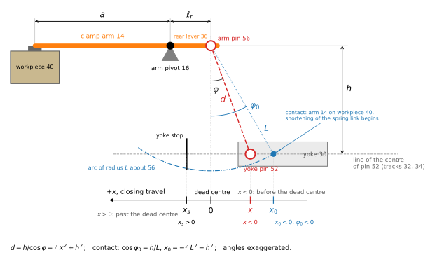

*Figure 4. Geometry of the linkage with the clamp arm 14 resting on the workpiece 40, drawn before the dead centre. The spring link is drawn as the dashed chord $d$ between the centres of the arm pin 56 and the yoke pin 52, at the angle $\varphi$ to the normal to the line of pin 52. $h$ is the height of the centre of 56 above that line; $\ell_r$ is the rear lever 36, from the arm pivot 16 to 56; $a$ runs from 16 to the clamping point. The arc of radius $L$, the free length of the spring link, about 56 cuts the line of pin 52 at the contact position $x_0$, $\varphi_0$: the arm touches the workpiece and the shortening begins; between $x_0$ and $-x_0$, $d < L$. The axis $x$ has its origin at the dead centre and is positive in the direction of closing travel, to the left: here $x<0$ and $\varphi<0$, and the yoke stop is at $x_s>0$. Angles exaggerated.*

The tracks guide the centre of the yoke pin 52 along a straight line, parallel to the piston axis but not necessarily on it. The position of the spring link is described by its angle $\varphi$ to the normal to that line: $\varphi = 0$ at the dead centre, negative before it, positive past it, in the direction of travel of the yoke when closing. The yoke position $x$ is measured along the line from the foot of the perpendicular from the centre of the arm pin 56, positive in the direction of closing travel; the yoke stop is at $x = x_s > 0$, angle $\varphi_s$.

$h$ is the distance, perpendicular to the tracks, between the line of the centre of the yoke pin 52 and the centre of the arm pin 56, with the clamp arm resting on the workpiece; at the dead centre it is the distance between the pin centres. It depends on the workpiece thickness (§6.1): $h_0$ is its value on the thickest piece. The free length $L$ of the spring link between the centres of the pins is fixed by the setting of the clamp (§8.1) and does not change with the workpiece.

The rear lever 36, of length $\ell_r$ between the centres of the arm pivot 16 and the arm pin 56, is assumed parallel to the tracks at the dead centre on the thickest piece, that is perpendicular to the spring link. Under this assumption the centres of 16 and 56 are at the same height above the tracks; 16 is fixed in the frame, while 56 moves with the workpiece thickness.

### 6.1 From thickness to height

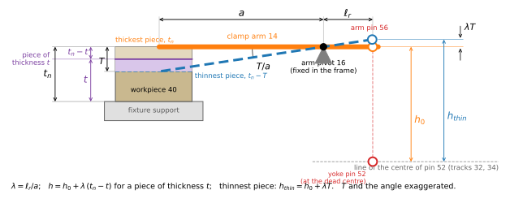

*Figure 5. The fixture support and the workpiece 40, with the top surface of the thickest piece ($t_n$) and of the thinnest ($t_n-T$); the tolerance band $T$ is exaggerated. The clamp arm 14 turns about the arm pivot 16: solid on the thickest piece, parallel to the tracks; dashed on the thinnest, turned by $T/a$. The pad goes down by $T$, the arm pin 56 rises by $\lambda T$, and its height above the line of the yoke pin 52 goes from $h_0$ to $h_{thin}$. A piece of thickness $t$ within the tolerance (purple) lets the pad go down by $t_n - t$ and raises the arm pin 56 by $\lambda(t_n - t)$, eq. (1); the thinnest piece is the case $t = t_n - T$.*

A piece of thickness $t$, thinner than the thickest $t_n$, lets the clamp arm turn further, by the angle $(t_n - t)/a$ about the arm pivot 16. The arm pin 56, at distance $\ell_r$ from 16 on a lever parallel to the tracks, moves away from the tracks by $\ell_r (t_n - t)/a$. With the lever ratio $\lambda = \ell_r/a$:

$$h = h_0 + \lambda\,(t_n - t),\qquad h_{thin} = h_0 + \lambda T \tag{1}$$

The thickest piece has the smallest height, $h_0$; the thinnest the largest, $h_{thin}$. Its displacement along the tracks is of second order in the angle and is neglected, so the origin of $x$ does not move. The thickness tolerance is taken as a field of width $T$ with the thickest piece as nominal ($t_n$).

### 6.2 Quantities

The patent declares no numerical values; all values are assumed for the model, except the tolerance width, which is taken from EN 10029.

| Symbol               | Meaning                                                                    | Value                   | Source             |
| -------------------- | -------------------------------------------------------------------------- | ----------------------- | ------------------ |
| $h_0$                | height of the centre of 56 above the line of the centre of 52, thickest piece; pin distance at the dead centre | 40 mm | assumed |
| $h$                  | the same height for a piece of thickness $t$                               | eq. (1)                 | derived            |
| $L$                  | free length of the spring link between pin centres, set by eq. (17)        | 41.06 mm                | setting, §8.1      |
| $e$, $e_0$           | largest shortening of the spring link, at the dead centre, $L-h$; depends on the piece; $e_0 = L - h_0$ on the thickest piece | eq. (3); $e_0$ = 1.06 mm | derived |
| $x_0$, $\varphi_0$   | contact position: the arm touches the workpiece, the shortening begins (thickest piece) | −9.3 mm, 13.1° | derived |
| $\ell_r$             | rear lever 36, centre of 16 to centre of 56                                | 30 mm                   | assumed            |
| $a$                  | arm pivot 16 to the clamping point on the workpiece                        | 100 mm                  | assumed            |
| $\lambda$            | lever ratio $\ell_r/a$                                                     | 0.3                     | derived            |
| $x_s$, $\varphi_s$   | yoke stop past the dead centre                                             | 2 mm, 2.86°             | assumed / derived  |
| $R$, $t_s$, $b$      | spring link: radius of the semi-ring centreline, thickness, total width of the two links 48 and 50 | 20 mm, 5 mm, from $k_s$ | assumed |
| $E$, $\sigma_{adm}$  | spring steel: elastic modulus, admissible stress                           | 206 GPa, 900 MPa        | assumed            |
| $K$                  | stress factor at the crown: curvature and axial force                      | 1.13                    | eq. (7)            |
| $k_s$                | stiffness of the spring link along the pin line                            | 5 kN/mm ($b$ = 29.3 mm) | explorer           |
| $\delta_{el}$        | elastic limit of the spring link deflection                                | 0.97 mm                 | eq. (6)            |
| $k_c$                | stiffness of the rest of the force loop, on the pin line                   | 40 kN/mm                | assumed            |
| $k$                  | series stiffness                                                           | 4.44 kN/mm              | eq. (8)            |
| $\mu_g$, $\rho$      | friction coefficient and friction angle on the tracks 32, 34               | 0.10, 5.71°             | assumed            |
| $T$                  | width of the thickness tolerance                                           | 1.4 mm                  | EN 10029, explorer |
| $F_t$, $F_z$         | cutting force: component parallel to the support / lifting component       | 150 N / 75 N            | assumed, explorer  |
| $\mu$, $S$           | friction at support and pad; safety factor                                 | 0.20; 2                 | assumed            |
| $N_{min}$            | minimum clamping force                                                     | 787.5 N                 | eq. (15)           |
| $N_{max}$            | maximum clamping force (admissible pad pressure)                           | 2000 N                  | assumed            |
| $P_{ext}$, $P_{ret}$ | cylinder force extending / retracting (bore 50 mm, rod 20 mm, 6 bar)       | 1178 N / 990 N          | assumed            |
| $F_{all}$            | allowable load on pins and frame                                           | 15 kN                   | assumed            |

Values marked "default" in the text are those of the table: $k_s$ = 5 kN/mm, $T$ = 1.4 mm.

## 7. Derivation

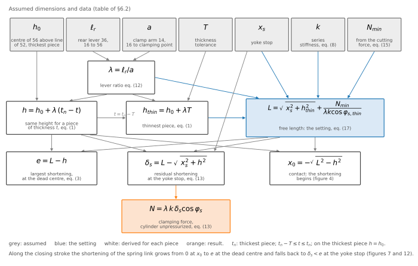

*Figure 6. Map of the relations among the dimensions. Grey: assumed quantities of the table; white: quantities derived for each piece; blue: the setting $L$; orange: the result, the clamping force $N$. Each arrow is a dependence, with the equation that carries it.*

The map shows the two chains of the model. From the piece to the height: $\ell_r$ and $a$ give $\lambda$; with $h_0$ they give the height $h$ for every thickness, eq. (1). From the height to the shortenings: $L$ is set once, on the thinnest piece, eq. (17), and the shortenings of the spring link come from the comparison of $L$ with $h$. The sections below follow these chains.

### 7.1 Angle and pin distance

In figure 4, with the arm on the workpiece the centre of the arm pin 56 is at height $h$ above the line of the yoke pin 52, and the spring link makes the angle $\varphi$ with the normal to that line. The yoke position and the distance between the pin centres are

$$x = h\tan\varphi,\qquad d = \frac{h}{\cos\varphi} = \sqrt{x^2+h^2} \tag{2}$$

$d$ is minimum, $d = h$, at the dead centre.

### 7.2 Shortening of the spring link

The spring link has free length $L$. Wherever $d < L$ it is forced to be shorter, by

$$\delta = \max\!\left(0,\; L-\frac{h}{\cos\varphi}\right),\qquad e = L-h \tag{3}$$

Loading begins at contact, where $d = L$, that is at $\cos\varphi_0 = h/L$, $x_0 = -\sqrt{L^2-h^2}$; the shortening grows to its largest value $e$ at the dead centre and decreases past it. On the thickest piece with the default values, $L$ = 41.06 mm (from the setting, eq. (17), §8.1), $e_0$ = 1.06 mm, and contact occurs at $\varphi_0$ = 13.1° ($x_0$ = −9.3 mm). On the thinnest piece the same $L$ leaves $e$ = 0.64 mm. Valid while the clamp arm does not rotate after contact; its small rotation due to the compliance of arm and workpiece is included in $k_c$.

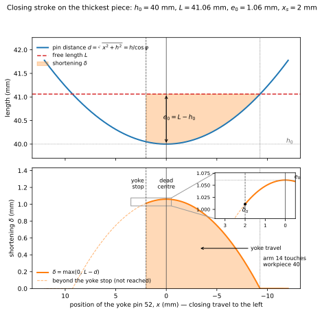

*Figure 7. Top: distance between the pin centres $d$ and free length $L$ along the yoke stroke; the shaded area is the shortening. Bottom: the shortening $\delta$, from contact to the yoke stop; past the stop the curve is not reached. Inset: residual shortening $\delta_s$ at the stop. Thickest piece, default values; the axis of the graph is $x$, positive in the direction of closing travel, to the left as in figure 4.*

### 7.3 Direction of the link force

The pins are taken without friction and no load acts on the spring link between them, so the spring link is a two-force member: the forces at its two ends are equal, opposite and directed along the line through the pin centres, whatever its curved shape. Their magnitude is $F$ (figure 8). The link is compressed: the pins 52 and 56 push its ends toward each other, and the link pushes the two pins apart, with the same force $F$.

### 7.4 Stiffness of the spring link

The spring link is made of the two links 48 and 50, side by side on the pins (patent figure 3, figure 3 here); they are equal and work in parallel, so their stiffnesses add, and the model treats them as one link of total width $b$. The spring portion 62 is reduced to a curved beam of rectangular section, width $b$ (perpendicular to the drawing) and thickness $t_s$ (in the plane of the drawing), so that $I = b\,t_s^3/12$. Its centreline runs at mid-thickness from one pin to the other. Since $F$ acts along the chord between the pins, the bending moment at a section of the centreline at distance $y$ from the chord is $M = F\,y$: zero at the pins, which transmit no moment, largest at the section farthest from the chord, the **crown**.

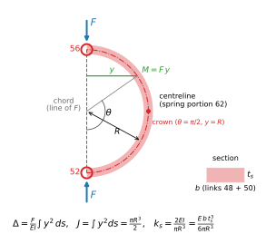

*Figure 8. The spring portion 62 as a semi-ring of radius $R$; the arrows are the forces $F$ of the pins on the spring link, along the chord; bending moment $M = F\,y$ at the section at angle $\theta$ from the chord; crown at $\theta = \pi/2$; section $b \times t_s$, with $b$ the total width of the links 48 and 50.*

**Energy of bending.** Take an element of the centreline of length $ds$ under the moment $M$. Its curvature is $\kappa = M/(EI)$, so its two faces turn relative to each other by

$$d\vartheta = \kappa\,ds = \frac{M}{EI}\,ds$$

The element behaves as a torsional spring of stiffness $EI/ds$. During loading the moment grows linearly from zero to $M$ together with the rotation, as in any elastic spring, and the work stored is half the final product — the same $\tfrac12 F\delta = F^2/(2k)$ of a spring:

$$dU = \tfrac12\,M\,d\vartheta = \frac{M^2}{2EI}\,ds$$

**Castigliano's theorem.** For a linear elastic body, the displacement of the point of application of a load $P$, measured in the direction of the load, is the derivative of the strain energy with respect to that load:

$$\delta_P = \frac{\partial U}{\partial P}$$

**Application to the spring link.** The load is the pair of opposite forces $F$ that the pins 52 and 56 apply at the two ends, along the chord (figure 8). If the two ends move toward each other by $u_1$ and $u_2$ along the chord, the pair does the work $F u_1 + F u_2 = F\,\Delta$, where $\Delta = u_1 + u_2$ is the relative approach of the pins. $\Delta$ is therefore the displacement that corresponds to the pair — the deflection of the spring link — and the theorem gives

$$\Delta = \frac{\partial U}{\partial F}$$

**Step 1 — the total energy.** Each element $ds$ stores $dU$; the energy of the whole spring link is the sum along the centreline:

$$U = \int dU = \int \frac{M^2}{2EI}\,ds$$

$U$ is a single number for the whole link, and it depends on $F$ through $M = F\,y$.

**Step 2 — derivative of the total energy, element by element.** The theorem asks for the derivative of $U$ with respect to $F$. Divided into elements, $U$ is a sum, and the derivative of a sum is the sum of the derivatives; the derivative acts on $F$, the integral on the position along the link, so the two can be exchanged as long as the limits — the two ends of the centreline — do not depend on $F$:

$$\Delta = \frac{\partial U}{\partial F} = \int \frac{\partial (dU)}{\partial F} = \int d\Delta$$

$d\Delta$ is the contribution of the element $ds$ to the approach of the pins; $\Delta$ is the sum of these contributions over the whole link.

**Step 3 — chain rule.** $E$ and $I$ do not depend on $F$; only $M$ does:

$$d\Delta = \frac{\partial}{\partial F}\!\left(\frac{M^2}{2EI}\right) ds = \frac{2M}{2EI}\,\frac{\partial M}{\partial F}\,ds = \frac{M}{EI}\,\frac{\partial M}{\partial F}\,ds$$

**Step 4 — the moment in the spring link.** At the section at distance $y$ from the chord, $M = F\,y$, so $\partial M/\partial F = y$ and $M\,\partial M/\partial F = F\,y\cdot y = F\,y^2$:

$$d\Delta = \frac{F\,y^2}{EI}\,ds$$

**Geometric check.** The same contribution follows from the geometry alone. Suppose only the element $ds$ deforms and the rest of the link is rigid. The element turns by $d\vartheta = M\,ds/(EI)$ and carries the part of the link beyond it, with its pin, in a rigid rotation. The pin moves perpendicular to the line that joins it to the element, and the component of that movement along the chord is $y\,d\vartheta$, where $y$ is the distance of the element from the chord. Hence

$$d\Delta = y\,d\vartheta = y\,\frac{M}{EI}\,ds = \frac{F\,y^2}{EI}\,ds$$

the same term. One $y$ comes from the moment ($M = F\,y$), the other from the lever arm that turns the rotation of the element into approach of the pins. The elements near the crown, at $y \approx R$, contribute most; those near the pins, at $y \approx 0$, almost nothing.

**Step 5 — the sum.** $F$ does not vary along the link, and $E$ and $I$ are constant along it, so they come out of the integral:

$$\Delta = \int d\Delta = \frac{F}{EI}\int y^2\,ds = \frac{F\,J}{EI},\qquad J = \int y^2\,ds$$

$J$ depends only on the shape of the centreline.

**Step 6 — stiffness.** $\Delta$ is proportional to $F$, so the spring link behaves as a linear spring of stiffness

$$k_s = \frac{F}{\Delta} = \frac{EI}{J} \tag{4}$$

**Reading.** $\partial M/\partial F = y$ is the moment produced by a unit pair of forces at the pins. The result is the unit-load (virtual work) formula, $\Delta = \int M\,m/(EI)\,ds$ with $m = 1\cdot y$: the geometric check above is the same formula read element by element.

The hypotheses, with their weight for the values of the table (see also §5): linear elastic material and small displacements, so that $y$ is taken on the unloaded shape; axial deformation neglected, worth $I/(AR^2) = t_s^2/(12R^2)$, about 0.5 % of the bending deflection; shear deformation neglected, about 1.6 %; the curved beam treated as slender, at $R/t_s = 4$ on the edge of validity, a correction of a few percent; the two links equal and in parallel.

**Semi-ring.** The C of figure 2 is idealized as a semi-ring of radius $R$ whose diameter is the chord between the pins ($2R \approx h$). The angle $\theta$ is measured from the chord, with centre at the midpoint of the chord, so that $y = R\sin\theta$ runs from 0 at the pins to $R$ at the crown, and $ds = R\,d\theta$ with $\theta$ from 0 to $\pi$:

$$J = \int_0^\pi R^2\sin^2\theta\,R\,d\theta = \frac{\pi R^3}{2},\qquad k_s = \frac{2EI}{\pi R^3} = \frac{E\,b\,t_s^3}{6\pi R^3} \tag{5}$$

**Elastic limit.** The largest bending moment is at the crown, $M = F R$. At the crown the tangent to the centreline is parallel to the chord, so the section is perpendicular to it and $F$ is entirely a normal force there (at a section at angle $\theta$, the normal force is $F\sin\theta$ and the shear force $F\cos\theta$). With the section modulus $W = I/(t_s/2)$ the bending stress of a straight beam is $\sigma = M/W = F R\,t_s/(2I)$. Two effects raise the stress at the inner fibre of the crown: the curvature of the beam ($R/t_s = 4$; Winkler's curved-beam stress is higher by a factor 1.09) and the axial force $F/A$, compressive on the same fibre, because pushing the ends together closes the C (a further 0.04). Together they form the factor $K$, and $\sigma = K\,F R\,t_s/(2I)$. Setting $\sigma = \sigma_{adm}$ and $F = k_s\,\delta_{el}$ with eq. (5), $I$ cancels:

$$\delta_{el}\,\frac{2EI}{\pi R^3} = \frac{2I\,\sigma_{adm}}{K\,R\,t_s}\quad\Rightarrow\quad\delta_{el} = \frac{\pi\,\sigma_{adm}\,R^2}{K\,E\,t_s} \tag{6}$$

$$K = \frac{c_i\,t_s}{6\,e_c\,r_i} + \frac{t_s}{6R},\qquad r_i = R - \frac{t_s}{2},\quad r_n = \frac{t_s}{\ln\!\big((R + t_s/2)/r_i\big)},\quad e_c = R - r_n,\quad c_i = r_n - r_i \tag{7}$$

$r_n$ is the radius of the neutral axis of the curved beam, $e_c$ its shift from the centreline and $c_i$ its distance from the inner fibre. With the values of the table $K$ = 1.13 and $\delta_{el}$ = 0.97 mm; without the factor ($K = 1$) eq. (6) would give 1.10 mm. $k_s$ is proportional to the width $b$, while $\delta_{el}$ does not depend on it: changing $k_s$ at constant $R$ and $t_s$ means changing the width of the spring link, at constant elastic limit. The default $k_s$ = 5 kN/mm corresponds to $b$ = 29.3 mm, about 14.6 mm for each of the links 48 and 50. The semi-ring makes the whole centreline work in bending; an idealization as two straight legs with a rigid back neglects the back, which carries the largest moment over its whole length, and overestimates the stiffness.

**Why a curved link.** A straight bar loaded along its axis stretches or shortens, within its elastic range, by at most $\sigma_{adm} L/E$: with the values of the table and $L$ = 41.06 mm, 0.18 mm. The shortening imposed at the dead centre on the thickest piece is $e$ = 1.06 mm, about six times as much; to take it elastically a straight bar would have to be about 243 mm long, six times the distance between the pins. A link that bends turns the same force into a much larger displacement at a lower stress: within the same pin distance the semi-ring takes 0.94 mm of the shortening, inside its elastic limit of 0.97 mm. This is why the spring link is curved.

### 7.5 Series stiffness

The force of the spring link closes through the whole clamp (figure 9): yoke pin 52 → spring link → arm pin 56 → clamp arm 14 → workpiece 40 and fixture support → frame 12 → tracks 32, 34 → yoke 30 → yoke pin 52. Every element of this loop carries the same force $F$, and their deformations add. The geometry imposes the total shortening $\delta$ of eq. (3) along the pin line; it is shared between the deflection of the spring link, $\Delta = F/k_s$, and the deflection of the rest of the loop, $\delta_c = F/k_c$:

$$\delta = \Delta + \delta_c = \frac{F}{k_s} + \frac{F}{k_c}\quad\Rightarrow\quad F = k\,\delta,\qquad k = \left(\frac{1}{k_s}+\frac{1}{k_c}\right)^{-1} \tag{8}$$

In series $k$ is smaller than the smaller stiffness (in parallel it would be $k_s + k_c$, larger than both). Default: $k$ = 4.44 kN/mm, just below $k_s$: the spring link governs because it is much more compliant than the rest.

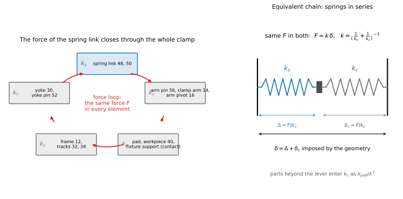

*Figure 9. Left: the loop through which the force of the spring link closes; the same force $F$ acts in every element. Right: the equivalent chain, the spring link $k_s$ and the rest of the loop $k_c$ in series, with the shortening $\delta$ imposed by the geometry.*

$k_c$ is the stiffness of everything else in the loop, reduced to the pin line: bending and crushing of the pins 52, 56 and of the arm pivot 16; bending of the clamp arm 14; contact deformation between pad, workpiece 40 and support; compliance of the frame 12 and of the tracks. The parts beyond the lever enter divided by $\lambda^2$: a displacement $\Delta_p$ at the pad is $\lambda\Delta_p$ at the arm pin 56, and the force at the pad is $\lambda F$, so a stiffness $k_{pad}$ at the pad counts as $k_{pad}/\lambda^2$ on the pin line. The value $k_c$ = 40 kN/mm is assumed, not computed; the lower $k_c$, the further $k$ falls below $k_s$. The rigid link is the case in which only $k_c$ remains, $k = k_c$.

### 7.6 Forces on the yoke

The free body is the yoke 30 with the piston 22. The positive direction along the tracks is the direction of travel when closing, and $\varphi$ is taken with its sign. Three forces act on the yoke along the tracks and across them.

The spring link pushes on the yoke pin 52 with $F$ along the line 56–52, away from 56. Its component along the tracks is

$$F\sin\varphi \tag{9}$$

directed against the travel before the dead centre ($\varphi < 0$) and with the travel past it ($\varphi > 0$). Its component across the tracks, $F\cos\varphi$, presses the yoke on the tracks 32, 34, which react with an equal normal force and with a Coulomb friction force $\mu_g F\cos\varphi$, always opposed to the velocity of the yoke. The cylinder acts along the tracks: a thrust when closing, a pull when opening. The motion is quasi-static, so the forces along the tracks balance.

Closing, the yoke moves in the positive direction and friction is negative:

$$P_{close} + F\sin\varphi - \mu_g F\cos\varphi = 0 \;\Rightarrow\; P_{close} = F\,(\mu_g\cos\varphi - \sin\varphi)$$

Before the dead centre $\varphi < 0$, so $F\sin\varphi = -F\sin|\varphi|$ and $P_{close} = F(\sin|\varphi| + \mu_g\cos\varphi)$: the cylinder overcomes the component of $F$ along the tracks and the friction. Past the dead centre $\varphi > 0$: the component assists, and the cylinder overcomes only the friction in excess of it.

Opening, the yoke moves in the negative direction, friction is positive and the pull of the cylinder is negative:

$$-P_{open} + F\sin\varphi + \mu_g F\cos\varphi = 0 \;\Rightarrow\; P_{open} = F\,(\sin\varphi + \mu_g\cos\varphi)$$

With $\mu_g = \tan\rho = \sin\rho/\cos\rho$ and the sine of a difference and of a sum:

$$P_{close} = F\,\frac{\sin(\rho-\varphi)}{\cos\rho}\quad\text{(closing)},\qquad P_{open} = F\,\frac{\sin(\varphi+\rho)}{\cos\rho}\quad\text{(opening)} \tag{10}$$

Normal force and friction together form a reaction of the tracks inclined by $\rho$ to the normal, on the side opposite to the motion; it is as if the link were turned by $\rho$, hence $\rho - \varphi$ and $\varphi + \rho$. At the dead centre the thrust is not zero but $F\tan\rho$. When closing, the thrust stays positive past the dead centre as long as $\varphi < \rho$; with $\varphi_s$ = 2.86° and $\rho$ = 5.71° the cylinder pushes all the way to the stop. With the cylinder unpressurized at the stop, the link pushes the yoke against the stop as long as $\varphi_s > 0$: this is the lock. Friction acts only if the yoke moves, so it does not weaken the lock; it adds to the force needed to open. The normal force is taken as $F\cos\varphi$ alone: the weight of the yoke and an uneven sharing between the tracks 32 and 34, which arises if the yoke tends to tilt and can raise the normal force, are neglected. The friction of the piston seals is not in the model; it would reduce $P_{ext}$ and $P_{ret}$. Friction in the pins 52 and 56 is also left out; its weight is estimated in §5.

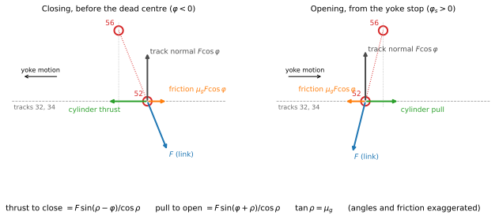

*Figure 10. Free body of the yoke at the yoke pin 52: force $F$ of the spring link on the pin, normal reaction and friction of the tracks, cylinder force. Left: closing, before the dead centre. Right: opening, from the yoke stop. Angles and friction exaggerated.*

### 7.7 Peak thrust when closing

**Objective.** Condition C3 (the cylinder closes and locks, §8) requires the largest thrust during closing not to exceed the cylinder force, $P_{max} \le P_{ext}$. This section finds where the maximum lies and how large it is, on the thickest piece.

Before the dead centre, as drawn in figure 4, $\varphi$ is negative; put $\varphi = -\psi$, $\psi > 0$. From eq. (3), (8) and (10), with $\sin(\rho+\psi)/\cos\rho = \sin\psi + \mu_g\cos\psi$, the thrust is the product of two factors:

$$P_{close}(\psi) = k\,\delta(\psi)\,s(\psi),\qquad \delta(\psi) = h+e-\frac{h}{\cos\psi},\qquad s(\psi) = \sin\psi+\mu_g\cos\psi$$

$k\,\delta$ is the force in the link, in N; $s$ is a pure number, the fraction of that force the cylinder must overcome along the tracks.

**Where the thrust grows.** At contact the link is unloaded and $P = 0$; at the dead centre $P = \mu_g k e$. The derivative of the product is $P' = k\,(\delta' s + \delta\, s')$, with $\delta' = -h\sin\psi/\cos^2\psi$ and $s' = \cos\psi - \mu_g\sin\psi$. At $\psi = 0$: $\delta = e$, $\delta' = 0$, $s = \mu_g$, $s' = 1$, so

$$P'(0) = k\,(0\cdot\mu_g + e\cdot 1) = k\,e > 0$$

At the dead centre the shortening is at its largest and stationary: for an instant the force in the link does not change, only the inclination does, and the component along the tracks grows from zero with unit slope. The thrust therefore grows moving away from the dead centre toward contact; since it returns to zero at contact, it has a maximum in between.

**Small angles.** The angles stay below $\psi_0 \approx \sqrt{2e/h}$ (13.2° on the thickest piece, 13.1° exact; $\psi$ in radians). The Taylor series, stopped at the first useful term, are

$$\frac{1}{\cos\psi} = 1 + \frac{\psi^2}{2} + \frac{5\psi^4}{24} + \dots,\qquad \sin\psi = \psi - \frac{\psi^3}{6} + \dots,\qquad \cos\psi = 1 - \frac{\psi^2}{2} + \dots$$

so that $\delta \approx e - h\psi^2/2$ and $s \approx \psi + \mu_g$; the contact angle follows from $\delta = 0$. The weight of the first neglected terms at the maximum, $\psi^*$ = 5.94° = 0.1037 rad, on the thickest piece:

| neglected term | value | relative to the term kept |
|---|---|---|
| $5h\psi^4/24$ in $\delta$ | 0.00097 mm | 0.11 % of $\delta$ = 0.846 mm |
| $\psi^3/6$ in $\sin\psi$ | 0.00019 | 0.09 % of $s$ = 0.204 |
| $\mu_g\psi^2/2$ in $\mu_g\cos\psi$ | 0.00054 | 0.26 % of $s$ |

**The maximum.** Expanded, $P \approx k\left[e\psi + e\mu_g - \tfrac{h}{2}\psi^3 - \tfrac{h\mu_g}{2}\psi^2\right]$; term by term,

$$\frac{dP}{d\psi} = k\left[e - h\mu_g\psi - \tfrac32 h\psi^2\right]$$

Setting it to zero gives the quadratic $\tfrac32 h\psi^2 + h\mu_g\psi - e = 0$; the negative root is discarded because $\psi > 0$, and the second derivative $-k\,h\,(\mu_g + 3\psi) < 0$ confirms a maximum. To obtain $P_{max}$ without substituting $\psi^*$ in the long expression, the stationarity condition is rearranged: it gives the shortening at the maximum, $\delta(\psi^*) = e - h\psi^{*2}/2 = h\,\psi^*(\psi^*+\mu_g)$; substituted in $P = k\,\delta\,(\psi+\mu_g)$:

$$\psi^* = \frac{-\mu_g+\sqrt{\mu_g^2+6e/h}}{3},\qquad P_{max} = k\,h\,\psi^*\,(\psi^*+\mu_g)^2 \tag{11}$$

Numerically, on the thickest piece, $\delta(\psi^*)$ = 0.846 mm both from $e_0 - h_0\psi^{*2}/2$ and from $h_0\psi^*(\psi^*+\mu_g)$, and eq. (11) gives $P_{max}$ = 766 N at $x^* = -h_0\tan\psi^*$ = −4.2 mm. The model script uses eq. (3), (8), (10) without approximation: the exact maximum is 762 N at 5.9°, so the error of the approximations is below 0.5 %. C3 holds: 762 N ≤ $P_{ext}$ = 1178 N.

**The sense.** At the maximum the cylinder pushes 0.76 kN, while the force in the link reaches $k\,e_0$ = 4.71 kN at the dead centre: $P_{max}/(k\,e_0)$ = 0.16, the cylinder supplies about one sixth of the force the toggle generates. This is the mechanical advantage of the toggle.

### 7.8 Clamping force: the lever

The clamp arm 14 turns about the arm pivot 16. The force of the spring link on the arm pin 56 has a component $F\cos\varphi$ perpendicular to the rear lever 36, which makes a moment about 16, and a component $F\sin\varphi$ along the arm, taken by the pivot. The moments about 16 give

$$N\,a = (F\cos\varphi)\,\ell_r\quad\Rightarrow\quad N = \lambda\,F\cos\varphi,\qquad \lambda = \frac{\ell_r}{a} \tag{12}$$

$\ell_r$ and $a$ are fixed dimensions; what changes with the angle is the component of the force. The height $h$ does not enter the lever.

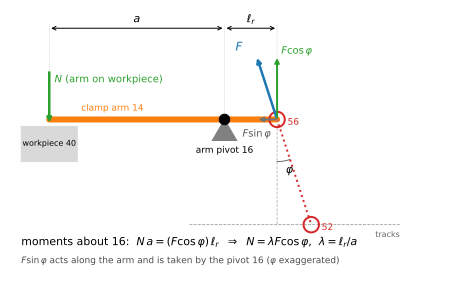

*Figure 11. Clamp arm 14 about the arm pivot 16: the force of the spring link on the arm pin 56, split into $F\cos\varphi$ and $F\sin\varphi$; clamping force $N$ at distance $a$. Angle exaggerated.*

### 7.9 Clamping force at the yoke stop

At the stop the distance between the pin centres is $d_s$, and the shortening left in the spring link is the difference between its free length and that distance:

$$d_s = \sqrt{x_s^2+h^2} = \frac{h}{\cos\varphi_s},\qquad \delta_s = L-d_s,\qquad N = \lambda\,k\,\delta_s\cos\varphi_s \tag{13}$$

$\delta_s$ is smaller than $e$; for small angles $\delta_s \approx e - h\varphi_s^2/2$. This residual shortening holds the piece with the cylinder unpressurized.

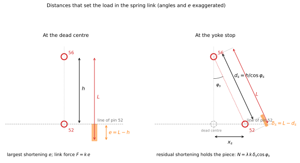

*Figure 12. Left: at the dead centre the pins are at distance $h$ and the link is shortened by $e = L - h$. Right: at the yoke stop the pins are at distance $d_s$ and the link is shortened by $\delta_s = L - d_s$. Angles and $e$ exaggerated.*

### 7.10 Force difference over the tolerance

The clamping force on the thickest and on the thinnest piece follows from eq. (13) with the heights of eq. (1). $L$ and $x_s$ are fixed, so a change of $h$ changes the residual shortening by

$$\frac{d\delta_s}{dh} = -\frac{h}{\sqrt{x_s^2+h^2}} = -\cos\varphi_s$$

From the thickest to the thinnest piece $h$ grows by $\lambda T$, so $\delta_{s,thin} \approx \delta_{s,thick} - \lambda T\cos\varphi_s$, and with eq. (13)

$$N_{thick} - N_{thin} = \lambda\,k\cos\varphi_s\,(\delta_{s,thick}-\delta_{s,thin}) = \lambda^2 k\,T\cos^2\varphi_s \approx \lambda^2\,k\,T \tag{14}$$

The last step takes $\cos^2\varphi_s$ = 0.9975 as 1 and neglects the small difference of $\varphi_s$ between the two pieces. Default: 559 N from eq. (13), 560 N from eq. (14); the difference is the factor $\cos^2\varphi_s$.

The tolerance passes through the lever twice: on the way in, the geometry turns the thickness difference $T$ at the pad into a displacement $\lambda T$ of the arm pin 56; on the way back, the lever turns the change of force in the spring link into force at the pad, again multiplied by $\lambda$. Seen from the workpiece, the clamp is a spring of stiffness $\lambda^2 k$ at the pad. The force difference is proportional to $k$, and the spring link lowers $k$: this is the relation the patent's principle rests on.

### 7.11 Minimum clamping force from the cutting force

With the forces of figure 1, the piece does not lift if $N \ge S\,F_z$. It does not slide if friction under the pad and on the support, $\mu N + \mu(N - F_z)$, exceeds $S\,F_t$. Hence

$$N_{min} = \max\left(S\,F_z,\;\frac{S\,F_t/\mu + F_z}{2}\right) \tag{15}$$

Default: $N_{min}$ = 787.5 N, set by sliding. While $N$ exceeds the lifting component the piece stays on the support and the arm does not move; the compliance of the clamp matters only after the piece has lifted.

## 8. Conditions and setting

Each specification becomes an inequality on the thinnest or on the thickest piece:

$$
\begin{aligned}
&\text{C1 (S1):} && N_{thin} \ge N_{min}\\
&\text{C2 (S2):} && N_{thick} \le N_{max}\\
&\text{C3 (S3):} && \max_{-\varphi_0\le\varphi\le\varphi_s} P_{close} \le P_{ext} \quad\text{(thickest piece)}\\
&\text{C4 (S4):} && \max_{-\varphi_0\le\varphi\le\varphi_s} P_{open} \le P_{ret} \quad\text{(thickest piece)}\\
&\text{C5 (S5):} && k\,e_0/k_s \le \delta_{el} \quad\text{(thickest piece)}\\
&\text{D1:} && k\,e_0 \le F_{all} \quad\text{(thickest piece)}
\end{aligned} \tag{16}
$$

### 8.1 Setting

The clamp is set by its free length, chosen so that the thinnest piece receives exactly the minimum force:

$$L = \sqrt{x_s^2 + h_{thin}^2} + \frac{N_{min}}{\lambda\,k\cos\varphi_{s,thin}} \tag{17}$$

With eq. (17), C1 holds by construction. The unloaded spring link must be longer than the distance between the pins at the stop on the thinnest piece, and the excess is the shortening that gives $N_{min}$. With the default values, step by step:

1. height on the thinnest piece, eq. (1): $h_{thin} = 40 + 0.3\cdot1.4$ = 40.42 mm;
2. distance between the pins at the stop: $d_{s,thin} = \sqrt{x_s^2+h_{thin}^2}$ = 40.469 mm, and $\cos\varphi_{s,thin} = h_{thin}/d_{s,thin}$ = 0.9988;
3. residual shortening that gives $N_{min}$: $\delta_{s,thin} = N_{min}/(\lambda\,k\cos\varphi_{s,thin}) = 787.5/(0.3\cdot4444\cdot0.9988)$ = 0.591 mm;
4. free length: $L = d_{s,thin} + \delta_{s,thin}$ = 41.06 mm; on the thickest piece the same $L$ gives $e_0 = L - h_0$ = 1.06 mm.

Default, thickest piece: $N_{thick}$ = 1346 N (C2: ≤ 2000 N), $P_{close}$ = 762 N (C3: ≤ 1178 N), $P_{open}$ = 673 N (C4: ≤ 990 N), spring link deflection 0.94 mm (C5: ≤ 0.97 mm), peak link force 4.71 kN (D1: ≤ 15 kN). All conditions hold; the closest is C5, with a margin of 3 %. The rigid link ($k = k_c$) on the same tolerance gives $N_{thick}$ = 5.8 kN, $P_{close}$ = 2.97 kN, $P_{open}$ = 2.91 kN and a peak link force of 21.4 kN: it fails C2, C3, C4 and D1.

## 9. Domain

The domain is the region of the plane $k_s \times T$ where all conditions hold, each point with its own setting, eq. (17).

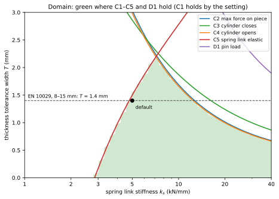

*Figure 13. Domain in the plane spring link stiffness × tolerance width. Green: all conditions hold. Lines: limit of each condition. Dashed: EN 10029 plate, $T$ = 1.4 mm; dot: default.*

**How the curves are obtained.** The figure script covers the plane with a grid of 46 values of $k_s$ from 1 to 40 kN/mm, on a log scale, by 61 values of $T$ from 0 to 3 mm. At every point it recomputes the whole clamp as for the default case: $k$ from eq. (8); the setting $L$ from eq. (17), so that C1 holds by construction and has no curve; $N_{thick}$ from eq. (13); the largest thrust and pull over the whole stroke from contact to stop with eq. (10), exact and not from eq. (11); the deflection $k\,e_0/k_s$ and the peak force $k\,e_0$. For each condition it takes the relative margin, value/limit − 1, negative where the condition holds; the limit curve is the line where the margin is zero, interpolated linearly between the points of the grid.

**Reading the boundaries.** With the approximations of §7 the main boundaries have closed forms. On the thickest piece $e_0 \approx \delta_{s,thick} + h_0\varphi_s^2/2$ and, from eq. (13) and (14), $\lambda k\,\delta_{s,thick} \approx N_{min} + \lambda^2 k T$, so $e_0 \approx N_{min}/(\lambda k) + \lambda T + h_0\varphi_s^2/2$.

On the soft side the limit is C5. The deflection of the spring link is $k\,e_0/k_s$; even with $T = 0$ it must stay below $\delta_{el}$, and with $k \approx k_s$ for a soft link:

$$k_s \ge \frac{N_{min}}{\lambda\,(\delta_{el} - h_0\varphi_s^2/2)} \tag{18}$$

that is 2.85 kN/mm, against 2.8 kN/mm from the grid: a softer spring link needs a larger shortening to give $N_{min}$, and reaches its elastic limit while the clamp crosses the dead centre.

On the stiff side C2 gives, from $N_{thick} \approx N_{min} + \lambda^2 k T$,

$$T \le \frac{N_{max} - N_{min}}{\lambda^2\,k} \tag{19}$$

and C4 the pull to open. When opening, $P_{open} \approx k\,\delta(\varphi)\,(\varphi+\mu_g)$ is the same function as the closing thrust with $\varphi$ in place of $\psi$; it grows up to 5.9°, beyond the stop at 2.86°, so over the stroke its largest value is at the stop, $P_{open} \approx k\,\delta_{s,thick}\,(\varphi_s + \mu_g)$, and

$$T \le \frac{P_{ret}/(\varphi_s+\mu_g) - N_{min}/\lambda}{\lambda\,k} \tag{20}$$

Both eq. (19) and eq. (20) are hyperbolas in $k$: a stiffer link admits a smaller tolerance. With the default values, $k$ in kN/mm and $T$ in mm, eq. (19) gives $T \le 13.5/k$ and eq. (20) $T \le 13.2/k$: they differ by less than 2 %, which is why the lines of C2 and C4 almost coincide.

The admissible tolerance has its maximum, $T \approx$ 2.2 mm, at $k_s$ of about 7 kN/mm, where the soft limit C5 meets the stiff limit C4; below $k_s \approx$ 2.8 kN/mm no setting satisfies C1 and C5 together. For the EN 10029 plate ($T$ = 1.4 mm) the spring link works from about 4.8 to 12.4 kN/mm. The rigid link admits $T \approx$ 0.30 mm, limited by the force needed to open.

## 10. Explorer

The explorer is a simulation of the clamp, the same for the reader who arrives from the entry page or the technical page and for the reader of this page. It runs in the browser with the equations of this model.

- **Mechanism:** side view of the clamp — workpiece 40 on the fixture support, clamp arm 14 with the arm pivot 16 and the rear lever 36, spring link (or rigid link) between the arm pin 56 and the yoke pin 52, yoke 30 on the tracks, cylinder 20 — moved by the kinematics of the model. Arrows show the clamping force $N$ on the pad, the link force $F$ on the arm pin 56 and the cylinder force on the yoke. A line below the drawing says what is happening: approach, contact, dead centre, lock at the stop, release; and, when the cylinder is not strong enough, why the yoke stops.
- **Controls:** yoke position along the stroke; ▶ Close and ◀ Open animate the closing and the opening down to the release of the workpiece, ▷| Step advances by 1/40 of the stroke in the chosen direction; workpiece thickness $t$ within the tolerance; spring link stiffness $k_s$ 1–40 kN/mm (with the width $b$) or rigid link; tolerance width $T$ 0–3 mm; friction in the pins 52, 56 on/off (§5); drawing exaggeration $E$.
- **Graphs along the stroke,** synchronized with the drawing, with $x$ positive to the left as in figure 4: shortening of the link $\delta$ with the elastic limit of the spring link, eq. (3), (6); link force $F$ on the arm pin 56 and clamping force $N$ on the pad with the band $N_{min}$–$N_{max}$, eq. (8), (12); cylinder force required to close and to open against the force available, eq. (10). Dashed curves show the thinnest and the thickest piece for comparison.
- **Values** at the current position, each with the equation it comes from; **conditions** C1–C5, D1; **domain** of figure 13 with the current point; fixed data and reference cases.
- **Exaggeration:** the shortening of the spring link (about 1 mm) and the thickness differences are too small to see at true scale. The drawing multiplies them by $E$ and scales the loaded stretch of the stroke so that contact falls where the graphs put it; $E$ = 1 is the true scale. Graphs and values are always true.
- **Verification:** `US5676357_check.py` runs the JavaScript model of the explorer against the Python model — 12 reference cases and the curves along the stroke, with and without friction in the pins — and the page checks itself against the reference table when it opens.

## 11. What it allows and where it stops

The idea can be seen in the explorer with one comparison. Set the tolerance of the plate, T = 1.4 mm, and close the clamp first on the thinnest and then on the thickest piece. With a spring link of 5 kN/mm the clamping force goes from 787.5 N to 1346 N: the 0.42 mm by which the arm pin 56 rises on the thinner piece is taken up by the bending of the link, and the force stays within the band. Switch to the rigid link and repeat on the same two pieces: the force goes from 787.5 N to 5.8 kN, and when opening the cylinder must pull 2.91 kN against the 990 N it has on the rod side — the clamp stays jammed closed. Same mechanism, same setting, same tolerance: only the stiffness of the link has changed.

| link | thinnest piece | thickest piece | opening: pull required / available |
|---|---|---|---|
| spring link, 5 kN/mm | 787.5 N | 1346 N, within the band | 673 N / 990 N: it opens |
| rigid link | 787.5 N | 5.8 kN, out of the band | 2.91 kN / 990 N: jammed closed |

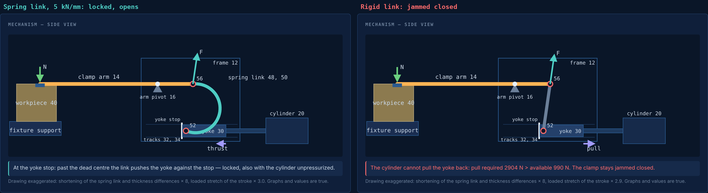

*Figure 14. The explorer on the thickest piece, $T$ = 1.4 mm. Left: spring link of 5 kN/mm, locked at the yoke stop; it opens. Right: rigid link, same piece and same setting rule: the pull required to open exceeds the force the cylinder has on the rod side, and the clamp stays jammed closed. Drawing exaggerated; values true.*

The spring link lets the clamp lock past the dead centre on workpieces of different thickness without re-adjustment: a thicker or thinner piece becomes a larger or smaller bending of the spring link, and the clamping force changes in proportion to the stiffness of the link instead of the stiffness of the whole structure. On hot-rolled plate, whose thickness varies by 1.4 mm within the standard, a clamp with rigid link set for the thinnest piece would press the thickest with more than seven times the minimum force and load its pins with over 20 kN; with a spring link of 5 kN/mm the force on the thickest piece is 1.7 times the minimum and every condition is met. A softer spring link widens the thickness range until the spring link itself reaches its elastic limit while the clamp crosses the dead centre; on the stiff side the range is limited by the force the cylinder needs to pull the yoke back across the dead centre, because the link presses the yoke on its tracks with nearly its whole force and the friction there adds to the pull. The release that the patent attributes to the spring link is therefore the first condition to be violated when the link is too stiff. The force is not made constant: it varies within the band over the tolerance range; a constant force calls for another principle, such as the cam profile of US 4,679,782. In machining, the clamp holds the piece in place as long as its force exceeds the lifting component of the cutting force, and in that range the softer link does not let the piece move; the price of the spring link is that the minimum force must be guaranteed on the thinnest piece and that the spring link, loaded at every cycle, limits the holding capacity of the clamp. The model is quasi-static: it treats the cutting force as steady, not as a force that varies in time with oscillations or impacts; whether the softer clamp holds the piece as well under the pulses of a milling cutter is a question this model does not answer. What the model leaves out, and how much each exclusion weighs, is listed in §5: only the friction in the pins moves a boundary of the domain appreciably — it lowers the stiff side, where the cylinder must pull the yoke back — without changing the conclusions.

