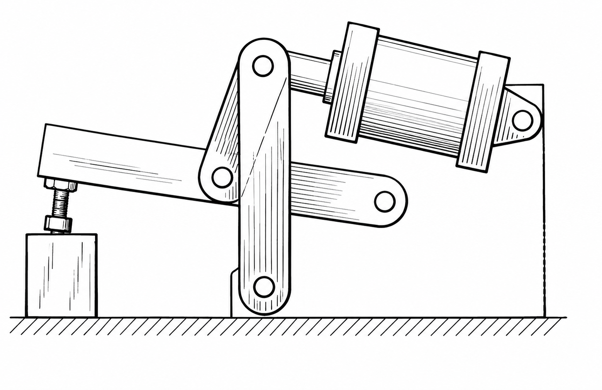
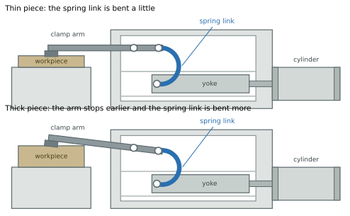
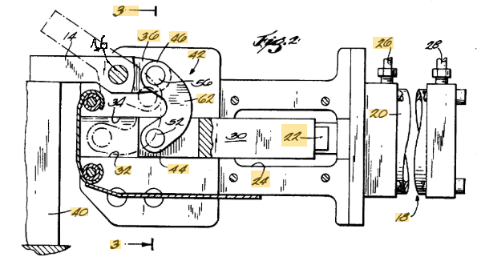

The first operation on a part cut from hot-rolled plate is a good place to see what this asks of the clamp. Plate rolled to EN 10029 has a thickness tolerance that spans 1.4 mm in every class, for any nominal thickness from 8 to 15 mm. Two pieces taken from the same order can differ by that much, and the clamp must hold each of them without anyone touching an adjusting screw.

## The function and the known way

The function of the clamp is to keep the workpiece in the position given by the fixture supports against the cutting forces. It presses the piece onto the supports: the friction produced by that force resists the component of the cutting force along the supports, and the force itself holds down the component that tends to lift the piece. It must do so for every workpiece within the thickness tolerance, without re-adjustment, and stay locked when the cylinder is unpressurized. That sets a band for the force on the workpiece. On the thinnest piece the clamp must press hard enough that the cut neither lifts nor slides it: in the reference case of the model this minimum is 787.5 N. On the thickest piece it must not press so hard that the pad marks the surface: the model takes 2000 N as the upper end of the band.

The known way is the toggle linkage with a rigid link. The cylinder 20 drives a yoke 30 along straight tracks; a link joins the yoke to the rear end of the clamp arm 14, behind its pivot. While the arm swings down, the link only turns it. When the arm lands on the workpiece it stops, but the yoke keeps moving, and the link has to swing through the position where it stands perpendicular to the tracks. In that position the distance between its two pins is shortest. The workpiece and the stopped arm therefore impose a shortening on the link, and something in the force loop has to yield by that amount for the yoke to reach its stop beyond the dead centre. Once past, the force in the linkage pushes the yoke against the stop, and the clamp is locked.

With a rigid link, what yields is the whole structure: pins, arm, lever, frame. It is very stiff, so a small shortening produces a large force. The clamp is set so that it locks on one thickness with the right force, and the setting holds only for that thickness. A thinner piece leaves the arm pin 56 farther from the line of the yoke pin: the linkage passes the dead centre with little or no shortening and the clamp presses lightly or not at all. A thicker piece brings the arm pin closer, and the shortening, and the force, climb steeply.

The numbers of the model show how steeply. A clamp with a rigid link, set to give 787.5 N on the thinnest plate, presses the thickest plate of the same tolerance with 5.8 kN, more than seven times the minimum, and loads its pins with about 21 kN. The cylinder that closed it cannot open it again: to pull the yoke back over the dead centre it would need 2.91 kN, and on the rod side it has 990 N. The clamp stays jammed closed. The rigid link works only when the tolerance of the pieces is very small; in the model it admits about 0.30 mm.

*A conventional toggle clamp with rigid links at the dead centre. Redrawn from US 5,688,014 (N. J. Kot, 1994), figure 1, prior art; reference numbers removed.*

So the known way has a contradiction inside it. Locking past the dead centre needs an interference: the link must be forced shorter than it wants to be. The tolerance of the workpiece changes that interference from piece to piece, and a stiff structure changes the force in proportion to its stiffness. The more rigid the clamp, the more securely it locks, and the narrower the range of thicknesses it can lock on. The usual answer is to adjust the clamp for each batch of thickness.

## The idea

US 5,676,357 (Aladdin Engineering & Manufacturing, inventor E. R. Horn, priority 1995) puts the yielding in a chosen place. The link between the yoke and the clamp arm is made elastic, with a stiffness chosen by the designer: the spring link, two C-shaped links side by side, each with a spring portion 62 between the yoke pin 52 and the arm pin 56. A thicker or thinner piece now means a larger or smaller bending of the spring link, and the force on the workpiece changes in proportion to the stiffness of the spring link instead of the stiffness of the whole structure.

The link is curved for a reason. A straight steel strip pulled or pushed along its axis stretches elastically by less than a fifth of the shortening the clamp imposes at the dead centre; to take all of it, the strip would have to be about six times longer than the distance between its pins. Bent into a C, the link takes the shortening within its elastic range.

The patent states the problem it addresses in its own words: when the dimensions of the workpieces differ substantially because of tolerances, the stresses in the clamp while it toggles can wear or bend its components. It claims a link that includes a spring portion limiting the clamping force, and describes it as an internal element that yields, lets the linkage reach the toggle position on oversized pieces, and permits unlocking.

*The same clamp with the same setting on the thinnest and on the thickest piece of the tolerance. On the thicker piece the arm stops earlier and the spring link is bent more. Drawn from the model; the thickness difference and the bending of the spring link are drawn about nine times larger than real, with the same factor.*

*US 5,676,357, figure 2 (Aladdin Engineering & Manufacturing, 1995): the clamp closed on the workpiece 40, partly cut away. Cylinder 20, yoke 30 on the tracks, spring link between the yoke pin 52 and the arm pin 56, clamp arm 14 on its pivot 16. Label 16 added.*

## Why it works

Seen from the workpiece, the linkage with its spring link acts as a spring of stiffness k: the spring link in series with the rest of the structure. In a series arrangement the softer element sets the stiffness: with a spring link of 5 kN/mm the whole loop has 4.44 kN/mm, a little below the spring link itself and far below the rigid structure. Each workpiece imposes on this spring a shortening set by its thickness, and the toggle geometry and the lever of the clamp arm carry the spring force to the workpiece. The range of thicknesses over which the clamp locks with a force inside the required band is inversely proportional to k: lowering the stiffness widens the range. The explorer lets you try it: set the tolerance, close the clamp on the thickest piece and move the stiffness of the spring link. As the stiffness goes down, the clamping force falls back inside the band; as it goes up, the force leaves the band and the pull needed to open exceeds what the cylinder has.

The setting is made on the thinnest piece, which must receive the minimum force. Over the plate tolerance of 1.4 mm the arm pin 56 rises by 0.42 mm on the thinnest piece, and that rise is taken up by the bending of the spring link. With 5 kN/mm the force on the workpiece goes from 787.5 N on the thinnest piece to 1346 N on the thickest, 1.7 times the minimum and well inside the band.

The same lower force makes the opening possible. To open, the cylinder must pull the yoke back over the dead centre, against the part of the link force that acts along the tracks and against the friction that the link force produces on them. Both are proportional to the force in the link. With the spring link the pull required on the thickest piece is 673 N, against the 990 N the cylinder has on the rod side. Once the yoke is back across the dead centre, the spring link pushes it and helps the opening. This is the sense in which the patent says that the spring link permits unlocking: it limits the force in the link, and with it the pull.

The comparison can be made in the explorer, on the same mechanism, with the same setting and the same tolerance.

*The explorer on the thickest piece, tolerance 1.4 mm. Left: spring link of 5 kN/mm, locked at the yoke stop; it opens. Right: rigid link, same piece and same setting rule; the pull required to open exceeds the force the cylinder has on the rod side, and the clamp stays jammed closed. Drawing exaggerated; values true. Figure 14 of the model page.*

## Where it stops

The spring link widens the range of thickness; it does not remove the limits. On the soft side, a softer spring link needs a larger shortening to give the minimum force on the thinnest piece, and it bends most while the clamp crosses the dead centre on the thickest one. If that bending exceeds its elastic range, it takes a permanent set, its free length changes, and the clamp no longer keeps the force inside the band over the whole tolerance. In the reference case the spring link bends by 0.94 mm against an elastic limit of 0.97 mm: this is the condition with the smallest margin.

On the stiff side the range is limited by the opening. Near the dead centre the spring link presses the yoke onto its tracks with nearly its whole force, and the friction there adds to the pull the cylinder must deliver. When the spring link is too stiff, the clamp still closes and locks, but the cylinder can no longer bring it back. The release that the patent attributes to the spring link is therefore the first condition to be violated when the link is too stiff. For the EN 10029 plate the model finds a working range of the spring link from about 4.8 to 12.4 kN/mm; the friction in the pins, which the reference model leaves out, lowers the upper end.

The idea does not make the force constant: it keeps it inside the band. A clamp that gives the same force on every piece calls for another principle, such as the cam of US 4,679,782. Last, the model is quasi-static: it treats the cutting force as steady, not as a force that varies in time with oscillations or impacts. A milling cutter loads the piece in pulses, one per tooth; whether the softer clamp holds the piece as well under them is a question this model does not answer.

## The same principle elsewhere

Pneumatic grippers in automation use the same over-centre lock. The angular grippers with toggle locking of De-Sta-Co, for example, lock at full closure so that they cannot open until air is supplied to the opening side; the patent itself presents its device as a clamp and gripper.

In robotics, a spring placed on purpose in series between a stiff drive and its load is the basis of the series elastic actuator, described in the same year as this patent by G. A. Pratt and M. M. Williamson at MIT. There too, a compliant element of known stiffness makes the force on the load depend on a deflection that can be large and measured, rather than on the small deformations of a stiff gear train.

## Further reading

The mechanism, with the model, its assumptions and every number of this page, is on [the model page](../math/). The [explorer](/calculators/c1_spring_link_explorer.html) moves the clamp through its stroke on the thinnest and on the thickest piece, with the spring link or the rigid link, and shows the forces on the workpiece, on the arm pin 56 and on the cylinder at each position. The other ways of performing the same function, before and after this patent, are on the [entry page](../).

**Sources.** US 5,676,357; US 4,679,782; US 5,688,014 (Google Patents). De-Sta-Co, angular grippers with toggle locking, RA series, product page. M. M. Williamson, *Series elastic actuators*, MS thesis, MIT, 1995; G. A. Pratt and M. M. Williamson, "Series elastic actuators", IEEE/RSJ IROS, 1995.
