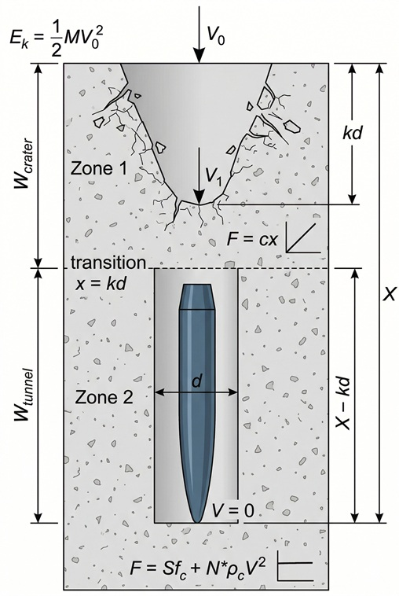

<iframe src="/calculators/a4_penetration_explorer.html"
        style="width:100%; height:980px;" loading="lazy"></iframe>

The scene above is not a drawing: the projectile's rest position is found by integrating the
equation of motion in the browser, using the same force law derived below — the two-zone model
of Li & Chen (2003). What follows is where every symbol, constant, and equation in that solver
comes from.

---

# Physics of Concrete Penetration — Academy Course

Preparatory course for tool A4 (Li & Chen 2003).
Covers the physics and mathematics required to *understand* the tool's formulae,
not merely to use them.

Prerequisites: algebra, derivatives, elementary integrals, concepts of stress and strain.

---

## Chapter 0 — Context

### 0.1 The problem and its practical relevance

A rigid projectile strikes a concrete target at velocity $V_0$. How deep does it penetrate?

The question is relevant in two contexts: protection of civil and military structures against impacts from missiles, fragments and tornado-generated projectiles; and design of kinetic-energy (KE) weapons. In both cases, a formula is needed that, given mass, velocity, projectile geometry and concrete strength, returns the penetration depth $X$.

The problem has been studied experimentally for over 60 years (1940s–2000s), producing thousands of test data points and dozens of empirical formulae.

### 0.2 Limitations of existing empirical formulae

The most widely used formulae — modified NDRC, Barr (UKAEA), ACE (Army Corps of Engineers) — suffer from three structural limitations:

**Unit dependence.** Most formulae are not dimensionally homogeneous. The NDRC formula in SI units has a numerical coefficient ($3.8 \times 10^{-5}$) that changes when switching to the imperial system. This makes it difficult to identify the physically relevant quantities.

**Ambiguous nose shape definition.** Every formula uses a different shape factor: NDRC assigns $N_N = 0.72$ (flat), 0.84 (blunt), 1.0 (spherical), 1.14 (sharp). The Hughes formula uses $N_H = 1.0$, 1.12, 1.26, 1.39 for the same shapes. These discrete definitions do not describe intermediate or truncated geometries.

**Narrow validity range.** Empirical formulae are calibrated on low- and medium-velocity tests, typically $0.6 < X/d < 2.0$. For deep penetrations ($X/d > 5$), such as those produced by ogive-nosed projectiles at 300–1000 m/s in the tests of Forrestal et al. (1994, 1996) and Frew et al. (1998), NDRC errors reach 20–40%.

### 0.3 Strategy of Li & Chen (2003)

Li & Chen propose a three-step approach:

1. **Dimensional analysis** (Lesson 1): starting from the physical quantities of the problem, the Buckingham Pi theorem reduces the number of variables to three dimensionless groups: the impact factor $I^*$, the mass ratio $\lambda$, and the nose factor $N^*$.

2. **Analytical model** (Lesson 2): the penetration model of Forrestal et al. (1994), based on cavity expansion theory, provides the force law on the projectile during both phases (crater and tunnel). Integration of the equation of motion yields the penetration depth in closed form.

3. **Non-dimensionalisation** (Lesson 2, §2.5 + [Appendix](#appendix-nondimensionalisation)): the three Pi groups are recombined, through the empirical parameter $S$ (Lesson 3), into just two numbers — the impact function $I$ and the geometry function $N$ — which entirely govern $X/d$.

The result is two formulae (Eqs. 15a and 15b of the paper): one for shallow penetration ($X/d \leq k$), one for deep penetration ($X/d > k$). The formulae are dimensionally homogeneous, use a unique nose factor definition, and are validated over a range from $X/d = 0.07$ to $X/d = 92.8$.

### 0.4 Experimental basis

The formulae are calibrated and validated on three main experimental campaigns:

**Forrestal et al. (1994):** 28 tests with 4340 steel ogive projectiles ($R_c$ 43–45) on concrete with $f_c$ = 23 and 97 MPa. Velocities 183–800 m/s. Projectiles with CRH = 2, 3 and 4.25. Penetrations $X/d$ from 6.2 to 65.8. These data cover the deep regime and provide the calibration of parameter $S$ (Tables 2–4 of the paper).

**Frew et al. (1998):** 16 tests with CRH=3 ogive projectiles on concrete with $f_c$ = 23 and 39 MPa. Velocities up to 1000 m/s. Penetrations up to $X/d = 92.8$. Extend the validation to the high-velocity regime.

**Sliter collection (1980):** 82 tests compiled from US and European sources (EDF, CEA, EPRI, Bechtel, EMI), predominantly with flat-nosed projectiles. Velocities 27–312 m/s. Penetrations $X/d$ from 0.04 to 5.8. Cover the shallow and medium regimes and allow comparison with NDRC and Barr.

In total, the paper validates the formulae on approximately 130 data points covering three orders of magnitude in $X/d$.

---

## Chapter 1 — Reference data

### 1.1 Symbol legend

**Projectile quantities:**

| Symbol | Quantity | SI unit |
|:--------|:----------|:---------|
| $M$ | mass | kg |
| $d$ | shank diameter | m |
| $V_0$ | impact velocity | m/s |
| $\psi$ | nose geometry parameter: CRH $= R/d$ for ogive, $H/d$ for conical, $r/d$ for spherical | — |
| $N^*$ | nose factor (Eq. 48) | — |
| $H$ | nose height | m |
| $L$ | projectile length | m |

**Target quantities:**

| Symbol | Quantity | SI unit |
|:--------|:----------|:---------|
| $f_c$ | unconfined compressive strength | Pa (MPa) |
| $\rho_c$ | density | kg/m³ |
| $S$ | empirical confined resistance constant (Eqs. 53–54) | — |
| $a$ | characteristic aggregate size | m |

**Penetration quantities:**

| Symbol | Quantity | SI unit |
|:--------|:----------|:---------|
| $X$ | penetration depth | m |
| $k$ | dimensionless crater depth (Eq. 37) | — |
| $V_1$ | projectile velocity at crater–tunnel transition (Eq. 27) | m/s |
| $c$ | linear force constant in crater (Eq. 26) | N/m |

**Dimensionless numbers:**

| Symbol | Quantity | Definition |
|:--------|:----------|:------------|
| $I^*$ | impact factor | $MV_0^2 / (d^3 f_c)$ |
| $\lambda$ | mass ratio | $M / (\rho_c d^3)$ |
| $I$ | impact function | $I^* / S = MV_0^2 / (S d^3 f_c)$ |
| $N$ | geometry function | $\lambda / N^* = M / (N^* \rho_c d^3)$ |
| $\Phi_J$ | Johnson number | $\rho_c V_0^2 / f_c = I^* / \lambda$ |

**Model constants:**

| Symbol | Quantity | Value |
|:--------|:----------|:-------|
| $A$ | static cavity pressure constant | absorbed into $S$ |
| $B$ | inertial cavity pressure constant | 1.0 (concrete) |

### 1.2 The reference case: shot 14

In experimental ballistics, every firing test is called a "shot" and is numbered. Shot 14 comes from the campaign of Forrestal et al. (1994), Table 3. It is used as the reference case throughout all lessons because it falls in an intermediate range (neither too slow nor too fast) and is fully documented in both dimensional form (Forrestal, Table 3) and dimensionless form (Li & Chen, Table 2).

**Projectile:**

| Quantity | Value |
|:----------|:-------|
| Material | 4340 steel, $R_c$ 43–45 |
| Mass $M$ | 0.906 kg |
| Diameter $d$ | 26.9 mm (0.0269 m) |
| Nose type | Ogive, CRH $\psi = 2.0$ |
| Nose factor $N^*$ | 0.156 |
| Nose height $H/d$ | 1.323 |
| Impact velocity $V_0$ | 277 m/s |

**Target:**

| Quantity | Value |
|:----------|:-------|
| Strength $f_c$ | 35.2 MPa |
| Density $\rho_c$ | 2370 kg/m³ |
| $S$ (from Table 2) | 12 |
| Type | Semi-infinite block, plain concrete |

**Results:**

| Quantity | Value |
|:----------|:-------|
| $X_{\text{test}}$ (measured) | 173 mm |
| $X/d_{\text{test}}$ | 6.43 |
| $X/d_{\text{anal}}$ (Eq. 15b) | 6.21 |
| $X/d_{\text{NDRC}}$ | 5.11 |
| Model vs test error | 3.4% |
| NDRC vs test error | 20.5% |

**Dimensionless numbers:**

| Symbol | Value | Interpretation |
|:--------|:-------|:----------------|
| $I^*$ | 101.46 | Impact factor |
| $\lambda$ | 19.64 | Slender projectile ($L/d \approx 6$) |
| $I$ | 8.455 | Energy >> absorption capacity → deep |
| $N$ | 125.9 | Heavy and sharp projectile |
| $I/N$ | 0.067 | $\ll 1$: geometry matters little |
| $\Phi_J$ | 5.17 | $\gg 1$: fully dynamic regime |
| $k$ | 2.030 (Eq. 25) / 2.0 (paper) | Crater depth |

### 1.3 Overview of available test data

The data in the paper cover a wide range of geometries and materials:

**Ogive projectiles (Forrestal/Frew) — deep penetration:**

| CRH $\psi$ | $N^*$ | $\lambda$ | $N$ | $f_c$ (MPa) | $S$ | $X/d$ range |
|:---|:---|:---|:---|:---|:---|:---|
| 2 | 0.156 | 19.6 | 125.9 | 35 / 97 | 12 / 7 | 6.2–65.8 |
| 3 | 0.106 | 15.2 / 24.8 | 143.4 / 234.3 | 23 / 39 / 58 | 21 / 15.2 / 8.6–10.5 | 9.8–92.8 |
| 4.25 | 0.076 | 15.2 | 200.0 | 23 | 21 | 8.6–66.6 |

**Flat-nosed projectiles (Sliter collection) — shallow/medium penetration:**

| $N^*$ | $\lambda$ | $N$ | $f_c$ (MPa) | $S$ | $X/d$ range |
|:---|:---|:---|:---|:---|:---|
| 1.0 | 0.5–96 | 0.5–96 | 22–48 | 10.6–15.3 | 0.04–5.8 |

The key difference: ogive projectiles have large $N$ (125–234) and penetrate in the $I/N \ll 1$ regime where geometry matters little. Flat-nosed projectiles have small $N$ (0.5–96) and penetrate in a regime where both $I$ and $N$ matter.

---

## Lesson 1 — Dimensional analysis and the Buckingham Pi theorem

### 1.1 The problem

A rigid projectile of mass $M$, diameter $d$, with a nose shape defined by a
geometric factor $N^*$, strikes a concrete target at velocity $V_0$.

We want the penetration depth $X$.

The physics of the problem involves 7 quantities (including $X$) and 3 fundamental dimensions (M, L, T). The neglected quantities — elastic modulus $E_c$, reinforcement ratio $r$, aggregate size $a$ and friction $\mu_m$ — have secondary effects documented in Section 2.1 of the paper.

### 1.2 The Buckingham Pi theorem

**Statement.** If a physical phenomenon involves $n$ quantities expressed in terms
of $m$ fundamental dimensions, then the phenomenon can be described by
$n - m$ independent dimensionless numbers (the "Pi groups").

The starting point is Eq. (1) of the paper, which lists all quantities that
*in principle* influence the penetration depth:

$$X = f(M, V_0, d, N^*, \rho_c, f_c, E_c, a, r, \mu_m) \tag{1}$$

where $N^*$ is the **nose factor** — a dimensionless number describing the shape
of the projectile nose (defined in Lesson 3, §3.2, Eq. 48). For now it suffices
to know that $N^* = 1$ for a flat nose, $N^* = 0.5$ for hemispherical, and $N^* = 0.156$
for the CRH=2 ogive of shot 14. The smaller $N^*$, the sharper the nose.

There are 10 quantities, but the paper (Section 2.1) argues experimentally that four of them have secondary effects and can be neglected:
$E_c$ (elastic modulus — narrow range for all concrete grades),
$a$ (aggregate — weak dependence, $\propto (d/a)^{0.1}$),
$r$ (reinforcement — negligible below 1.5% per direction),
$\mu_m$ (friction — secondary role, absorbed into the model).

**7 quantities** remain (including $X$) and **3 fundamental dimensions** (M, L, T):

$$n - m = 7 - 3 = 4 \text{ Pi groups} \tag{1a}$$

But $N^*$ is already dimensionless by construction (it is a normalised geometric integral, Eq. 48), so it counts as a Pi group in its own right.
**3 Pi groups remain to be built** from the 6 dimensional quantities
($X$, $M$, $V_0$, $d$, $\rho_c$, $f_c$).

### 1.3 Construction of the Pi groups

We choose $M$, $d$ and $f_c$ as repeating variables (basis) — they cover all three
fundamental dimensions:

$$[M] = \text{kg}, \quad [d] = \text{m}, \quad [f_c] = \text{kg} \cdot \text{m}^{-1} \cdot \text{s}^{-2} \tag{2}$$

$$[V_0] = \text{m} \cdot \text{s}^{-1}, \quad [\rho_c] = \text{kg} \cdot \text{m}^{-3}, \quad [X] = \text{m} \tag{3}$$

**Pi group Π₁ — contains $X$:**

We seek $\Pi_1 = X \cdot M^a \cdot d^b \cdot f_c^c$ dimensionless. The conditions for dimensionlessness (each dimensional exponent equal to zero in the product) give the system:

- kg: $a + c = 0$
- m: $1 + b - c = 0$
- s: $-2c = 0$

Hence: $c = 0$, $a = 0$, $b = -1$.

$$\boxed{\Pi_1 = \frac{X}{d}} \tag{4}$$

The dimensionless penetration depth. This is the result we want to compute.

*Shot 14:* $X_{\text{test}} = 173$ mm, $d = 26.9$ mm → $X/d_{\text{test}} = 173/26.9 = 6.43$. Matches Table 2 of the paper. ✓

**Pi group Π₂ — contains $V_0$:**

We seek $\Pi_2 = V_0 \cdot M^a \cdot d^b \cdot f_c^c$ dimensionless.

$$[V_0 \cdot M^a \cdot d^b \cdot f_c^c] = \text{m} \cdot \text{s}^{-1} \cdot \text{kg}^{a+c} \cdot \text{m}^{b-c} \cdot \text{s}^{-2c}$$

Conditions:

- kg: $a + c = 0$
- m: $1 + b - c = 0$
- s: $-1 - 2c = 0$

Hence: $c = -1/2$, $a = 1/2$, $b = -3/2$.

$$\Pi_2 = V_0 \cdot M^{1/2} \cdot d^{-3/2} \cdot f_c^{-1/2} = V_0 \sqrt{\frac{M}{d^3 \, f_c}} \tag{5}$$

For convenience the square of $\Pi_2$ is used:

$$\boxed{I^* = \Pi_2^2 = \frac{M V_0^2}{d^3 f_c}} \tag{6}$$

This is the **impact factor** $I^*$ of the paper (Eq. 5). It appears in the formulae of
Chang (1981), Hughes (1984) and Haldar & Hamieh (1984).

**Physical interpretation:** $M V_0^2$ is (up to a factor of 2) the kinetic energy.
$d^3 f_c$ has the dimensions of energy (force × length = pressure × volume).
Therefore $I^*$ is an energy ratio: kinetic energy of the projectile relative
to the "absorption capacity" of the concrete over a volume of order $d^3$.

*Shot 14:*

- Numerator: $M V_0^2 = 0.906 \times 277^2 = 0.906 \times 76\,729 = 69\,537$ J
- Denominator: $d^3 f_c = (0.0269)^3 \times 35.2 \times 10^6 = 1.9448 \times 10^{-5} \times 3.52 \times 10^7 = 684.6$
- $I^* = 69\,537 / 684.6 = 101.6$

Paper (Table 2, shot 14): $I^* = 101.46$ ✓ (difference due to rounding of $d$ and $f_c$).

**Pi group Π₃ — contains $\rho_c$:**

We seek $\Pi_3 = \rho_c \cdot M^a \cdot d^b \cdot f_c^c$ dimensionless.

$$[\rho_c \cdot M^a \cdot d^b \cdot f_c^c] = \text{kg} \cdot \text{m}^{-3} \cdot \text{kg}^{a+c} \cdot \text{m}^{b-c} \cdot \text{s}^{-2c}$$

Conditions:

- kg: $1 + a + c = 0$
- m: $-3 + b - c = 0$
- s: $-2c = 0$

Hence: $c = 0$, $a = -1$, $b = 3$.

$$\Pi_3 = \frac{\rho_c \, d^3}{M} \tag{7}$$

The paper uses the reciprocal (Eq. 6). Inverting a Pi group is allowed — the reciprocal of a dimensionless number is still dimensionless. The choice is one of convenience: with this definition a large $\lambda$ means a heavy projectile relative to the target.

$$\boxed{\lambda = \frac{M}{\rho_c \, d^3}} \tag{8}$$

**Physical interpretation:** $M/d^2$ is the "sectional pressure" of the projectile
(mass per unit frontal area). $\rho_c \cdot d$ is an "areal density" of the
target over a depth of order one diameter. The ratio $\lambda$ tells how
"heavy" the projectile is relative to the target, at equal geometric scale.

For a projectile with density $\rho_p$ and length $L$:

$$\lambda \approx \frac{\rho_p}{\rho_c} \cdot \frac{L}{d} \tag{9}$$

i.e., $\lambda$ combines relative density and projectile slenderness.

*Shot 14:*

- $d^3 = 0.0269^3 = 1.9448 \times 10^{-5}$ m³
- $\rho_c \, d^3 = 2370 \times 1.9448 \times 10^{-5} = 0.04609$ kg
- $\lambda = 0.906 / 0.04609 = 19.66$

Paper (Table 2, shot 14): $\lambda = 19.64$ ✓

*Consistency check with Eq. (9):* 4340 steel → $\rho_p \approx 7850$ kg/m³, hence $\rho_p/\rho_c \approx 7850/2370 \approx 3.3$. With $\lambda \approx 19.7$ we get $L/d \approx 6$ — a slender projectile, consistent with the CRH=2 ogive geometry.

### 1.4 Result of dimensional analysis

$$\frac{X}{d} = f\!\left(\frac{M V_0^2}{d^3 f_c}, \; \frac{M}{\rho_c \, d^3}, \; N^*\right) \tag{10}$$

Three dimensionless numbers govern the phenomenon.

**What does physics tell us about the form of $f$?**

Dimensional analysis does not give the explicit form of $f$, but we can verify that the expected monotone dependencies are consistent with the arguments:

- **$I^*$ ↑ → $X/d$ ↑?** More kinetic energy ($MV_0^2$ ↑) or less resistance ($f_c$ ↓) → greater penetration. We expect $f$ increasing in $I^*$. Reasonable.

- **$\lambda$ ↑ → $X/d$ ↑?** For fixed $I^*$, a heavier, more slender projectile should penetrate more. We expect $f$ increasing in $\lambda$ as well. Reasonable.

- **$N^*$ ↑ → $X/d$ ↓?** Small $N^*$ = sharp nose, large $N^*$ = flat nose. A sharp nose penetrates more. We expect $f$ decreasing in $N^*$. Reasonable.

The expected qualitative behaviour is consistent with the structure of $f$.

**Limitation of dimensional analysis:** it does not rule out non-monotone dependencies, coupled dependencies, or the possibility that one argument matters far more than the others. For instance, it does not tell us that $X/d$ is nearly linear in $I$ and nearly insensitive to $N$ when $I/N \ll 1$ — that is only revealed by the physical model (Lessons 2–3).

There is also a subtlety regarding the Pi groups: the reasoning "for fixed $I^*$, increasing $\lambda$ implies $X/d$ ↑" is physically sensible, but holding $I^*$ constant while varying $\lambda$ is not trivial — because $I^*$ contains $M$ in the numerator and $\lambda$ contains $M$ in the numerator. If $M$ is increased, *both* rise. The Pi groups are independent as dimensionless numbers, but not independent in the underlying physical parameters. This is one of the reasons why the paper recombines $I^*$, $\lambda$ and $N^*$ into $I$ and $N$: in the new pair the physical dependencies separate more cleanly.

The paper recombines them into two derived numbers using the empirical parameter $S$ (Lesson 3):

**Impact function — Eq. (14) of the paper:**

$$I = \frac{I^*}{S} = \frac{M V_0^2}{S \, d^3 f_c} \tag{11}$$

Dividing by $S$ absorbs the empirical correlation between the uniaxial strength $f_c$ and the effective confined strength. In this way $I$ contains all the information about the impact energy relative to the true resistance of the target.

*Shot 14* (with $S = 12$ from Table 2): $I = 101.46 / 12 = 8.455$. Paper: $I = 8.45$ ✓

**Projectile geometry function — Eq. (13) of the paper:**

$$N = \frac{\lambda}{N^*} = \frac{M}{N^* \rho_c \, d^3} \tag{12}$$

Combines relative mass and nose shape into a single number. Heavy and sharp projectile → large $N$.

*Shot 14* (with $N^* = 0.156$): $N = 19.64 / 0.156 = 125.9$. Paper: $N = 125.9$ ✓

With these two numbers, the penetration depth is given by Eqs. (15a)/(15b) of the paper.

**Note.** Dimensional analysis alone does not give the *form* of function $f$.
It only says that the function exists and depends on those three groups. To obtain the explicit form, a physical model is needed — and that is what Lessons 2 and 3 provide.

### 1.5 The Johnson damage number

A classical dimensionless number in impact mechanics is the Johnson number:

$$\Phi_J = \frac{\rho_c V_0^2}{f_c} \tag{13}$$

which classifies the severity of the impact. It is obtained by combining $I^*$ and $\lambda$:

$$\Phi_J = \frac{I^*}{\lambda} \tag{14}$$

**Algebraic verification:**

$$\frac{I^*}{\lambda} = \frac{MV_0^2/(d^3 f_c)}{M/(\rho_c d^3)} = \frac{MV_0^2}{d^3 f_c} \cdot \frac{\rho_c d^3}{M} = \frac{\rho_c V_0^2}{f_c}$$

$M$ and $d^3$ cancel: $\Phi_J$ does not depend on the projectile (neither mass, nor diameter, nor nose shape). It depends only on velocity and target properties.

*Shot 14 — via ratio:*
$\Phi_J = 101.46 / 19.64 = 5.17$

*Shot 14 — via direct definition:*
$\Phi_J = 2370 \times 277^2 / (35.2 \times 10^6) = 1.819 \times 10^8 / 3.52 \times 10^7 = 5.17$ ✓

Both routes give the same result — confirming that $I^*$ and $\lambda$ are consistent.

**Interpretation:**

- $\Phi_J \ll 1$: quasi-static regime, concrete resists without significant damage
- $\Phi_J \sim 1$: dynamic regime, significant penetration
- $\Phi_J \gg 1$: hypervelocity regime, perforation likely

Shot 14: $\Phi_J = 5.17 \gg 1$ → fully dynamic regime, significant penetration. Consistent with $X/d = 6.43$ (deep penetration).

### 1.6 Lesson 1 summary

| Quantity | Formula | Shot 14 | Paper | Eq. |
| :-------- | :------------------------------- | :---------- | :----- | :--- |
| $X/d$ | — | 6.43 (test) | 6.43 | (4) |
| $I^*$ | $MV_0^2/(d^3 f_c)$ | 101.6 | 101.46 | (6) |
| $\lambda$ | $M/(\rho_c d^3)$ | 19.66 | 19.64 | (8) |
| $I$ | $I^*/S$ | 8.455 | 8.45 | (11) |
| $N$ | $\lambda/N^*$ | 125.9 | 125.9 | (12) |
| $\Phi_J$ | $I^*/\lambda = \rho_c V_0^2/f_c$ | 5.17 | — | (13) |

---

## Lesson 2 — Equation of motion and integration

### 2.1 The physical model

When the projectile enters the concrete, two distinct phases are observed experimentally:

**Phase 1 — Crater formation** ($x \leq kd$)

The concrete fractures and is ejected laterally, forming a conical crater.
The resisting force grows linearly with depth:

$$F = c \, x \quad \text{for } x \leq kd \tag{15}$$

where $c$ is a constant and $k$ is a dimensionless parameter related to nose geometry
(see §2.4). The transition at $x = kd$ marks the boundary from the crater zone to the tunnel zone.

**Phase 2 — Tunnel penetration** ($x > kd$)

Beyond the crater zone, the projectile bores a cylindrical tunnel of diameter $d$.
The resisting force is given by cavity expansion theory (Lesson 3):

$$F = \frac{\pi d^2}{4}\left(S \, f_c + N^* \rho_c V^2\right) \quad \text{for } x > kd \tag{16}$$

where $V$ is the instantaneous projectile velocity (which decreases during penetration), and $S \, f_c$ is the static term (Lesson 3).

**Key observation:** in Phase 1 the force depends only on position $x$.
In Phase 2 it depends on velocity $V$. The two phases require different integration strategies.

**Orders of magnitude — shot 14:**

We compute the force in the tunnel zone to understand the scale of the problem.

*Static term* ($S f_c$, velocity-independent):
- Frontal area: $\pi d^2/4 = \pi \times 0.0269^2 / 4 = 5.685 \times 10^{-4}$ m²
- $S f_c = 12 \times 35.2 = 422.4$ MPa
- Static force: $5.685 \times 10^{-4} \times 422.4 \times 10^6 = 240\,100$ N ≈ **240 kN**

*Dynamic term* ($N^* \rho_c V^2$, at initial velocity $V_0 = 277$ m/s as upper bound):
- $N^* \rho_c V_0^2 = 0.156 \times 2370 \times 277^2 = 28.4$ MPa
- Dynamic force: $5.685 \times 10^{-4} \times 28.4 \times 10^6 = 16\,100$ N ≈ **16 kN**

The static term dominates (~94% of total force). The dynamic term $\rho_c V^2$ becomes comparable to $S f_c$ only when $V \sim \sqrt{S f_c / (N^* \rho_c)} \approx 1070$ m/s, well beyond this case.

The total force of ~256 kN corresponds to a deceleration of:
$$a = \frac{F}{M} \approx \frac{256\,000}{0.906} \approx 283\,000 \text{ m/s}^2 \approx 29\,000 \, g$$

A large value but normal in terminal ballistics — this is why the projectile must be made of hardened high-strength steel (4340, $R_c$ 43–45).

_Schematic of the physical model quantities_

### 2.2 Phase 1 — Integration with linear force

The equation of motion in the crater zone is:

$$M \frac{dV}{dt} = -c \, x \tag{17}$$

We change variable from $t$ to $x$ using the standard dynamics trick:

$$\frac{dV}{dt} = \frac{dV}{dx} \cdot \frac{dx}{dt} = V \frac{dV}{dx} \tag{18}$$

The equation becomes:
$$M V \, dV = -c \, x \, dx \tag{19}$$

This is separable: $V$ on the left, $x$ on the right.

**Case 1 — projectile stops inside the crater** ($X \leq kd$):

Integrating from $(x = 0, V = V_0)$ to $(x = X, V = 0)$:
$$\int_{V_0}^{0} M V \, dV = -\int_0^X c \, x \, dx \tag{20}$$

Left-hand side:
$$M \left[\frac{V^2}{2}\right]_{V_0}^{0} = -\frac{1}{2} M V_0^2 \tag{21}$$

Right-hand side:
$$-c\left[\frac{x^2}{2}\right]_0^X = -\frac{1}{2} c X^2 \tag{22}$$

Equating:
$$X^2 = \frac{MV_0^2}{c} \quad \Rightarrow \quad X = V_0\sqrt{\frac{M}{c}} \tag{23}$$

This is Eq. (9a) of the paper. Depth is proportional to $V_0$ and to $\sqrt{M}$.

**Case 2 — projectile traverses the entire crater** ($X > kd$):

The projectile does not stop in Phase 1 but exits the crater with velocity $V_1$. Integrating from $(x = 0, V = V_0)$ to $(x = kd, V = V_1)$:
$$\frac{1}{2}M(V_1^2 - V_0^2) = -\frac{1}{2}c(kd)^2 \tag{24}$$

Rearranging:
$$\frac{1}{2}MV_0^2 - \frac{1}{2}MV_1^2 = \frac{1}{2}c(kd)^2 \tag{25}$$

This is the work–energy theorem: kinetic energy lost by the projectile equals the work done by the linear force over path $kd$.

**Determination of $c$ — force continuity condition:**

At transition $x = kd$ the force must be continuous. Phase 1 gives $F_1 = c \cdot kd$.
Phase 2 gives $F_2 = \frac{\pi d^2}{4}(S f_c + N^* \rho_c V_1^2)$. Equating:

$$c = \frac{\pi d}{4k}(S f_c + N^* \rho_c V_1^2) \tag{26}$$

This is Eq. (10b) of the paper.

**Note on $V_1$:** it is the velocity of the projectile at the instant it finishes the crater zone and enters the tunnel zone — i.e., when it reaches depth $x = kd$. The projectile arrives at the surface with velocity $V_0$, decelerates through the crater, and exits the crater with velocity $V_1 < V_0$. From that point on the physics changes (the resisting force becomes that of cavity expansion rather than the linear one), and $V_1$ is the initial condition for Phase 2.

**Derivation of $V_1^2$:**

Substituting $c$ from Eq. (26) into the energy balance Eq. (25):
$$\frac{1}{2} \cdot \frac{\pi d}{4k}(S f_c + N^* \rho_c V_1^2) \cdot k^2 d^2 = \frac{1}{2}M(V_0^2 - V_1^2)$$

Cancelling $\frac{1}{2}$ and expanding the left-hand side:

$$\frac{\pi k d^3}{4}(S f_c + N^* \rho_c V_1^2) = M(V_0^2 - V_1^2)$$

Expanding:

$$\frac{\pi k d^3}{4} S f_c + \frac{\pi k d^3}{4} N^* \rho_c V_1^2 = MV_0^2 - MV_1^2$$

Collecting all $V_1^2$ terms on the left:

$$MV_1^2 + \frac{\pi k d^3}{4} N^* \rho_c V_1^2 = MV_0^2 - \frac{\pi k d^3}{4} S f_c$$

Factoring out $V_1^2$:

$$\boxed{V_1^2 = \frac{MV_0^2 - \frac{\pi k d^3}{4} S f_c}{M + \frac{\pi k d^3}{4} N^* \rho_c}} \tag{27}$$

This is Eq. (10a) of the paper.

**Dimensional check:**
- Numerator: $[MV_0^2] = \text{kg} \cdot \text{m}^2/\text{s}^2$ and $[d^3 S f_c] = \text{m}^3 \cdot \text{Pa} = \text{kg} \cdot \text{m}^2/\text{s}^2$ ✓ (homogeneous, can be subtracted)
- Denominator: $[M] = \text{kg}$ and $[d^3 N^* \rho_c] = \text{m}^3 \cdot \text{kg/m}^3 = \text{kg}$ ✓ (homogeneous, can be added)
- Result: $\text{m}^2/\text{s}^2$ ✓

**Physical structure of Eq. (27):**
- **Numerator**: initial kinetic energy minus energy absorbed by the crater (static term). If the numerator is negative, the projectile lacks sufficient energy to traverse the crater → it stops in Phase 1.
- **Denominator**: effective system mass. The term $\frac{\pi k d^3}{4} N^* \rho_c$ is the mass of concrete "engaged" in the motion during crater formation — an inertial effect of the target.

**Shot 14 numbers** (with $k = 2$, $S = 12$):

- $\frac{\pi k d^3}{4} = \frac{\pi \times 2 \times 1.9448 \times 10^{-5}}{4} = 3.055 \times 10^{-5}$ m³
- Numerator: $0.906 \times 277^2 - 3.055 \times 10^{-5} \times 12 \times 35.2 \times 10^6 = 69\,537 - 12\,904 = 56\,633$
- Denominator: $0.906 + 3.055 \times 10^{-5} \times 0.156 \times 2370 = 0.906 + 0.0113 = 0.9173$
- Target inertia term (0.0113 kg) is ~1.2% of $M$: projectile dominates.
- $V_1^2 = 56\,633 / 0.9173 = 61\,714$ m²/s²
- $V_1 = 248.4$ m/s

### 2.2.1 Energy balance — shot 14

| | **Impact** | **Transition** ($x = kd$) | **Rest** ($x = X$) |
|:---|:---|:---|:---|
| **Velocity** | $V_0 = 277$ m/s | $V_1 = 248$ m/s | $V = 0$ |
| **Position** | $x = 0$ | $x = kd = 53.8$ mm | $x = X = 173$ mm |
| **Phase path** | | ← crater: 53.8 mm → | ← tunnel: 119.2 mm → |
| **Force** | $F = 0$ (surface) | $F = 253$ kN (continuity) | $F = 240$ kN (static only) |
| **Force type** | | linear $F = cx$ ↗ | nearly constant $F \approx S f_c \cdot \pi d^2/4$ → |
| **Kinetic energy** | $E_k = 34\,770$ J | $E_k = 27\,960$ J | $E_k = 0$ |
| **Phase work** | | $W_{\text{crater}} = 6\,810$ J | $W_{\text{tunnel}} = 27\,960$ J |

The total balance:

$$\underbrace{\frac{1}{2}MV_0^2}_{34\,770 \text{ J}} = \underbrace{W_{\text{crater}}}_{6\,810 \text{ J}} + \underbrace{W_{\text{tunnel}}}_{27\,960 \text{ J}} \tag{28}$$

The force in the crater starts from zero at the surface and grows linearly to 253 kN at the transition. The mean force in the crater is therefore about 126 kN — much less than in the tunnel. The crater absorbs less energy not only because it is shorter (54 mm vs 119 mm) but also because the mean force is roughly half.

The force in the tunnel is not perfectly constant: it starts at 253 kN (with the dynamic contribution at $V_1 = 248$ m/s) and drops to 240 kN (static term only, at $V = 0$). The variation is 5% — this is why the "constant force" approximation works well for energy estimates.

Eq. (27) is the "energy hinge" between the two phases: $V_1$ closes the crater balance and opens the tunnel balance.

### 2.3 Phase 2 — Integration with velocity-dependent force

In the tunnel zone ($x > kd$) the equation of motion is:

$$M V \frac{dV}{dx} = -\frac{\pi d^2}{4}\left(S f_c + N^* \rho_c V^2\right) \tag{29}$$

The resisting force does not depend on position $x$ but on velocity $V$: locally, the concrete does not care how much tunnel already lies behind — it only cares how fast the projectile is pushing right now. This is a local, instantaneous resistance coming from cavity expansion theory (Lesson 3).

Separating variables — $V$ to the left, $x$ to the right:

$$\frac{M V \, dV}{S f_c + N^* \rho_c V^2} = -\frac{\pi d^2}{4} dx \tag{30}$$

To integrate the left-hand side, substitute $u = S f_c + N^* \rho_c V^2$,
so $du = 2 N^* \rho_c V \, dV$, i.e. $V \, dV = du / (2 N^* \rho_c)$:

$$\frac{M}{2 N^* \rho_c} \int \frac{du}{u} = -\frac{\pi d^2}{4} \int dx \tag{31}$$

Integrate with limits. Left side: from $V = V_1$ (tunnel entry) to $V = 0$ (rest). Right side: from $x = kd$ to $x = X$.

$$\frac{M}{2 N^* \rho_c} \left[\ln u\right]_{u(V_1)}^{u(0)} = -\frac{\pi d^2}{4}(X - kd) \tag{32}$$

Evaluating the limits of $u$:
- At $V = 0$: $u = S f_c$
- At $V = V_1$: $u = S f_c + N^* \rho_c V_1^2$

$$\frac{M}{2 N^* \rho_c} \ln\!\left(\frac{S f_c}{S f_c + N^* \rho_c V_1^2}\right) = -\frac{\pi d^2}{4}(X - kd) \tag{33}$$

The logarithm has argument $< 1$ (numerator < denominator), so it is negative. The right-hand side is negative. Consistent. To obtain a formula with a positive logarithm, use $\ln(a/b) = -\ln(b/a)$:

$$\frac{M}{2 N^* \rho_c} \ln\!\left(1 + \frac{N^* \rho_c V_1^2}{S f_c}\right) = \frac{\pi d^2}{4}(X - kd) \tag{34}$$

Solving for $X$:

$$\boxed{X = \frac{2M}{\pi d^2 N^* \rho_c} \ln\!\left(1 + \frac{N^* \rho_c V_1^2}{S f_c}\right) + kd} \tag{35}$$

This is Eq. (9b) of the paper.

**Dimensional checks:**

Prefactor:
$$\left[\frac{M}{d^2 N^* \rho_c}\right] = \frac{\text{kg}}{\text{m}^2 \cdot \text{kg/m}^3} = \text{m} \quad \checkmark$$

Logarithm argument:
$$\left[\frac{N^* \rho_c V_1^2}{S f_c}\right] = \frac{\text{kg/m}^3 \cdot \text{m}^2/\text{s}^2}{\text{Pa}} = \frac{\text{kg/(m} \cdot \text{s}^2)}{\text{kg/(m} \cdot \text{s}^2)} = 1 \quad \checkmark$$

**Physical structure:**
- The prefactor $\frac{2M}{\pi d^2 N^* \rho_c}$ has dimension of length — it is the penetration scale in the tunnel
- The logarithm argument is the ratio of dynamic pressure ($N^* \rho_c V_1^2$) to static resistance ($S f_c$): it tells how much "kinetic reserve" the projectile has at tunnel entry
- The term $+kd$ is the crater depth, already traversed

**Shot 14 numbers** (with $k = 2$, $S = 12$, $V_1 = 248.4$ m/s):

Prefactor:
- $d^2 = 7.236 \times 10^{-4}$ m²
- $\pi d^2 = 2.273 \times 10^{-3}$ m²
- $N^* \rho_c = 0.156 \times 2370 = 369.7$ kg/m³
- $\pi d^2 N^* \rho_c = 2.273 \times 10^{-3} \times 369.7 = 0.8405$ kg/m
- $\frac{2M}{\pi d^2 N^* \rho_c} = \frac{2 \times 0.906}{0.8405} = 2.156$ m

Logarithm argument:
- $N^* \rho_c V_1^2 = 369.7 \times 61\,714 = 22.82 \times 10^6$ Pa = 22.82 MPa
- $S f_c = 12 \times 35.2 = 422.4$ MPa
- $\frac{N^* \rho_c V_1^2}{S f_c} = 22.82/422.4 = 0.05404$
- $\ln(1 + 0.05404) = \ln(1.05404) = 0.05261$

Penetration:
- $X = 2.156 \times 0.05261 + 2 \times 0.0269 = 0.1134 + 0.0538 = 0.1672$ m = **167.2 mm**

Paper (Table 2, shot 14): $X/d_{\text{anal}} = 6.21$ → $X_{\text{anal}} = 6.21 \times 26.9 = 167.0$ mm ✓

Test: $X_{\text{test}} = 173$ mm. Error: $(173 - 167)/173 = 3.5\%$ ✓

**Observation on the logarithm:** the argument is $1 + 0.054 \approx 1.054$, so the logarithm is small. The dynamic term $N^* \rho_c V_1^2$ is only 5.4% of the static resistance $S f_c$ at tunnel entry — consistent with the force balance computed in §2.1.

### 2.4 The parameter $k$ — crater depth

The parameter $k$ defines the depth of the crater–tunnel transition, at $x = kd$. The paper proposes a model based on the Prandtl plastic slip field.

**Flat nose — the Prandtl field:**

For a rigid flat-nosed punch pressing on a semi-infinite medium, classical plasticity theory (Prandtl) predicts a slip-line field at 45° below the punch. The depth of the plastic zone is:

$$\frac{d}{\sqrt{2}} = 0.707 \, d \tag{36}$$

This gives $k = 0.707$ for a flat nose. The Prandtl field does not model the dynamics of crater formation — it models only its depth. It is a static result from classical plasticity used as an estimate in the dynamic problem.

**Generic nose — extension of the model:**

For a projectile with a non-flat nose (ogive, conical, spherical), the paper assumes that the nose becomes fully embedded before the tunnel phase begins. The crater depth becomes the sum of two contributions: the Prandtl plastic depth ($0.707d$) from the "punch" effect of the shank, plus the nose height $H$ from immersion of the tip:

$$\boxed{k = 0.707 + \frac{H}{d}} \tag{37}$$

This is Eq. (25) of the paper.

**Nose height for ogive:**

For an ogive with CRH = $\psi = R/d$, from the geometry of the arc:

$$\frac{H}{d} = \sqrt{\psi - \frac{1}{4}} \tag{38}$$

**Shot 14 numbers** (ogive CRH = 2, $\psi = 2$):

$$\frac{H}{d} = \sqrt{2 - 0.25} = \sqrt{1.75} = 1.3229$$

$$k = 0.707 + 1.323 = 2.030$$

**Comparison with the paper:** in Tables 2–4 the paper uses $k = 2$ for all Forrestal data. The difference between $k = 2.030$ (from Eq. 37) and $k = 2$ (used in the tables) is ~1.5%. The reason is historical: Forrestal et al. (1994) had proposed $k = 2$ as an empirical value from their experimental data. Eq. (25) of Li & Chen is a subsequent analytical model that yields a slightly different value. For numerical verification we use $k = 2$ (to reproduce the tables). For the tool we use $k = 2.030$ from Eq. (37) (for consistency with the analytical model).

**Values of $k$ for different geometries:**

| Nose shape | $\psi$ | $H/d$ | $k$ |
|:---|:---|:---|:---|
| Flat | — | 0 | 0.707 |
| Hemispherical | $r/d = 0.5$ | 0.500 | 1.207 |
| Ogive CRH=2 | 2 | 1.323 | 2.030 |
| Ogive CRH=3 | 3 | 1.658 | 2.365 |
| Ogive CRH=4.5 | 4.5 | 2.062 | 2.769 |

Paper: CRH=3 → $k = 2.367$, CRH=4.5 → $k = 2.77$. Differences in the third decimal place, from rounding $0.707 \approx 1/\sqrt{2} = 0.70711...$ ✓

**Sensitivity of $k$ on penetration:**

For deep penetration ($X/d \gg k$), the term $kd$ is a small fraction of total penetration. Shot 14: $kd = 53.8$ mm out of $X = 167$ mm, i.e. ~32%. For faster projectiles (e.g. shot 6-2368, $X/d \approx 66$) the crater becomes negligible.

For shallow penetration ($X/d < 2$), $k$ is the dominant parameter — it is the very threshold that determines whether the projectile stops in the crater or enters the tunnel.

### 2.5 Non-dimensionalisation — from Eqs. (9) to Eqs. (15)

This is the central algebraic step. We take the dimensional formulae of Phase 1 and Phase 2 and transform them into formulae depending only on $I$ and $N$. The full derivation is in the [non-dimensionalisation appendix](#appendix-nondimensionalisation) below — here we trace the logical thread with numbers alongside.

**Starting point — Eq. (35) divided by $d$:**

$$\frac{X}{d} = \frac{2M}{\pi d^3 N^* \rho_c} \ln\!\left(1 + \frac{N^* \rho_c V_1^2}{S f_c}\right) + k \tag{39}$$

**Step 1 — The prefactor becomes $\frac{2}{\pi}N$:**

In the prefactor we recognise $N = M/(N^* \rho_c d^3)$:

$$\frac{2M}{\pi d^3 N^* \rho_c} = \frac{2}{\pi} \cdot \frac{M}{N^* \rho_c d^3} = \frac{2}{\pi} N \tag{40}$$

*Shot 14:* $\frac{2}{\pi} N = \frac{2}{\pi} \times 125.9 = 80.15$ (dimensionless). Check: $\frac{2}{\pi} N \times d = 80.15 \times 0.0269 = 2.156$ m, equal to the dimensional prefactor computed in §2.3 ✓

Therefore:

$$\frac{X}{d} = \frac{2}{\pi} N \ln\!\left(1 + \frac{N^* \rho_c V_1^2}{S f_c}\right) + k \tag{41}$$

**Step 2 — The logarithm argument:**

We need to express $V_1^2$ in terms of $I$ and $N$. The algebraic work is detailed in the [appendix](#appendix-nondimensionalisation) (Steps 2–5). The result is:

$$\frac{N^* \rho_c V_1^2}{S f_c} = \frac{I/N - \pi k/(4N)}{1 + \pi k/(4N)} \tag{42}$$

*Shot 14 — check via dimensional numbers:*
- $N^* \rho_c V_1^2 / (S f_c) = 22.82/422.4 = 0.05404$

*Shot 14 — check via dimensionless formula:*
- $I/N = 8.455/125.9 = 0.06716$
- $\pi k/(4N) = \pi \times 2/(4 \times 125.9) = 0.01248$
- Numerator: $0.06716 - 0.01248 = 0.05468$
- Denominator: $1 + 0.01248 = 1.01248$
- Ratio: $0.05468/1.01248 = 0.05401$

Both routes: $0.05404$ vs $0.05401$ ✓ (fourth decimal place, rounding).

**Step 3 — The algebraic identity that simplifies everything:**

Adding 1 to Eq. (42) and using the identity: if $a = \frac{p - q}{1 + q}$, then $1 + a = \frac{1 + p}{1 + q}$, with $p = I/N$ and $q = \pi k/(4N)$:

$$1 + \frac{N^* \rho_c V_1^2}{S f_c} = \frac{1 + I/N}{1 + \pi k/(4N)} \tag{43}$$

*Shot 14:*
- $1 + I/N = 1.06716$
- $1 + \pi k/(4N) = 1.01248$
- Ratio: $1.06716/1.01248 = 1.05400$
- Direct check: $1 + 0.05404 = 1.05404$ ✓

**Step 4 — Assembly of Eq. (15b):**

Substituting Eq. (43) into Eq. (41):

$$\boxed{\frac{X}{d} = \frac{2}{\pi} N \ln\!\left(\frac{1 + I/N}{1 + k\pi/(4N)}\right) + k \quad \text{for } X/d > k} \tag{44}$$

This is Eq. (15b) of the paper. All the physics is compressed into two numbers: $I$ and $N$.

*Shot 14 — full computation:*
- $\ln(1.05400) = 0.05261$
- $\frac{2}{\pi} \times 125.9 \times 0.05261 = 80.15 \times 0.05261 = 4.217$
- $X/d = 4.217 + 2 = 6.217$

Paper (Table 2, shot 14): $X/d_{\text{anal}} = 6.21$ ✓

**Eq. (15a) — shallow penetration:**

For $X/d \leq k$ we start from Eq. (23): $X^2 = MV_0^2/c$, with $c$ from Eq. (26). The non-dimensionalisation (developed in full in the appendix, section [Derivation of Eq. 15a](#appendix-eq-15a)) gives:

$$\boxed{\frac{X}{d} = \sqrt{\frac{4kI}{\pi} \cdot \frac{1 + k\pi/(4N)}{1 + I/N}} \quad \text{for } X/d \leq k} \tag{45}$$

This is Eq. (15a) of the paper.

Shot 14 does not fall in this case ($I = 8.455 > \pi k/4 = 1.571$ → deep penetration).

**Junction at the boundary $I = \pi k / 4$:**

At the boundary between the two formulae, with $k = 2$, $N = 125.9$:
- $I_{\text{boundary}} = \pi \times 2 / 4 = 1.571$
- Eq. (45): $X/d = \sqrt{4.0 \times \frac{1.01248}{1.01248}} = \sqrt{4.0} = 2.0 = k$ ✓
- Eq. (44): $\ln\!\left(\frac{1.01248}{1.01248}\right) = \ln(1) = 0$ → $X/d = 0 + 2 = k$ ✓

The two formulae match exactly at $X/d = k$.

### 2.6 Lesson 2 summary

| Quantity | Formula | Shot 14 | Paper | Eq. |
|:---|:---|:---|:---|:---|
| $c$ | $\frac{\pi d}{4k}(S f_c + N^* \rho_c V_1^2)$ | from Eq. (26) | — | (26) |
| $V_1$ | Eq. (27) | 248.4 m/s | — | (27) |
| $k$ | $0.707 + H/d$ | 2.030 (tool) / 2 (paper) | 2 | (37) |
| $E_{k,0}$ | $\frac{1}{2}MV_0^2$ | 34,770 J | — | — |
| $E_{k,1}$ | $\frac{1}{2}MV_1^2$ | 27,960 J | — | — |
| $W_{\text{crater}}$ | $E_{k,0} - E_{k,1}$ | 6,810 J | — | (28) |
| $X$ dimensional | Eq. (35) | 167.2 mm | 167.0 mm | (35) |
| $X/d$ dimensionless | Eq. (44) | 6.217 | 6.21 | (44) |
| $X_{\text{test}}$ | measured | 173 mm | 173 mm | — |
| error | $(X_{\text{test}} - X_{\text{calc}})/X_{\text{test}}$ | 3.5% | — | — |

---

## Lesson 3 — Cavity expansion theory

### 3.1 The physical idea

The central question: where does the force $F = \frac{\pi d^2}{4}(S f_c + N^* \rho_c V^2)$ used in Lesson 2 come from?

It comes from cavity expansion theory. Imagine expanding a spherical cavity from zero radius inside an infinite concrete medium. The surrounding material compresses, and two concentric zones form:

- A **plastic zone** close to the cavity — the concrete has exceeded its strength limit
- An **elastic zone** further away — the concrete is still intact

The pressure required to expand the cavity takes the form (Forrestal & Luk 1988):

$$p = A \, \tau_0 + B \, \rho_c \, \dot{a}^2 \tag{46}$$

where $\tau_0$ is the shear strength of the concrete, $\dot{a}$ is the radial velocity of the cavity wall, and $A$, $B$ are dimensionless constants that depend on the ratio $E_c / f_c$.

The first term ($A \tau_0$) is the static resistance — how much the material resists deformation regardless of rate. The second ($B \rho_c \dot{a}^2$) is the inertial term — the material has mass and resists acceleration. At moderate impact velocity the static term dominates largely; the numbers for shot 14 are shown in §3.3, after all symbols have been defined.

### 3.2 From spherical cavity to projectile

The link between spherical cavity and projectile: each infinitesimal element of the nose, as it advances into the concrete, pushes material laterally as if expanding a local cavity.

The local cavity expansion velocity depends on the axial velocity $V$ of the projectile and the local nose angle $\theta$:

$$\dot{a} = V \sin\theta \tag{47}$$

To obtain the total force on the nose, the cavity pressure (Eq. 46) must be integrated over the entire nose surface, projected in the axial direction. Here is how.

**Ingredient 1 — the projected area element on the axis.**

Consider the nose as a solid of revolution with profile $y(x)$, where $x$ is the axial coordinate from the tip and $y$ is the local radius. An infinitesimal ring at position $x$ has projected area on the axis:

$$dA_{\text{proj}} = 2\pi y \, dy = 2\pi y \, y' \, dx \tag{47a}$$

The axial force is the integral of pressure over the projected area — the same principle by which the force on a piston is $p \times A_{\text{frontal}}$.

**Ingredient 2 — the local cavity velocity.**

The angle between the profile tangent and the axis is $\theta$, with $\sin\theta = y'/\sqrt{1+y'^2}$. From (47):

$$\dot{a}^2 = V^2 \sin^2\theta = V^2 \frac{y'^2}{1 + y'^2} \tag{47b}$$

The inertial term in the cavity pressure then becomes $B \rho_c V^2 \frac{y'^2}{1+y'^2}$.

**Ingredient 3 — assembling the integral.**

The total axial force is:

$$F = \int_0^h p \cdot 2\pi y \, y' \, dx = 2\pi \int_0^h \left(A\tau_0 + B\rho_c V^2 \frac{y'^2}{1+y'^2}\right) y \, y' \, dx \tag{47c}$$

Separating the two terms.

*Static term:*

$$2\pi A\tau_0 \int_0^h y \, y' \, dx = 2\pi A\tau_0 \int_0^{d/2} y \, dy = 2\pi A\tau_0 \cdot \frac{d^2}{8} = \frac{\pi d^2}{4} A\tau_0 \tag{47d}$$

The integral resolves directly because $y \, y' \, dx = y \, dy$, and the result is $d^2/8$. The static term **does not depend on nose shape** — it depends only on diameter. Any nose with the same $d$ has the same static force.

*Dynamic term:*

$$2\pi B\rho_c V^2 \int_0^h \frac{y \, y'^3}{1+y'^2} \, dx \tag{47e}$$

The integrand $\frac{y \, y'^3}{1+y'^2}$ is the product of the projected area ($y \, y'$) and the cavity velocity factor $\sin^2\theta$ ($y'^2/(1+y'^2)$). This integral **depends on nose shape**. To normalise it, we factor out $\frac{\pi d^2}{4} B \rho_c V^2$ and define the **nose factor**:

$$\boxed{N^* = \frac{8}{d^2} \int_0^h \frac{y \, y'^3}{1+y'^2} \, dx} \tag{48}$$

where the factor $8/d^2$ is the normalisation: $2\pi / (\pi d^2/4) = 8/d^2$.

This is Eq. (2) of the paper. The key point: the static term does not "see" nose shape (the integral always gives $d^2/8$). The dynamic term does, and that is where $N^*$ originates. This is why $N^*$ multiplies only $\rho_c V^2$ and not $\tau_0$ in the final formula.

**Assembled result:**

$$F = \frac{\pi d^2}{4}\left(A \, \tau_0 + B \, N^* \rho_c V^2\right) \tag{49}$$

The closed-form expressions for $N^*$ for the standard geometries (Eqs. 3a–3c of the paper) are obtained by solving integral (48) with the profiles $y(x)$ of ogive, cone and sphere:

| Nose type | $\psi$ definition | $N^*$ | Range |
|:----------|:-------------------|:------|:------|
| Flat | — | $1.0$ | — |
| Ogive | $\psi = R/d$ (CRH) | $\dfrac{1}{3\psi} - \dfrac{1}{24\psi^2}$ | $0 < N^* < 0.5$ |
| Conical | $\psi = H/d$ | $\dfrac{1}{1 + 4\psi^2}$ | $0 < N^* < 1.0$ |
| Spherical | $\psi = r/d$ | $1 - \dfrac{1}{8\psi^2}$ | $0.5 < N^* < 1.0$ |

The definitions are consistent at boundaries: $N^* = 1$ for a flat nose (from both the conical formula with $\psi = 0$ and the spherical formula with $\psi \to \infty$), and $N^* = 0.5$ for a hemispherical nose (from both the ogive formula with $\psi = 0.5$ and the spherical formula with $\psi = 0.5$).

**Shot 14** (ogive CRH = 2):

$$N^* = \frac{1}{3 \times 2} - \frac{1}{24 \times 4} = \frac{1}{6} - \frac{1}{96} = \frac{16 - 1}{96} = \frac{15}{96} = 0.15625$$

Paper: $N^* = 0.156$ ✓

A small value — a sharp nose. For comparison: flat nose $N^* = 1.0$, hemispherical $N^* = 0.5$. Ogive CRH=2 is about 6 times more "efficient" than a flat nose at penetrating, because it deflects material laterally at more favourable angles.

Reference values:

| Nose type | $\psi$ | $N^*$ |
|:----------|:-------|:------|
| Flat | — | 1.000 |
| Hemispherical | 0.5 | 0.500 |
| Ogive CRH=2 | 2 | 0.156 |
| Ogive CRH=3 | 3 | 0.106 |
| Ogive CRH=4.5 | 4.5 | 0.076 |

### 3.3 The parameter $S$ and the simplification $A \tau_0 \to S f_c$

The static term $A \tau_0$ in Eq. (49) involves the shear strength $\tau_0$ and the constant $A$ that depends on the concrete constitutive model (ratio $E_c/f_c$, internal friction angle, confinement). All this is complex and has no universal closed form.

Forrestal et al. (1994) compress everything into a single empirical constant:

$$A \, \tau_0 = S \, f_c \tag{50}$$

where $S$ is dimensionless and calibrated from tests. In parallel, the parameter $B$ has a narrow range: $B \approx 1.0$ for concrete, 1.1 for aluminium, 1.2 for soil. In the Li & Chen paper, $B = 1.0$ is assumed.

Setting $B = 1$ and substituting $A \tau_0 = S f_c$ into Eq. (49), the force becomes:

$$\boxed{F = \frac{\pi d^2}{4}\left(S \, f_c + N^* \rho_c V^2\right)} \tag{51}$$

This is Eq. (16) from Lesson 2. Now we know where every piece comes from.

**Force structure:**
- $S f_c$ = **static** term: material resistance under triaxial confinement, scaled by ratio $S$ relative to the uniaxial strength $f_c$
- $N^* \rho_c V^2$ = **dynamic** term: inertia of the material that must be displaced, modulated by nose shape

At low velocity the static term dominates. At high velocity inertia dominates. The transition occurs around:

$$V_{\text{trans}} \sim \sqrt{\frac{S f_c}{N^* \rho_c}} \tag{52}$$

*Shot 14:*

$$V_{\text{trans}} = \sqrt{\frac{422.4 \times 10^6}{0.156 \times 2370}} = \sqrt{\frac{4.224 \times 10^8}{369.7}} = \sqrt{1.143 \times 10^6} \approx 1069 \text{ m/s}$$

Well above $V_0 = 277$ m/s — shot 14 is fully in the statically-dominated regime. The dynamic term contributes only 5.4% of total force at tunnel entry (consistent with the balance in §2.1).

**Physical meaning of $S$:**

$S$ scales the uniaxial compressive strength $f_c$ to the effective resistance level under dynamic triaxial confinement. For shot 14, $S = 12$ means the effective concrete resistance during penetration is about 12 times its laboratory-measured strength on an unconfined cylinder. This large factor is not surprising: concrete is a material highly sensitive to confining pressure, and during penetration the material around the tunnel is confined by the surrounding concrete.

### 3.4 The empirical correlation $S = S(f_c)$

$S$ cannot be computed analytically — it depends on the behaviour of concrete under dynamic triaxial confinement, for which no universal closed theory exists.

It is determined empirically: for each test with measured $V_0$ and $X$, Eq. (35) from Lesson 2 is inverted to obtain $S$. The dependence on $f_c$ is then fitted.

From the experimental data of Forrestal et al. (1994, 1996) and Frew et al. (1998), two correlations emerge ($f_c$ in MPa):

**Original correlation (Forrestal 1994):**

$$S_{\text{orig}} = 82.6 \, f_c^{-0.544} \tag{53}$$

**Simplified correlation (Li & Chen 2003):**

$$S_{\text{simpl}} = 72.0 \, f_c^{-0.5} \tag{54}$$

The second is less precise but makes the impact function $I$ proportional to $f_c^{-1/2}$, which is the same dependence used in classical empirical formulae (NDRC, Hughes, Chang). This enables direct comparison (Section 3.2 of the paper).

**Shot 14 numbers** ($f_c = 35.2$ MPa):

- $S_{\text{orig}} = 82.6 \times 35.2^{-0.544} = 82.6 \times 0.1537 = 12.70$
- $S_{\text{simpl}} = 72.0 \times 35.2^{-0.5} = 72.0 / 5.933 = 12.13$

Paper (Table 2): $S = 12$. Both correlations are close, with the simplified one slightly more accurate for this $f_c$.

**Comparison table for different $f_c$:**

| $f_c$ (MPa) | $S_{\text{orig}}$ | $S_{\text{simpl}}$ | $S$ paper |
|:---|:---|:---|:---|
| 13.5 | 21.0 | 19.6 | 21 |
| 23 | 15.5 | 15.0 | 15.2 |
| 35.2 | 12.7 | 12.1 | 12 |
| 51 | 10.3 | 10.1 | — |
| 62.8 | 9.2 | 9.1 | — |
| 97 | 7.2 | 7.3 | 7 |

The two correlations diverge mainly at low $f_c$. For $f_c > 30$ MPa they are practically equivalent.

### 3.5 Physical meaning of $I$ and $N$ in light of cavity expansion

We can now give a full physical interpretation to the two dimensionless numbers of the tool.

**Impact function $I$:**

$$I = \frac{MV_0^2}{S \, d^3 f_c} \tag{55}$$

- Numerator: kinetic energy of the projectile (up to factor 1/2)
- Denominator: $S f_c \cdot d^3$ = effective concrete resistance (under confinement, scaled by $S$) × characteristic volume $d^3$

$I$ measures how much the projectile's energy exceeds the absorption capacity of the concrete. With the meaning of $S$ clarified by cavity expansion, $I$ is no longer an empirical number — it is the ratio between available energy and absorbable energy.

*Shot 14:* $I = 8.455$. Kinetic energy is 8.5 times the absorption capacity over volume $d^3$ — deep penetration.

**Geometry function $N$:**

$$N = \frac{M}{N^* \rho_c d^3} = \frac{\lambda}{N^*} \tag{56}$$

- $M/(\rho_c d^3) = \lambda$: relative mass of the projectile
- $1/N^*$: nose efficiency from cavity expansion — how little the nose "demands" from the material resistance per unit cavity pressure

A heavy projectile ($\lambda$ large) and sharp nose ($N^*$ small) gives large $N$ → deeper penetration for the same $I$.

*Shot 14:* $N = 125.9$, $I/N = 0.067 \ll 1$ → geometry matters little, $X/d$ depends almost entirely on $I$. This is the regime where empirical formulae (which treat geometry with an approximate factor) work reasonably well.

**Connection with Lesson 1:**

Dimensional analysis (Lesson 1) produced $I^*$, $\lambda$ and $N^*$ — three Pi groups. The recombination into $I$ and $N$ requires the parameter $S$, which comes from cavity expansion (this lesson). The step from three Pi groups to two operational numbers is not purely dimensional — it is a physical step. Lesson 1 alone does not reach $I$ and $N$; it only does so when combined with Lesson 3.

### 3.6 Model validity limits

The cavity expansion model, and therefore the entire A4 tool, is valid under the following conditions:

**1. Rigid (non-deformable) projectile.**

If the projectile deforms or erodes during penetration, the resisting force changes and the model does not apply. Experimentally: negligible erosion below ~800 m/s for hardened steel.

*Shot 14:* $V_0 = 277$ m/s, well below the limit. ✓

**2. Semi-infinite target.**

The target must be thick enough to avoid rear boundary effects (no scabbing, no perforation). Practical rule: target thickness $\geq 3X$.

*Shot 14:* $3X = 3 \times 173 = 519$ mm. Forrestal's blocks are much thicker. ✓

**3. Normal incidence.**

The projectile strikes perpendicular to the surface. Oblique angles require corrections not covered by the model.

**4. Unreinforced or lightly reinforced concrete.**

Heavy reinforcement ($> 1.5\%$ per direction) modifies the response. Light reinforcement ($< 1.5\%$) has negligible effect on penetration depth.

**5. Aggregate small compared to projectile.**

The continuum concrete model is valid when $d/a \gg 1$. For ratios $d/a < 2$ the response becomes stochastic.

*Shot 14:* $d = 26.9$ mm — for typical aggregate 10–20 mm, $d/a \approx 1.5\text{–}2.7$. At the lower end of continuum model validity.

### 3.7 Lesson 3 summary

| Quantity | Formula | Shot 14 | Paper | Eq. |
|:---|:---|:---|:---|:---|
| $N^*$ | $\frac{1}{3\psi} - \frac{1}{24\psi^2}$ | 0.15625 | 0.156 | (48) |
| $S_{\text{orig}}$ | $82.6 \, f_c^{-0.544}$ | 12.70 | 12 | (53) |
| $S_{\text{simpl}}$ | $72.0 \, f_c^{-0.5}$ | 12.13 | 12 | (54) |
| $V_{\text{trans}}$ | $\sqrt{S f_c / (N^* \rho_c)}$ | 1069 m/s | — | (52) |
| $S f_c$ | — | 422.4 MPa | — | — |
| $N^* \rho_c V_1^2$ | — | 22.7 MPa | — | — |
| dyn./stat. ratio | — | 5.4% | — | — |

---

## Summary — What tool A4 requires

| Concept | Where needed | Lesson |
|:---|:---|:---|
| Dimensional analysis → $I^*$, $\lambda$, $N^*$ | Consistency constraint: what $X/d$ may depend on | L1 |
| Equation of motion $MV \, dV/dx = -F$ | How $X$ is reached | L2 |
| Phase 1 integration (linear force) | Eq. (23) → shallow penetration; Eq. (27) → $V_1$ | L2 |
| Phase 2 integration (force $\propto V^2$) | Eq. (35) → deep penetration | L2 |
| Parameter $k$ and Prandtl field | Depth of crater–tunnel transition | L2 |
| Cavity expansion → $F = S f_c + N^* \rho_c V^2$ | Origin of resisting force | L3 |
| Nose factor $N^*$ and surface integral | Why nose shape matters | L3 |
| Correlation $S(f_c)$ | Empirical calibration | L3 |
| Validity limits | When NOT to use the tool | L3 |

**How the three lessons reinforce each other:**

Lesson 2 is the load-bearing structure — it produces the formulae. Lesson 1 is an independent consistency constraint on the form of the result: it guarantees that $X/d$ depends only on certain dimensionless groups, without needing the model. Lesson 3 provides the force law that Lesson 2 uses as input, and the parameter $S$ that enables the recombination from three Pi groups ($I^*$, $\lambda$, $N^*$) to two operational numbers ($I$, $N$). Each lesson can stand on its own, but together they give a complete understanding of the model.

---

**References:**
- Li QM, Chen XW (2003). *Dimensionless formulae for penetration depth of concrete target impacted by a non-deformable projectile.* IJIE 28, 93–116.
- Forrestal MJ, Altman BS, Cargile JD, Hanchak SJ (1994). *An empirical equation for penetration depth of ogive-nose projectiles into concrete targets.* IJIE 15(4), 395–405.
- Forrestal MJ, Frew DJ, Hanchak SJ, Brar NS (1996). *Penetration of grout and concrete targets with ogive-nose steel projectiles.* IJIE 18(5), 465–476.
- Frew DJ, Hanchak SJ, Green ML, Forrestal MJ (1998). *Penetration of concrete targets with ogive-nose steel rods.* IJIE 21, 489–497.
- Forrestal MJ, Luk VK (1988). *Dynamic spherical cavity-expansion in a compressible elastic-plastic solid.* ASME J Appl Mech 55, 275–279.
- Sliter GE (1980). *Assessment of empirical concrete impact formulas.* ASCE J Struct Div 106(ST5), 1023–1045.
- Jones N (1997). *Structural Impact.* Cambridge University Press.

---

## Try it on your own case

The full pipeline — inputs, intermediate values, output — is in the **[A4 tool →](/series-a/a4-penetration-depth/)**
---

## Appendix — Explicit non-dimensionalisation: from Eq. (9) to Eq. (15)

This appendix develops, without gaps, the algebraic passage from the dimensional penetration-depth formula (Eq. 9b of the paper) to the final dimensionless formula (Eq. 15b), and derives Eq. (15a) for shallow penetration.

### Starting point

Two dimensional equations must be transformed.

**Eq. (9b) — penetration depth for $X > kd$:**

$$X = \frac{2M}{\pi d^2 N^* \rho_c} \ln\!\left(1 + \frac{N^* \rho_c V_1^2}{S \, f_c}\right) + kd \tag{9b}$$

**Eq. (10a) — velocity at the crater–tunnel transition:**

$$V_1^2 = \frac{M V_0^2 - \frac{\pi k d^3}{4} S \, f_c}{M + \frac{\pi k d^3}{4} N^* \rho_c} \tag{10a}$$

**Goal:** express $X/d$ in terms of the dimensionless numbers $I = \dfrac{M V_0^2}{S \, d^3 f_c}$ and $N = \dfrac{M}{N^* \rho_c \, d^3}$ alone.

### Step 1 — Non-dimensionalising the prefactor of Eq. (9b)

Consider the coefficient in front of the logarithm in Eq. (9b):

$$\frac{2M}{\pi d^2 N^* \rho_c}$$

Divide numerator and denominator by $d^3$, then multiply and divide by $d$:

$$\frac{2M}{\pi d^2 N^* \rho_c} = \frac{2}{\pi} \cdot \frac{M}{N^* \rho_c \, d^3} \cdot d$$

Recognising $N = M / (N^* \rho_c \, d^3)$:

$$\frac{2M}{\pi d^2 N^* \rho_c} = \frac{2}{\pi} \, N \, d$$

So Eq. (9b) divided by $d$ becomes:

$$\frac{X}{d} = \frac{2}{\pi} \, N \, \ln\!\left(1 + \frac{N^* \rho_c V_1^2}{S \, f_c}\right) + k \tag{A1}$$

The prefactor and the $+k$ term are already in final form. The work that remains is on the logarithm's argument.

### Step 2 — Rewriting $V_1^2$ in dimensionless form

Divide numerator and denominator of Eq. (10a) by $M$:

$$V_1^2 = \frac{V_0^2 - \frac{\pi k d^3}{4M} S \, f_c}{1 + \frac{\pi k d^3}{4M} N^* \rho_c} \tag{A2}$$

Two terms carry the factor $\frac{\pi k d^3}{4M}$; the next step handles it.

### Step 3 — Expressing $\frac{\pi k d^3}{4M}$ through $N$

From $N = \dfrac{M}{N^* \rho_c \, d^3}$ we get $\dfrac{d^3}{M} = \dfrac{1}{N \cdot N^* \rho_c}$. Substituting into the denominator term of Eq. (A2):

$$\frac{\pi k d^3}{4M} N^* \rho_c = \frac{\pi k}{4} \cdot \frac{1}{N \cdot N^* \rho_c} \cdot N^* \rho_c = \frac{\pi k}{4N} \tag{A3}$$

### Step 4 — Building $\frac{N^* \rho_c V_1^2}{S \, f_c}$

This is the argument inside the logarithm in Eq. (A1). Multiply $V_1^2$ from Eq. (A2) by $\dfrac{N^* \rho_c}{S \, f_c}$:

$$\frac{N^* \rho_c V_1^2}{S \, f_c} = \frac{N^* \rho_c}{S \, f_c} \cdot \frac{V_0^2 - \frac{\pi k d^3}{4M} S \, f_c}{1 + \frac{\pi k d^3}{4M} N^* \rho_c} \tag{A4}$$

**Denominator:** from Step 3, it equals $1 + \dfrac{\pi k}{4N}$.

**Numerator, first term** — multiply and divide by $M/d^3$:

$$\frac{N^* \rho_c}{S \, f_c} \cdot V_0^2 = \frac{M V_0^2}{S \, d^3 f_c} \cdot \frac{N^* \rho_c \, d^3}{M} = \frac{I}{N} \tag{A5}$$

using $I = \dfrac{M V_0^2}{S \, d^3 f_c}$ and $\dfrac{1}{N} = \dfrac{N^* \rho_c \, d^3}{M}$.

**Numerator, second term** — the $S f_c$ cancels:

$$\frac{N^* \rho_c}{S \, f_c} \cdot \frac{\pi k d^3}{4M} \cdot S \, f_c = \frac{\pi k}{4} \cdot \frac{N^* \rho_c \, d^3}{M} = \frac{\pi k}{4N} \tag{A6}$$

### Step 5 — Assembly

Substituting (A5) and (A6) into the numerator, and (A3) into the denominator of Eq. (A4):

$$\frac{N^* \rho_c V_1^2}{S \, f_c} = \frac{\dfrac{I}{N} - \dfrac{\pi k}{4N}}{1 + \dfrac{\pi k}{4N}}$$

Add $1$ to both sides and apply the algebraic identity $1 + \dfrac{p - q}{1 + q} = \dfrac{1 + p}{1 + q}$, with $p = I/N$ and $q = \pi k/(4N)$:

$$1 + \frac{N^* \rho_c V_1^2}{S \, f_c} = \frac{1 + I/N}{1 + \pi k/(4N)}$$

Substituting into Eq. (A1):

$$\boxed{\frac{X}{d} = \frac{2}{\pi} N \ln\!\left(\frac{1 + I/N}{1 + \pi k/(4N)}\right) + k \quad \text{for } X/d > k} \tag{15b}$$

which is exactly Eq. (15b) of the paper. All the physics is compressed into two numbers, $I$ and $N$.

### Summary of key substitutions

| Dimensional expression | → | Dimensionless form | Definition used |
|:-----------------------|:--|:-------------------|:----------------|
| $\frac{2M}{\pi d^2 N^* \rho_c}$ | → | $\frac{2}{\pi} N \cdot d$ | $N = M/(N^* \rho_c d^3)$ |
| $\frac{\pi k d^3}{4M} N^* \rho_c$ | → | $\frac{\pi k}{4N}$ | $N = M/(N^* \rho_c d^3)$ |
| $\frac{N^* \rho_c}{S f_c} \cdot V_0^2$ | → | $\frac{I}{N}$ | $I = MV_0^2/(S d^3 f_c)$ and $N$ |
| $1 + \frac{N^* \rho_c V_1^2}{S f_c}$ | → | $\frac{1 + I/N}{1 + \pi k/(4N)}$ | algebraic identity |

The least obvious move is the last: the identity $1 + \frac{p-q}{1+q} = \frac{1+p}{1+q}$, which turns the difference in the numerator into the clean ratio of the final formula.

---

### Derivation of Eq. (15a) — case $X/d \leq k$

The projectile stops inside the crater. All kinetic energy is absorbed by the linear force $F = cx$:

$$\tfrac{1}{2}MV_0^2 = \tfrac{1}{2}cX^2 \quad \Rightarrow \quad X^2 = \frac{MV_0^2}{c}$$

Here $V_1$ is not a real velocity (the projectile never reaches $x = kd$), but the constant $c$ is fixed by force continuity at the transition and contains $V_0$, not $V_1$:

$$c = \frac{\pi d}{4k} \cdot \frac{N^* \rho_c V_0^2 + S f_c}{1 + \frac{\pi k d^3}{4M} N^* \rho_c}$$

Substituting and dividing by $d^2$:

$$\left(\frac{X}{d}\right)^2 = \frac{4k}{\pi} \cdot \frac{M V_0^2}{d^3} \cdot \frac{1 + \frac{\pi k d^3}{4M} N^* \rho_c}{N^* \rho_c V_0^2 + S f_c}$$

Now non-dimensionalise with the substitutions of Steps 1–4. The inertial term in the numerator is $\frac{\pi k d^3}{4M} N^* \rho_c = \frac{\pi k}{4N}$ (Step 3). Factoring $S f_c$ out of the denominator:

$$N^* \rho_c V_0^2 + S f_c = S f_c \left(1 + \frac{I}{N}\right)$$

since $\frac{N^* \rho_c V_0^2}{S f_c} = \frac{I}{N}$ (same substitution as Step 4). The term $\frac{MV_0^2}{d^3}$ divided by $S f_c$ gives $I$. Assembling:

$$\left(\frac{X}{d}\right)^2 = \frac{4k}{\pi} \cdot \frac{I \left(1 + \frac{\pi k}{4N}\right)}{1 + \frac{I}{N}}$$

$$\boxed{\frac{X}{d} = \sqrt{\frac{4kI}{\pi} \cdot \frac{1 + k\pi/(4N)}{1 + I/N}} \quad \text{for } X/d \leq k} \tag{15a}$$

which is exactly Eq. (15a) of the paper.

**Consistency checks:**

1. For $N \gg 1$: the terms $k\pi/(4N)$ and $I/N$ are small, giving $X/d \approx \sqrt{4kI/(\pi(1+I/N))}$. ✓
2. For $N \gg 1$ and $I/N \ll 1$: $X/d \to \sqrt{4kI/\pi}$. ✓
3. At the boundary $X/d = k$, where $I = \pi k/4$ (the projectile has just enough energy to reach the crater floor):

    $$(X/d)^2 = \frac{4k}{\pi} \cdot \frac{\pi k}{4} \cdot \frac{1 + k\pi/(4N)}{1 + \pi k/(4N)} = k^2 \cdot 1 = k^2 \; \checkmark$$

    Eq. (15b) at the same point: $\ln(1) = 0 \Rightarrow X/d = k$. ✓ The two formulae match exactly at the boundary.