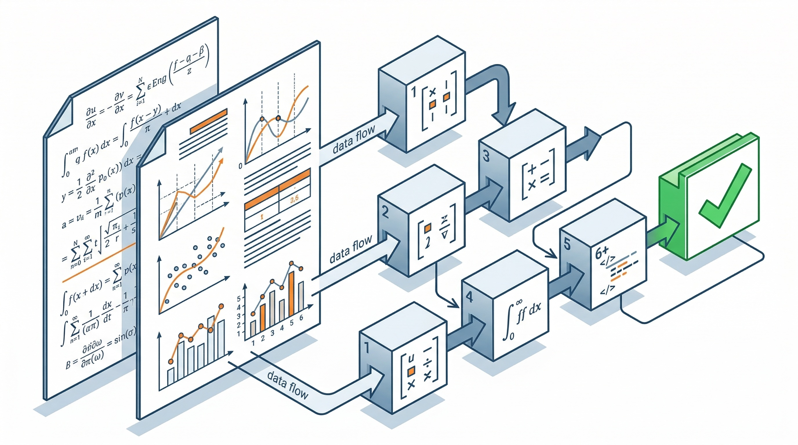

## Papers → Tools

Technical papers publish methods. This series makes them usable.

Each tool takes a method from a peer-reviewed paper and restructures it as a transparent calculation chain: geometry and material go in, engineering quantities come out. Every node has declared inputs, a formula, and declared outputs. The numerical case is worked through step by step so that every intermediate value is visible and verifiable.

Where the source paper contains errors — wrong units, inconsistent constants, conflated quantities — they are identified, corrected, and documented with the reasoning behind the correction.

Each tool ships with a Python notebook (numpy + matplotlib, no other dependencies) that runs on Google Colab. Change the input cell, press Run All, get your result. No installation, no environment setup.

**What this is not:** a library, a software package, or a black box. It is a set of documented, transparent calculations that you can read, check, and modify.
