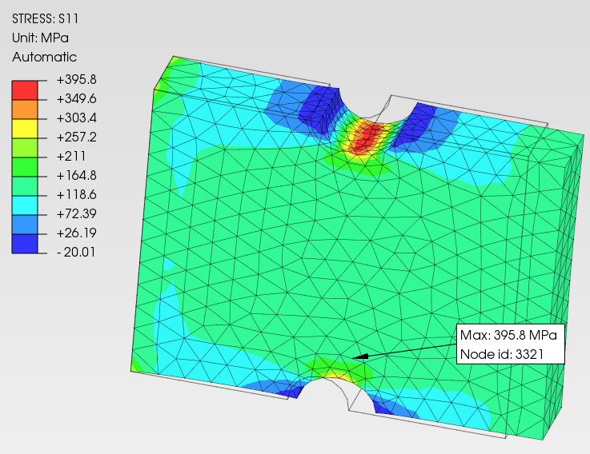

## Fatigue in Notched Plates — Worked Example

When a notched component fails by fatigue, it is rarely a sudden surprise. It is the result of a calculation not done, or done wrong. The method to do it exists, is well established, but is scattered across Peterson, Shigley, and the FEM literature in a way that no single reference makes it immediately applicable.

Hazizi, Ghaleeh, and Rasool (2023) published in *Applied Mechanics* a method to answer this question for flat steel plates with opposite semicircular edge notches — the typical case of tabs, reduced flanges, seal-groove joints, and structural connection plates. The method combines an analytical calculation based on Peterson and Shigley with a FEM verification, and produces both the maximum stress at the notch and the fatigue life in cycles.

This document structures that method as a calculation chain with explicit inputs and outputs for each step, corrects three errors present in the original paper, adds two missing nodes (Marin factors and real-component endurance limit), and includes the tools to replicate it — a Python script and a PrePoMax model — so you can apply it directly to your own case with different geometry and material.

The reference numerical case is the one from the paper: $\sigma_{max}$ analytical $= 379$ MPa, $\sigma_{max}$ FEM $= 395.914$ MPa, $N_f$ analytical $= 2891$ cycles, $N_f$ FEM $= 2882$ cycles (Table 7, Hazizi et al.).

📓 **[Open in Google Colab](https://colab.research.google.com/github/endofwave/engineering-tools/blob/main/static/notebooks/fatica_catena_10_nodi.ipynb)** to run the calculation with your own geometry and material.

### What you will find here

Section 1 — The physics of the notch problem, explained before any formula.
Section 2 — The analytical method: the calculation chain commented node by node, with corrections to the paper's errors.
Section 3 — The Python script: geometry and material in, S-N curve and $N_f$ out.
Section 4 — The PrePoMax model: step-by-step instructions to replicate the FEM.
Section 5 — How to adapt it to your case: which parameters change, and the limits of the method.

### Reference numbers

Geometry: $D = 25.4$ mm, $d = 20.32$ mm, $h = r = 2.54$ mm, $t = 6.35$ mm, $L = 31$ mm, $F = 20195$ N.
Material: alloy steel, $E = 210000$ N/mm², $\nu = 0.28$, $S_{ut} = 724$ N/mm², $\sigma_y = 620$ N/mm².
Paper results (Table 7): $\sigma_{max}$ analytical $= 379$ MPa, $\sigma_{max}$ FEM $= 395.914$ MPa, $N_f$ analytical $= 2891$ cycles, $N_f$ FEM $= 2882$ cycles.

## Section 1 — The physics

### Why a notch is dangerous

A plate under axial load transmits the applied force through its cross-section. Without discontinuities the stress flow lines are parallel and uniformly distributed — every point of the section carries the same share of the load.

A notch interrupts this flow. The lines must detour around the discontinuity and crowd into the narrowed zone at the notch tip. The material in that zone carries a stress much higher than it would if the plate were smooth. This phenomenon is called **stress concentration**.

### The stress concentration factor $K_t$

The ratio between the actual maximum stress at the notch tip and the nominal stress that would be calculated on the net section without perturbation is the **stress concentration factor**:

$$K_t = \frac{\sigma_{max}}{\sigma_{nom}}$$

$K_t$ is always greater than 1. A notch with $K_t = 3$ means the stress at the tip is three times the nominal one. The values of $K_t$ depend exclusively on geometry — not on the material, not on the load.

### $K_t$ and $K_f$ — geometric concentration and fatigue behaviour

$K_t$ is a purely geometric and elastic factor. In fatigue, however, two notches with the same $K_t$ but different tip radii behave differently under cyclic loading.

The reason is the **stress gradient**. With a small radius the gradient is steep — the high-stress zone is confined to a few grains of material. With a large radius the gradient is gentle — the high-stress zone is extensive and involves many grains. The probability that such a zone contains a critical defect capable of initiating a crack is proportional to its volume.

The **fatigue notch factor** $K_f$ captures this effect. It is defined through the **notch sensitivity** $q$ ($0 \leq q \leq 1$):

$$K_f = 1 + q(K_t - 1)$$

When $q = 0$ the material is insensitive to the notch ($K_f = 1$). When $q = 1$ the material feels the full elastic peak ($K_f = K_t$). Real values lie in between.

The operational choice in the calculation is binary: use $K_t$ or $K_f$, never both. $K_f$ replaces $K_t$ — it does not multiply by it. Using $K_t$ directly, as the Hazizi paper does, is a conservative choice because $K_t \geq K_f$: it overestimates the effective fatigue concentration and therefore underestimates life. Those who want to refine the calculation can substitute $K_f$ for $K_t$ in node 3 of the chain — the structure does not change.

### The S-N curve and the endurance limit

Under cyclic loading the material accumulates damage at each cycle even if the stress is well below the static ultimate strength. The relationship between stress amplitude and number of cycles to failure is represented in the **S-N curve** (or Wöhler curve): stress on the vertical axis, number of cycles on a logarithmic horizontal axis.

For steel the S-N curve features an **endurance limit** $S_e$: below this threshold the life is theoretically infinite. For aluminium and other non-ferrous materials the endurance limit does not exist — the curve drops continuously.

### Mean stress and the Goodman diagram

The classical S-N curve is built for **fully reversed** cycles — stress oscillating symmetrically about zero, zero mean stress. In reality the cycle is often asymmetric.

A cycle described by $\sigma_{max}$ and $\sigma_{min}$ has:

$$\sigma_m = \frac{\sigma_{max} + \sigma_{min}}{2} \qquad \sigma_a = \frac{\sigma_{max} - \sigma_{min}}{2}$$

A positive mean stress (tension) adds to the cyclic peak and reduces fatigue life. The **Goodman diagram** corrects the endurance limit in the presence of non-zero mean stress. The safety condition is:

$$\frac{\sigma_a}{S_e} + \frac{\sigma_m}{S_{ut}} \leq 1$$

From which the fully reversed equivalent stress $\sigma_{ar}$ — the symmetric cycle that produces the same damage as the actual asymmetric cycle:

$$\sigma_{ar} = \frac{\sigma_a}{1 - \dfrac{\sigma_m}{S_{ut}}}$$

## Section 2 — The analytical method

### The calculation chain — 10 nodes

The method is articulated in 10 nodes. Each node has declared inputs and outputs. The starting point is geometry and load; the end point is $N_f$.

$$\underbrace{F,\ t,\ D,\ h}_{\text{geometry and load}} \xrightarrow{1} \sigma_{nom} \xrightarrow{2} K_t \xrightarrow{3} \sigma_{max} \xrightarrow{4} S'_e \xrightarrow{5} \underbrace{k_a,\ k_b,\ \ldots}_{\text{Marin}} \xrightarrow{6} S_e \xrightarrow{7} f \xrightarrow{8} a,\ b \xrightarrow{9} \sigma_{ar} \xrightarrow{10} N_f$$

Nodes 1–3 convert geometry and load into maximum stress at the notch. Node 4 produces the endurance limit of the standard specimen. Nodes 5–6 build the real-component endurance limit through the Marin factors. Nodes 7–8 calibrate the component's S-N curve. Nodes 9–10 compare stress and curve to obtain life.

Compared to the Hazizi et al. chain, this version adds two explicit nodes — node 5 (Marin) and node 6 ($S_e$) — absent in the original paper, where the S-N curve is calibrated on the specimen limit $S'_e$ instead of the component limit $S_e$.

### Node 1 — Nominal stress $\sigma_{nom}$

**Input:** $F$, $t$, $D$, $h$
**Output:** $\sigma_{nom}$

The nominal stress is calculated on the net section — what remains after removing the material of the two notches:

$$\sigma_{nom} = \frac{F}{t \times (D - 2h)} = \frac{20195}{6.35 \times (25.4 - 2 \times 2.54)} = \frac{20195}{6.35 \times 20.32} = \frac{20195}{129.03} = 156.5 \ \text{MPa}$$

The denominator $t \times (D - 2h)$ is the area of the resisting section at the notches.

### Node 2 — Stress concentration factor $K_t$

**Input:** $h$, $D$
**Output:** $K_t$

For rectangular plates with opposite semicircular notches, Peterson provides the polynomial formula:

$$K_t = 3.065 - 3.370\left(\frac{2h}{D}\right) + 0.647\left(\frac{2h}{D}\right)^2 + 0.658\left(\frac{2h}{D}\right)^3$$

The dimensionless parameter $2h/D$ measures the fraction of total width removed by the notches. In our case:

$$\frac{2h}{D} = \frac{2 \times 2.54}{25.4} = \frac{5.08}{25.4} = 0.2$$

The notches remove 20% of the width. Substituting:

$$K_t = 3.065 - 3.370 \times 0.2 + 0.647 \times 0.04 + 0.658 \times 0.008$$

$$K_t = 3.065 - 0.674 + 0.026 + 0.005 = 2.422$$

### Node 3 — Maximum stress $\sigma_{max}$

**Input:** $K_t$, $\sigma_{nom}$
**Output:** $\sigma_{max}$

Direct definition of $K_t$:

$$\sigma_{max} = K_t \times \sigma_{nom} = 2.422 \times 156.5 = 379 \ \text{MPa}$$

This is the first validation result: it is compared directly with the peak stress that PrePoMax returns at the notch — $395.914$ MPa in the Hazizi et al. simulation. The difference (4.5%) is typical of analytical-FEM comparison on geometries with stress concentration.

### Node 4 — Specimen endurance limit $S'_e$

**Input:** $S_{ut}$
**Output:** $S'_e$

$S'_e$ is the endurance limit measured on a standard specimen — a cylinder of 7.62 mm diameter, mirror-polished finish, rotating bending load, room temperature. For steels with $S_{ut} < 1400$ MPa the Shigley empirical correlation is:

$$S'_e = 0.55 \times S_{ut} = 0.55 \times 724 = 398 \ \text{MPa}$$

This is the specimen limit, not the real component's. The differences between specimen and component — surface finish, dimensions, load type — are corrected in nodes 5 and 6.

### Node 5 — Marin factors

**Input:** $S_{ut}$, section geometry, operating conditions
**Output:** $k_a$, $k_b$, $k_c$, $k_d$, $k_e$

The Marin factors translate the differences between standard specimen and real component into numerical coefficients. Each factor is $\leq 1$ and corrects a specific discrepancy. The Hazizi paper does not apply them — it uses $S'_e$ directly as if the component were a specimen. This omission is at the root of the $N_f$ divergence discussed at the end of this section.

**$k_a$ — surface finish.** Surface irregularities act as micro-notches and reduce fatigue life. For a machined surface, Shigley provides (Table 6-2, constants in MPa):

$$k_a = a_M \cdot S_{ut}^{b_M} = 4.51 \times 724^{-0.265}$$

Intermediate step: $\log_{10}(724) = 2.860$, so $724^{0.265} = 10^{0.265 \times 2.860} = 10^{0.758} = 5.727$.

$$k_a = \frac{4.51}{5.727} = 0.788$$

**$k_b$ — section size.** The mechanism behind $k_b$ is statistical: larger sections have more volume of highly stressed material, hence a higher probability of containing a critical defect. This applies in bending and torsion, where a stress gradient exists through the section. In pure axial tension the distribution is uniform — no gradient exists, and the mechanism does not operate:

$$k_b = 1.0$$

**$k_c$ — load type.** The standard specimen is tested in rotating bending. For axial loading Shigley (Table 6-7) indicates:

$$k_c = 0.85$$

**$k_d$, $k_e$ — temperature and reliability.** At room temperature and 50% reliability (median):

$$k_d = 1.0 \qquad k_e = 1.0$$

For 90% reliability, $k_e = 0.897$ (Shigley, Table 6-5). The effect of $k_e$ is discussed at node 10.

**Marin factor product:**

$$k_a \times k_b \times k_c \times k_d \times k_e = 0.788 \times 1.0 \times 0.85 \times 1.0 \times 1.0 = 0.670$$

### Node 6 — Component endurance limit $S_e$

**Input:** $S'_e$, Marin product
**Output:** $S_e$

$$S_e = 0.670 \times 398 = 266.6 \ \text{MPa}$$

This is the real component's endurance limit — the fully reversed stress below which life is theoretically infinite for this steel plate, with this finish and this load type.

The Hazizi paper uses $S'_e = 398$ MPa to calibrate the S-N curve. The correct value is $S_e = 266.6$ MPa. The difference is a factor of 1.49 — not negligible.

### Node 7 — Fatigue strength fraction $f$

**Input:** $S_{ut}$
**Output:** $f$ (dimensionless, $0 < f < 1$)

$f$ is the fraction of $S_{ut}$ at which the material endures $10^3$ cycles. It fixes the left anchor point of the S-N curve in the high-cycle range ($10^3$–$10^6$ cycles). Without $f$ the Basquin line cannot be drawn.

Shigley provides the empirical formula (with $S_{ut}$ in MPa):

$$f = 1.06 - 4.1 \times 10^{-4} \times S_{ut} + 1.5 \times 10^{-7} \times S_{ut}^2$$

$$f = 1.06 - 4.1 \times 10^{-4} \times 724 + 1.5 \times 10^{-7} \times 724^2 = 1.06 - 0.297 + 0.079 = 0.842$$

The strength at $10^3$ cycles is therefore $f \cdot S_{ut} = 0.842 \times 724 = 609.5$ MPa.

**Note on units:** Shigley also provides an equivalent formula with $S_{ut}$ in ksi, with different constants. The Hazizi paper uses the ksi version without declaring the conversion — see the critical notes at the end of this section.

### Node 8 — Basquin constants $a$ and $b$

**Input:** $f$, $S_{ut}$, $S_e$
**Output:** $a$ [MPa], $b$ [dimensionless]

The S-N curve in the $10^3$–$10^6$ cycle range is approximately linear in log-log scale. Basquin describes it with a power law $S_f = a \cdot N^b$, calibrated on two anchor points:

$$\text{Point 1:} \quad (N = 10^3, \ S_f = f \cdot S_{ut} = 609.5 \ \text{MPa})$$

$$\text{Point 2:} \quad (N = 10^6, \ S_f = S_e = 266.6 \ \text{MPa})$$

Point 2 uses $S_e$ — the component limit — not the specimen's $S'_e$. This is the structural difference from the paper, where point 2 is $(10^6, \ 398)$.

The constants:

$$a = \frac{(f \cdot S_{ut})^2}{S_e} = \frac{609.5^2}{266.6} = \frac{371{,}490}{266.6} = 1393 \ \text{MPa}$$

$$b = -\frac{1}{3} \log_{10}\left(\frac{f \cdot S_{ut}}{S_e}\right) = -\frac{1}{3} \log_{10}\left(\frac{609.5}{266.6}\right) = -\frac{1}{3} \log_{10}(2.286) = -\frac{1}{3} \times 0.359 = -0.120$$

The slope $|b| = 0.120$ is about twice that of the paper ($|b| = 0.061$). A steeper curve means that life $N_f$ is more sensitive to the applied stress — small changes in $\sigma_{ar}$ produce large changes in $N_f$.

### Node 9 — Equivalent stress $\sigma_{ar}$

**Input:** $\sigma_{max}$, $S_{ut}$
**Output:** $\sigma_{ar}$

The paper's load goes from zero to $F_{max}$ — a pulsating cycle with $\sigma_{min} = 0$. The maximum stress at the notch is $\sigma_{max} = 379$ MPa, so:

$$\sigma_m = \sigma_a = \frac{\sigma_{max}}{2} = \frac{379}{2} = 189.5 \ \text{MPa}$$

Applying the Goodman criterion to convert to the fully reversed equivalent cycle:

$$\sigma_{ar} = \frac{\sigma_a}{1 - \dfrac{\sigma_m}{S_{ut}}} = \frac{189.5}{1 - \dfrac{189.5}{724}} = \frac{189.5}{0.738} = 256.8 \ \text{MPa}$$

**Local stress approach — declared choice.** In this calculation $\sigma_{max} = K_t \cdot \sigma_{nom}$ is the local stress at the notch, and both $\sigma_a$ and $\sigma_m$ carry the $K_t$ amplification. This differs from the standard nominal approach of Shigley (Ch. 6), where $K_f$ multiplies only the alternating component:

$$\sigma_{ar}^{nom} = \frac{K_f \cdot \sigma_{nom,a}}{1 - \dfrac{\sigma_{nom,m}}{S_{ut}}} = \frac{2.422 \times 78.3}{1 - \dfrac{78.3}{724}} = \frac{189.5}{0.892} = 212.5 \ \text{MPa}$$

The local approach gives $\sigma_{ar} = 256.8$ MPa; the nominal one gives $212.5$ MPa — a 21% difference. The local approach is more conservative because it amplifies the mean stress as well, and the justification for not amplifying it (local plastic relaxation of the mean stress) requires the material to yield at the notch tip, which is reasonable for finite fatigue life but less defensible in the elastic regime. The paper uses the local approach and this document follows suit for consistency.

### Node 10 — Fatigue life $N_f$

**Input:** $\sigma_{ar}$, $a$, $b$, $S_e$
**Output:** $N_f$

The inverted Basquin formula gives:

$$N_f = \left(\frac{\sigma_{ar}}{a}\right)^{1/b}$$

but it is applicable only if $\sigma_{ar} > S_e$. If $\sigma_{ar} \leq S_e$ the equivalent stress is below the endurance limit and life is theoretically infinite.

**Result:** $\sigma_{ar} = 256.8$ MPa $< S_e = 266.6$ MPa → $N_f = \infty$ (infinite life).

The margin is 9.8 MPa, equal to 3.7% of $S_e$. This is a minimal margin — any variation in the assumptions will eliminate it.

**Effect of reliability.** With $k_e = 0.897$ (90% reliability) the Marin product drops to 0.601, $S_e$ drops to 239.1 MPa, and the situation reverses: $\sigma_{ar} = 256.8$ MPa $> S_e = 239.1$ MPa → $N_f$ is finite. With recalculated Basquin parameters ($a = 1553$ MPa, $b = -0.135$):

$$N_f = \left(\frac{256.8}{1553}\right)^{1/(-0.135)} = \left(0.165\right)^{-7.39} \approx 591{,}000 \ \text{cycles}$$

This is $\approx 205$ times the FEM result of 2882 cycles. The discrepancy is not a calculation error — it is the comparison of two incompatible frameworks, as clarified in the critical notes that follow.

### Critical notes on the Hazizi et al. paper

This subsection documents the errors identified in the paper and the reason why the original result $N_f = 2891$ cycles coincides only apparently with the FEM.

**Error 1 — Units on $f$ (node 7).** The paper uses the Shigley formula calibrated in ksi but works in MPa in the header. In the calculations it substitutes $S_{ut} = 105$ — which is $724 \div 6.895 = 105.0$ ksi — without documenting the conversion. The result $f = 0.842$ is numerically correct, but anyone substituting 724 MPa in the same formula gets $f = 2.65$ — physically impossible.

**Error 2 — Constant $a$ (node 8).** The paper obtains $a = 1108$ MPa. With the consistent values ($f = 0.842$, $S_{ut} = 724$ MPa, $S'_e = 398$ MPa) the result is $a = 933$ MPa — a 19% difference. The origin of the value 1108 is not reconstructible from the formula $a = (f \cdot S_{ut})^2 / S'_e$ with any consistent combination of inputs.

**Error 3 — $\sigma_{ar}$ (node 9).** The paper writes $S'_e = \sigma_a = \sigma_{ar} = 0.941 \times S_{ut} = 682$ MPa, conflating three physically distinct quantities in a single expression without justification. The coefficient 0.941 is not reconstructible from any known analytical path (Goodman, Gerber, ASME-elliptic). The correct Goodman calculation gives $\sigma_{ar} = 256.8$ MPa — a factor of 2.66 lower.

**The error compensation.** Error 3 inflates $\sigma_{ar}$ from 256.8 to 682 MPa ($\times 2.66$). Error 2 produces a curve with $|b| = 0.061$ instead of 0.120 — halved slope that attenuates the sensitivity of $N_f$ to stress. The two effects balance out and produce $N_f = 2891$ cycles, which happens to approach the FEM (2882 cycles).

**Why the analytical-FEM comparison in the paper does not hold.** The Hazizi FEM uses the ASME Carbon Steel S-N curves (Table 8 of the paper) — tabulated data for carbon steel derived from specimen tests per ASME BPVC. They do not have the same form as the Basquin curve calibrated with Shigley and are not built with the same parameters. The two methods use different material data, built with different methodologies, for different applications. The convergence $2891 \approx 2882$ is not a genuine agreement — it is the product of three compensating errors applied to a non-homogeneous comparison.

The discrepancy of $\approx 200\times$ between the correct result (591,000 cycles at 90% reliability) and the FEM (2882 cycles) is not anomalous in this context: it is the expected difference when two frameworks use radically different S-N curves. It cannot be resolved by adjusting analytical parameters — it requires choosing a single set of S-N data and applying it consistently in both methods.

**What remains valid.** The geometry is correct. Nodes 1–3 ($\sigma_{nom}$, $K_t$, $\sigma_{max} = 379$ MPa analytical, 395.9 MPa FEM) are correct and replicable — the FEM is a valid benchmark for the maximum stress. The conceptual structure of the method (analytical chain + FEM verification) is correct. The errors are in nodes 7–9 of the paper's original chain and do not invalidate the approach — they make it inapplicable without the corrections documented here.

## Section 3 — The Python script

### What it does

The notebook `fatica_catena_10_nodi.ipynb` implements the complete analytical chain described in Section 2. It takes geometry, load, and material as input, and returns three outputs: numerical values of each node printed to console, the component's S-N curve with the operating point highlighted, and the $N_f$ verdict with the margin relative to $S_e$.

The dependencies are two: `numpy` and `matplotlib`. No external fatigue library — the chain is more transparent written from scratch with the formulas documented in Section 2.

### Notebook structure

The notebook has 19 cells, alternating between markdown (explanations with formulas) and code (calculations and plots). The sequence follows the 10 nodes of the chain.

**Input cell** — all modifiable parameters are grouped in the first code cell: geometry ($D$, $h$, $r$, $t$, $L$), load ($F$), material ($S_{ut}$, $S_y$), surface finish constants ($a_M$, $b_M$), load type ($k_c$), and reliability ($k_e$). To adapt the calculation to your own case it is sufficient to modify this cell and rerun everything.

**Nodes 1–3** — from geometry to maximum stress at the notch. Peterson's formula for opposite semicircular notches calculates $K_t$, then $\sigma_{max} = K_t \cdot \sigma_{nom}$.

**Nodes 4–6** — from material to component endurance limit. $S'_e = 0.55 \cdot S_{ut}$ for the specimen, then the Marin factors ($k_a$ finish, $k_b$ size, $k_c$ load, $k_d$ temperature, $k_e$ reliability) reduce it to the real component's $S_e$.

**Nodes 7–8** — S-N Basquin curve calibration. The fraction $f$ fixes the point at $10^3$ cycles, then constants $a$ and $b$ define the log-log line between $(10^3,\, f \cdot S_{ut})$ and $(10^6,\, S_e)$.

**Node 9** — equivalent stress $\sigma_{ar}$ with Goodman (local stress approach, pulsating cycle $0 \to \sigma_{max}$).

**Node 10** — verdict: if $\sigma_{ar} \leq S_e$ life is infinite, otherwise $N_f = (\sigma_{ar}/a)^{1/b}$.

**S-N plot** — Basquin curve + $S_e$ plateau + operating point $\sigma_{ar}$ highlighted. If life is finite, projection lines show where the point intercepts the curve.

**Reliability comparison** — the final cell reruns the chain for $k_e = 1.000$ (50%) and $k_e = 0.897$ (90%) and overlays the two S-N curves. The summary table shows how the reliability change flips the verdict from infinite life to $N_f = 591{,}000$ cycles.

### Reference values

The following table compares the notebook results with the values verified in Section 2. The script does not round intermediate results — small differences in the last digit (e.g. 379.1 vs 379) are due to the rounding chain in the text.

| Node | Quantity | Section 2 | Notebook |
|:----:|:--------:|:---------:|:--------:|
| 1 | $\sigma_{nom}$ | 156.5 MPa | 156.5 MPa |
| 2 | $K_t$ | 2.422 | 2.422 |
| 3 | $\sigma_{max}$ | 379 MPa | 379.1 MPa |
| 4 | $S'_e$ | 398 MPa | 398.2 MPa |
| 5 | $k_a$ | 0.788 | 0.788 |
| 5 | Marin | 0.670 | 0.670 |
| 6 | $S_e$ | 266.6 MPa | 266.6 MPa |
| 7 | $f$ | 0.842 | 0.842 |
| 8 | $a$ | 1393 MPa | 1393 MPa |
| 8 | $b$ | $-0.120$ | $-0.120$ |
| 9 | $\sigma_{ar}$ | 256.8 MPa | 256.8 MPa |
| 10 | $N_f$ (50%) | $\infty$ | $\infty$ |
| 10 | $N_f$ (90%) | 591,000 | 591,467 |

### How to use it

The notebook is designed for Google Colab: open it, modify the input cell with your geometry and material, and press **Runtime → Run all**. The surface finish constants ($a_M$, $b_M$) are commented in the input cell with values for ground, machined, hot-rolled, and as-forged — choose the one matching your component. Same for $k_c$ (bending, axial, torsion) and $k_e$ (reliability).

Two points to check when changing case:

Peterson's formula at node 2 is valid for rectangular plates with opposite semicircular notches ($h = r$). For other notch geometries (V-notch, U-notch, keyhole) the polynomial changes — replace with the correct coefficients from Peterson or Pilkey.

The coefficient $k_b = 1.0$ is valid for pure axial loading. If the load is in bending or torsion, $k_b$ depends on the section size according to Shigley's correlations (Tab. 6-8) — it must be calculated as a function of the equivalent diameter.

### Note — pyLife for full-field analysis

This notebook covers the calculation at a single point: the notch tip. To extend the fatigue analysis to the entire stress field returned by FEM — evaluating every mesh node — the reference is **pyLife** (Bosch Research): an open-source library that integrates Wöhler curves, mean stress correction, and post-processing of FEM results in standard formats. The workflow would be: CalculiX → `.frd` file → pyLife → $N_f$ map over the entire component.

## Section 4 — The PrePoMax model

### Objective

Replicate the paper's FEM result: $\sigma_{max} = 395.914$ MPa at the notch tip, under axial load $F = 20195$ N. The model uses the same geometric and material data as the analytical chain — the verification is cross-checked.

The sequence is in three blocks: CAD geometry in Onshape → STEP export → setup and analysis in PrePoMax.

### Block 1 — CAD geometry in Onshape

#### Modelling strategy

The notched plate profile is not drawn as a closed contour with arcs. Instead, the **extrude + boolean** strategy is used:

1. Extrude the full rectangle $L \times D \times t$
2. Extrude two cylinders of radius $r$, centred on the edges $Y = \pm D/2$ at mid-length
3. Subtract the cylinders from the plate with a boolean subtraction

This approach is more robust than the arc-profile method because it avoids ambiguities in sketch region selection.

#### Opening the Feature Studio

In Onshape, Part Studio → `{}` button in the toolbar (or **Tools → FeatureScript editor**). The **Feature Studio 1** tab opens. Paste the following script, replacing all content.

#### FeatureScript script

```featurescript
FeatureScript 2909;
import(path : "onshape/std/common.fs", version : "2909.0");

annotation { "Feature Type Name" : "Notched Plate" }
export const notchedPlate = defineFeature(function(context is Context, id is Id, definition is map)
    precondition {}
    {
        // Geometry from the paper — Hazizi et al. 2023
        const L = 31   * millimeter;   // total length
        const D = 25.4 * millimeter;   // total width
        const t = 6.35 * millimeter;   // thickness
        const r = 2.54 * millimeter;   // notch radius = depth h

        // Step 1 - full rectangle
        var skRect = newSketch(context, id + "skRect", {
            "sketchPlane" : qCreatedBy(makeId("Front"), EntityType.FACE)
        });
        skRectangle(skRect, "rect", {
            "firstCorner"  : vector(-L/2, -D/2),
            "secondCorner" : vector( L/2,  D/2)
        });
        skSolve(skRect);

        var regionRect = qSketchRegion(id + "skRect");
        var normalRect = evOwnerSketchPlane(context, { "entity" : regionRect }).normal;
        opExtrude(context, id + "extRect", {
            "entities"  : regionRect,
            "direction" : normalRect,
            "endBound"  : BoundingType.BLIND,
            "endDepth"  : t
        });

        // Step 2 - lower notch cylinder (edge Y = -D/2)
        var skBot = newSketch(context, id + "skBot", {
            "sketchPlane" : qCreatedBy(makeId("Front"), EntityType.FACE)
        });
        skCircle(skBot, "circ", {
            "center" : vector(0 * millimeter, -D/2),
            "radius" : r
        });
        skSolve(skBot);

        var regionBot = qSketchRegion(id + "skBot");
        var normalBot = evOwnerSketchPlane(context, { "entity" : regionBot }).normal;
        opExtrude(context, id + "extBot", {
            "entities"  : regionBot,
            "direction" : normalBot,
            "endBound"  : BoundingType.BLIND,
            "endDepth"  : t
        });

        // Step 3 - upper notch cylinder (edge Y = +D/2)
        var skTop = newSketch(context, id + "skTop", {
            "sketchPlane" : qCreatedBy(makeId("Front"), EntityType.FACE)
        });
        skCircle(skTop, "circ", {
            "center" : vector(0 * millimeter, D/2),
            "radius" : r
        });
        skSolve(skTop);

        var regionTop = qSketchRegion(id + "skTop");
        var normalTop = evOwnerSketchPlane(context, { "entity" : regionTop }).normal;
        opExtrude(context, id + "extTop", {
            "entities"  : regionTop,
            "direction" : normalTop,
            "endBound"  : BoundingType.BLIND,
            "endDepth"  : t
        });

        // Step 4 - boolean subtraction
        opBoolean(context, id + "bool", {
            "targets"   : qCreatedBy(id + "extRect", EntityType.BODY),
            "tools"     : qUnion([
                              qCreatedBy(id + "extBot", EntityType.BODY),
                              qCreatedBy(id + "extTop", EntityType.BODY)
                          ]),
            "operationType" : BooleanOperationType.SUBTRACTION
        });
    });
```

#### FeatureScript version

The version number in the header (`2909`) must match the one shown by Onshape in the editor when opened. If different, replace `2909` with the correct number — the geometric logic does not change.

#### Geometric verification

After clicking **Commit** and activating the feature in the Part Studio, check in the viewport:

- Width at the notch section: $d = D - 2r = 25.4 - 5.08 = 20.32$ mm
- The two notches are symmetric and centred at mid-length ($x = 0$)
- The thickness is uniform: $t = 6.35$ mm

#### STEP export

Right-click on **Part 1** in the feature tree → **Export** → Format: **STEP**, Version: **AP214** → file name: `piastra_intagliata.step`.

### Block 2 — Setup in PrePoMax

#### Model creation

File → New → Model space: **3D** → Unit system: **mm, ton, s, °C** (standard mechanical units, forces in N, stresses in MPa).

File → Import → select `piastra_intagliata.step`.

#### Material

Model → Materials → Create:

- Name: `Steel_Hazizi`
- Elasticity → Elastic:
  - Young's modulus: `210000` MPa
  - Poisson's ratio: `0.28`

**Note on units:** $1 \ \text{MPa} = 1 \ \text{N/mm}^2$. The value `210000` is correct in the mm/N system.

#### Section

Model → Sections → Create → **Solid Section**:

- Material: `Steel_Hazizi`
- Region: click the solid in the viewport → OK

#### Global mesh with local refinement

Local refinement at the notch is essential. Without it the default mesh underestimates $\sigma_{max}$ by about 10%.

Tab **Geometry** → menu **Mesh** → **Mesh Setup Item** → **Create** → **Local Mesh Size**:

- Region: select the **curved face of the notch** in the viewport (both semicircular faces)
- Element size: `0.5` mm

The value 0.5 mm corresponds to about $r/5 = 2.54/5$ — it guarantees at least 8–10 elements on the semicircular profile.

After setting the Local Mesh Size, menu **Mesh** → **Create Mesh**.

#### Step and boundary conditions

Tree → Steps → right-click → **New** → **Static Step** (linear elastic analysis, static load).

Expand Step-1:

**Constraint** — right-click on **BCs** → New → **Fixed**:
- Select the left short face (end $x = -L/2$)
- All degrees of freedom locked

**Load** — right-click on **Loads** → New → **Surface Traction**:
- Select the right short face (end $x = +L/2$)
- Component 1 (X direction): `20195` N
- Components 2 and 3: `0`

**Note:** Surface Traction in PrePoMax accepts the total force in N, not the pressure. Do not divide by the area.

#### Execution

Right-click on **PiastraIntagliata** in Analyses → **Run**.

### Block 3 — Reading the results

#### Component to read

The load is axial in the X direction. The relevant stress component is **S11** — normal stress in the load direction. Von Mises (MISES) is not the correct quantity for comparison with $K_t \cdot \sigma_{nom}$.

Tab Results → STRESS → **S11**.

#### Result obtained

| Quantity | Paper (Table 7) | FEM obtained | Deviation |
|---|---|---|---|
| $\sigma_{max}$ S11 | $395.914$ MPa | $395.8$ MPa | $0.03\%$ |



The deviation is negligible. The model is validated.

#### Stress map interpretation

The S11 peak concentrates at the notch tip on the tension side. The expected distribution is:

- **Red** (maximum): notch tip, tension-loaded side
- **Green** (nominal): zone away from the notches — corresponds to $\sigma_{nom} = 156.5$ MPa
- **Blue** (minimum, negative): opposite edge of the notch, transverse compression due to Poisson's effect

The symmetry of the map across both notches is the most immediate qualitative check of model correctness.

#### FEM-derived $K_t$ verification

The FEM allows extracting $K_t$ experimentally as the ratio of peak to nominal:

$$K_t^{FEM} = \frac{\sigma_{max}^{FEM}}{\sigma_{nom}} = \frac{395.8}{156.5} = 2.529$$

The analytical value from Peterson is $K_t = 2.422$. The 4.4% difference is expected: the FEM captures local three-dimensional effects that Peterson's formula, calibrated on infinite plane geometries, does not include.

### Operational notes

**Mesh convergence:** the result with Local Mesh Size = 0.5 mm is converged for this case. For geometries with smaller notch radii ($r < 1$ mm) it may be necessary to go down to 0.2 mm or less.

**Element type:** PrePoMax generates second-order tetrahedra (C3D10) by default with STEP geometry. Second-order elements are necessary to capture the stress gradient at the notch — do not use linear elements (C3D4) for this type of analysis.

**Constraint condition:** the full Fixed constraint on the left face overrides transverse degrees of freedom and can introduce local edge effects. For a geometry with $L/D = 31/25.4 = 1.22$ the ratio is low — in a refined model one would use symmetry constraints or a constraint that allows free transverse contraction. For the peak stress verification at the notch, far from the constraint, the effect is negligible.

## Section 5 — How to adapt it to your case

The entire calculation of Sections 2 and 3 is built on a specific case: rectangular alloy steel plate, opposite semicircular notches, pulsating axial load. This section explains how to go from that case to yours.

### From component to parameters

The following table maps four typical components to the chain nodes that change relative to the notebook. Unlisted nodes remain unchanged — only the numerical values in the input cell change.

| Component | Description | Nodes to modify | What changes |
|:----------|:------------|:---------------:|:-------------|
| Bolted tab | Plate with semicircular notches, axial load, structural steel | none | Numbers only: $D$, $h$, $t$, $F$, $S_{ut}$, finish (typically hot-rolled: $a_M = 57.7$, $b_M = -0.718$) |
| Grooved flange | Plate with deeper notches ($2h/D > 0.3$), same type | none | Numbers only. Peterson's polynomial remains valid for $2h/D$ up to $\sim 0.5$. Beyond that, verify with Peterson/Pilkey |
| Plate with hole | Central circular hole instead of edge notches | Node 2 | Peterson's polynomial changes: need coefficients for hole in finite plate (Peterson, Fig. 4.1). Nodes 4–10 remain identical |
| Shaft with groove | Cylindrical section, circumferential notch, rotating bending load | Nodes 2, 5 | $K_t$ from Peterson for grooved shaft (Fig. 2.26). $k_b$ depends on diameter ($k_b < 1$ for $d > 7.62$ mm). $k_c = 1.0$ (the specimen is in rotating bending) |

If your component does not fit any of these four cases but has simple geometry, uniaxial loading, and ferrous material, the method is probably still applicable — you just need to identify which $K_t$ to use and which Marin factors to update.

### What to replace

The notebook parameters are organised in four categories. For each, the reference where to find the values for your own case.

**Geometry** — $D$, $h$, $r$, $t$. In the notebook $h = r$ because the notch is semicircular. For a U-notch with flat bottom $h \neq r$ and the ratio $h/r$ enters separately in the $K_t$ polynomial. The parameter $L$ (total length) is not used in the analytical calculation — it is only needed for the FEM model.

**Load** — $F$ and cycle type. The notebook assumes a pulsating cycle $0 \to F$, which produces $\sigma_a = \sigma_m = \sigma_{max}/2$. If the cycle is different, for example fully reversed ($\sigma_{min} = -\sigma_{max}$, hence $\sigma_m = 0$) or with a generic ratio $R = \sigma_{min}/\sigma_{max}$, the formulas at node 9 must be recalculated:

$$\sigma_a = \frac{\sigma_{max} - \sigma_{min}}{2} \qquad \sigma_m = \frac{\sigma_{max} + \sigma_{min}}{2}$$

With $\sigma_m = 0$ the Goodman correction vanishes and $\sigma_{ar} = \sigma_a$ directly.

**Material** — $S_{ut}$ and surface finish constants. The constants $a_M$ and $b_M$ depend on the type of machining and are tabulated in Shigley (Tab. 6-2) for four categories: ground ($a_M = 1.58$, $b_M = -0.085$), machined/cold-drawn ($4.51$, $-0.265$), hot-rolled ($57.7$, $-0.718$), as-forged ($272$, $-0.995$). Values are in MPa units — do not use the ksi constants without converting. For $S_{ut} \geq 1400$ MPa the correlation $S'_e = 0.55 \cdot S_{ut}$ no longer holds and the ceiling $S'_e = 700$ MPa is used.

**Marin factors** — each has its own reference:
$k_a$ follows from the finish (Shigley Tab. 6-2, see above).
$k_b$ equals 1.0 for axial loading. For bending and torsion it depends on the equivalent diameter (Shigley Eq. 6-19 and Tab. 6-8): $k_b = 1.24 \cdot d^{-0.107}$ for $2.79 \leq d \leq 51$ mm, $k_b = 1.51 \cdot d^{-0.157}$ for $51 < d \leq 254$ mm. For non-circular sections the equivalent diameter $d_e$ from Shigley (Tab. 6-8) is used.
$k_c$ equals 0.85 for axial loading, 1.0 for rotating bending, 0.59 for torsion (Shigley Tab. 6-7).
$k_d$ equals 1.0 at room temperature. For elevated temperatures Shigley provides the correlation (Tab. 6-11 and Eq. 6-27).
$k_e$ depends on the desired reliability: 1.000 at 50%, 0.897 at 90%, 0.868 at 95%, 0.814 at 99% (Shigley Tab. 6-5).

### What requires a different equation

Three chain nodes cannot be updated by changing a number — they require a different equation.

**Node 2 — the $K_t$ polynomial.** The formula in the notebook is valid exclusively for rectangular plates with two opposite semicircular notches ($h = r$). For other notch geometries the polynomial changes. The main references are Peterson's *Stress Concentration Factors* (Pilkey & Pilkey, 3rd ed.) and the ESDU online charts. Some common cases: circular hole in finite plate (Peterson Fig. 4.1), grooved shaft under bending (Fig. 2.26), grooved shaft under torsion (Fig. 2.47). Each case has its own set of coefficients and its own dimensionless parameter — always verify the range of validity.

**Node 5 — $k_b$ in bending and torsion.** In axial loading $k_b = 1.0$ because the stress distribution is uniform. In bending and torsion a gradient exists and the volume of highly stressed material grows with section size. The Shigley correlations for $k_b$ as a function of diameter are reported in the previous block. For non-circular sections (rectangular, tubular) one goes through the equivalent diameter $d_e$ that preserves the same highly stressed volume ($\geq 95\%$ of peak).

**Node 9 — the mean stress criterion.** The notebook uses Goodman, which is the most common and most conservative among linear criteria. For situations where Goodman is too conservative it can be replaced with Gerber (parabolic) or ASME-elliptic. The formulas for $\sigma_{ar}$:

Goodman: $\displaystyle\sigma_{ar} = \frac{\sigma_a}{1 - \dfrac{\sigma_m}{S_{ut}}}$

Gerber: $\displaystyle\sigma_{ar} = \frac{\sigma_a}{1 - \left(\dfrac{\sigma_m}{S_{ut}}\right)^2}$

ASME-elliptic: $\displaystyle\sigma_{ar} = \frac{\sigma_a}{\sqrt{1 - \left(\dfrac{\sigma_m}{S_y}\right)^2}}$

Goodman uses $S_{ut}$ in the denominator, ASME-elliptic uses $S_y$. For $\sigma_m > 0$ Gerber gives lower $\sigma_{ar}$ than Goodman — it estimates a longer life. The choice depends on the acceptable level of conservatism and sector practice.

### Limits of the method

Four conditions where the 10-node chain is not applicable. In each case the alternative framework is indicated.

**Non-ferrous materials (aluminium, titanium, copper).** The S-N curve has no plateau — no endurance limit $S_e$ exists in the steel sense. A conventional limit at $5 \times 10^8$ cycles (or the value specified by the applicable standard) is used and the Basquin line extends beyond $10^6$. The Marin factors and the $f$ formula are calibrated on steels — for other materials, specific experimental data are needed.

**Notch-tip plasticity.** If $\sigma_{max} > S_y$ the material yields locally and the elastic approach ($\sigma_{max} = K_t \cdot \sigma_{nom}$) overestimates the actual stress. Neuber's rule ($K_t \cdot \sigma_{nom} = \sqrt{K_\sigma \cdot K_\varepsilon} \cdot \sigma_{nom}$) and a strain-life approach (Coffin-Manson) working in strain rather than stress are needed. This is typical of low-cycle fatigue ($N_f < 10^3$).

**Multiaxiality.** The chain assumes a uniaxial stress state. If stresses in multiple directions coexist at the notch (bending + torsion, internal pressure + axial load), an equivalent stress criterion is needed: von Mises for ductile materials (Sines, Crossland) or maximum principal stress for brittle materials. The choice of criterion and the definition of equivalent multiaxial $\sigma_a$ and $\sigma_m$ are a chapter on their own — Shigley Ch. 6.14 and Socie & Marquis (2000).

**Variable amplitude loading spectrum.** The chain runs a constant-amplitude cycle. If the real load is a spectrum with variable amplitudes (vibrations, measured operational loads), Palmgren-Miner's cumulative damage rule ($\sum n_i / N_{f,i} = 1$) and a cycle counting method (rainflow) are needed. The notebook computes $N_f$ for a single stress level — Miner combines multiple levels into cumulative damage. pyLife (Bosch Research) handles this complete workflow from FEM results.

## Appendix — Basquin equation: origin and limits

Oswald Basquin in 1910 observed that experimental fatigue data, when plotted in log-log scale (log $S$ vs log $N$), show an approximately linear trend in the finite-life range. This log-log linearity is equivalent to a power law in linear scale:

$$S_f = a \cdot N^b$$

It is not a physical law derived from first principles — it is an empirical fit. It is used because it is simple to calibrate with only two points, it allows analytical inversion to find $N$ given $S$, and it works well in the $10^3$–$10^6$ cycle range for steels and common alloys.

Inverting for $N$:

$$N_f = \left(\frac{S_f}{a}\right)^{1/b}$$

The formula is valid only in the range $[S_e,\ f \cdot S_{ut}]$. Outside: for $S_f < S_e$ the curve is horizontal (infinite life for steel); for $S_f > f \cdot S_{ut}$ the line is not calibrated.

The main limitations are three: it is not valid outside the calibration range; it does not describe the endurance limit plateau (which requires separate treatment); the parameters $a$ and $b$ depend on the load type (rotating bending, axial, torsion) and must be derived for the specific load type.

## References

- Hazizi, K., Ghaleeh, M., & Rasool, G. (2023). Stress analysis and fatigue life prediction of notched plate. *Applied Mechanics*, 4(2), 586–607.
- Peterson, R. E. (1974). *Stress Concentration Factors*. Wiley. See also: Pilkey, W. D. & Pilkey, D. F. (2008), 3rd ed.
- Budynas, R. G. & Nisbett, J. K. (2020). *Shigley's Mechanical Engineering Design*, 11th ed. McGraw-Hill.
- Basquin, O. H. (1910). The exponential law of endurance tests. *Proc. ASTM*, 10, 625–630.
