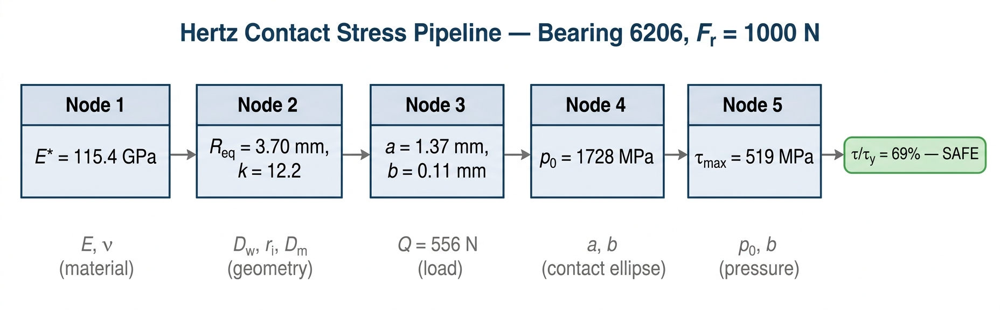
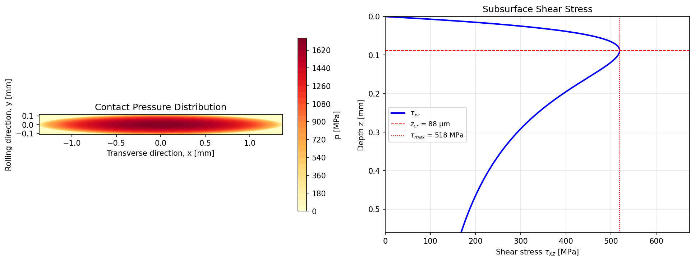
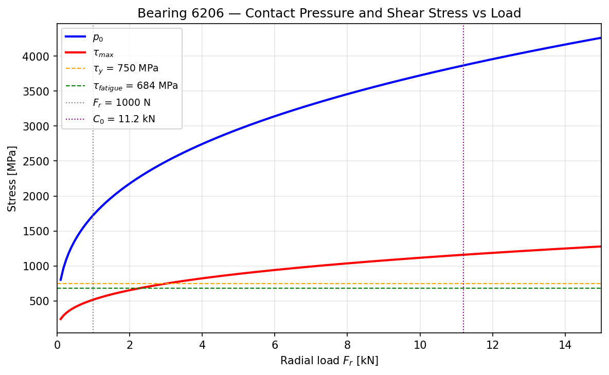

<iframe 
  src="/widgets/A2_hertz_calculator.html"
  style="height:1100px;"
  loading="lazy"
  title="A2 Hertz Contact Stress Calculator">
</iframe>

## Quick Example

> **What this tool does, in 30 seconds.**
> Given a bearing designation and a radial load, the pipeline computes the maximum
> subsurface shear stress and tells you how close you are to the material limit.

**Input:** Bearing 6206, radial load 1000 N, AISI 52100 steel ( $E = 210$ GPa, $\nu = 0.3$ ).
Ball Ø 9.525 mm, inner groove radius 4.89 mm, pitch diameter 46.0 mm, 9 balls, $\alpha = 0°$.

$$
\boxed{\tau_{\max} = 519 \text{ MPa} \quad \text{at} \quad z_{cr} = 88 \;\mu\text{m below the surface}}
$$

The maximum subsurface shear stress is **69 % of the shear yield strength** of hardened
AISI 52100 ( $\tau_y \approx 750$ MPa, Tresca). **Margin to yield: 31 %.** Infinite fatigue
life expected at this load level.

| Check | Value | Limit | Status |
|:------|------:|------:|:-------|
| $\tau_{\max} / \tau_y$ | 69 % | 100 % | Safe — 31 % margin |
| $\tau_{\max} / \tau_{fatigue}$ | 76 % | 100 % | Below fatigue limit |
| $F_r / C_0$ | 8.9 % | 100 % | Light load |

| Node | Quantity | Value | Unit |
|:----:|:---------|------:|:-----|
| 1 | Reduced elastic modulus $E^*$ | 115.4 | GPa |
| 2 | Equivalent radius $R_{eq}$ | 3.700 | mm |
| 2b | Ellipticity $k = a/b$ | 12.19 | — |
| 3 | Contact semi-axes $a \times b$ | 1.368 × 0.112 | mm |
| 4 | Max contact pressure $p_0$ | 1728 | MPa |
| 5 | Max shear stress $\tau_{\max}$ | 519 | MPa |
| 5 | Critical depth $z_{cr}$ | 88 | μm |

📓 **[Open in Google Colab](https://colab.research.google.com/github/endofwave/engineering-tools/blob/main/static/notebooks/hertz_contact_stress_pipeline.ipynb)** to run the calculation with your own bearing data.

---

## Pipeline Overview

The pipeline takes bearing geometry, material properties, and radial load as input.
It outputs the maximum subsurface shear stress $\tau_{\max}$ and its depth $z_{cr}$,
which govern fatigue initiation at the ball–raceway contact.

The pipeline is **linear and non-iterative**. The only potentially iterative step
(elliptic integrals in Node 2b) is handled by the Hamrock-Brewe closed-form
approximation.

---

## Node 1 — Reduced Elastic Modulus $E^*$

**Purpose:** combine the elastic properties of ball and raceway into a single
equivalent modulus.

| Symbol | Description | Unit |
|:------:|:------------|:-----|
| $E_1$ | Young's modulus, ball | Pa |
| $\nu_1$ | Poisson's ratio, ball | — |
| $E_2$ | Young's modulus, raceway | Pa |
| $\nu_2$ | Poisson's ratio, raceway | — |

$$
\frac{1}{E^*} = \frac{1 - \nu_1^2}{E_1} + \frac{1 - \nu_2^2}{E_2}
$$

Harris convention (used in Nodes 3–4):

$$E' = 2 \, E^*$$

| Output | Description | Unit |
|:------:|:------------|:-----|
| $E^*$ | Reduced elastic modulus | Pa |
| $E'$ | Harris reduced modulus | Pa |

---

## Node 2 — Curvatures and Equivalent Radius

**Purpose:** compute the four principal curvatures at the ball–inner-race contact
and combine them into an equivalent radius $R_{eq}$ and an ellipticity parameter.

| Input | Description | Unit |
|:-----:|:------------|:-----|
| $D_w$ | Ball diameter | m |
| $r_i$ | Inner race groove radius | m |
| $D_m$ | Pitch (mean) diameter | m |
| $\alpha$ | Contact angle | rad |

The two principal planes at the contact point are:

- **Plane I (rolling direction):** circumferential plane through ball centre.
- **Plane II (transverse direction):** axial cross-section through ball centre.

**Ball** (sphere):
$$\rho_{1x} = \rho_{1y} = \frac{2}{D_w}$$

**Inner raceway:**
$$
\rho_{2x} = \frac{2}{D_m - D_w \cos\alpha}
\qquad\text{(convex, rolling)}
$$
$$
\rho_{2y} = -\frac{1}{r_i}
\qquad\text{(concave, transverse)}
$$

The negative sign indicates that the groove is concave — it wraps around the ball.

**Curvature sums:**
$$
\frac{1}{R_x} = \rho_{1x} + \rho_{2x}
\qquad
\frac{1}{R_y} = \rho_{1y} + \rho_{2y}
$$

$$
\Sigma\rho = \frac{1}{R_x} + \frac{1}{R_y}
\qquad
R_{eq} = \frac{1}{\Sigma\rho}
$$

### Ellipticity (Hamrock-Brewe 1983)

The ratio $R_y/R_x$ determines the shape of the contact ellipse.
The Hamrock-Brewe closed-form approximation replaces iterative
evaluation of complete elliptic integrals:

$$
k = 1.0339\left(\frac{R_y}{R_x}\right)^{0.6360}
$$

$$
\mathcal{E} = 1.0003 + \frac{0.5968}{R_y/R_x}
\qquad
\mathcal{F} = 1.5277 + 0.6023 \, \ln\!\left(\frac{R_y}{R_x}\right)
$$

where $k = a/b$ is the ellipticity ratio, $\mathcal{E}$ the complete elliptic
integral of the second kind, $\mathcal{F}$ the first kind.
Accurate to < 1 % for $R_y/R_x > 1$.

> **Why Hamrock-Brewe?** Exact evaluation requires iterative root-finding
> (the argument depends on $k$, which depends on the integrals). The Hamrock-Brewe
> formulas break this circularity, keeping the pipeline non-iterative and scipy-free.

| Output | Description | Unit |
|:------:|:------------|:-----|
| $R_{eq}$ | Equivalent radius | m |
| $k$ | Ellipticity ratio $a/b$ | — |
| $\mathcal{E}$ | Elliptic integral, 2nd kind | — |
| $\mathcal{F}$ | Elliptic integral, 1st kind | — |

---

## Node 3 — Contact Ellipse Semi-Axes

**Purpose:** compute the dimensions of the elliptical contact patch.

The load on the most-loaded ball follows the **Stribeck equation** (zero clearance):

$$
Q_{\max} = \frac{5 \, F_r}{Z \, \cos\alpha}
$$

Contact semi-axes (Hamrock-Dowson):

$$
b = \left(\frac{6 \, \mathcal{E} \, Q \, R_{eq}}{\pi \, k \, E'}\right)^{1/3}
\qquad
a = k \, b
$$

where $a$ is the major semi-axis (transverse) and $b$ the minor (rolling direction).

| Output | Description | Unit |
|:------:|:------------|:-----|
| $Q_{\max}$ | Load on most-loaded ball | N |
| $a$ | Major semi-axis | m |
| $b$ | Minor semi-axis | m |

---

## Node 4 — Maximum Contact Pressure

**Purpose:** peak Hertzian pressure at the centre of the contact ellipse.

$$
p(x, y) = p_0 \sqrt{1 - \frac{x^2}{a^2} - \frac{y^2}{b^2}}
$$

$$
p_0 = \frac{3 \, Q}{2 \, \pi \, a \, b}
$$

| Output | Description | Unit |
|:------:|:------------|:-----|
| $p_0$ | Maximum contact pressure | Pa |

---

## Node 5 — Maximum Shear Stress and Critical Depth

**Purpose:** maximum subsurface shear stress (Tresca) and the depth where
fatigue cracks initiate.

For $k \gg 1$ (highly elliptical, typical of ball bearings), the stress field
approximates **2D plane-strain Hertz contact** in the $b$-direction (< 1 % error
for $k > 5$).

Subsurface stresses along the $z$-axis:

$$
\frac{\sigma_x}{p_0} = -\left[\frac{1 + 2\zeta^2}{\sqrt{1+\zeta^2}} - 2\zeta\right]
\qquad
\frac{\sigma_z}{p_0} = -\frac{1}{\sqrt{1+\zeta^2}}
\qquad
\zeta = z/b
$$

$$
\sigma_y = \nu \, (\sigma_x + \sigma_z)
\qquad
\tau = \frac{\sigma_x - \sigma_z}{2}
$$

Analytical maximum:

$$
\tau_{\max} = 0.300 \, p_0
\qquad\text{at}\qquad
\zeta_{cr} = 0.786
\qquad\Rightarrow\qquad
z_{cr} = 0.786 \, b
$$

| Output | Description | Unit |
|:------:|:------------|:-----|
| $\tau_{\max}$ | Maximum subsurface shear stress | Pa |
| $z_{cr}$ | Critical depth below surface | m |

---

## Numerical Verification — Bearing 6206

### Input Data

| Parameter | Symbol | Value | Unit | Source |
|:----------|:------:|------:|:-----|:-------|
| Bore diameter | $d$ | 30 | mm | Catalog |
| Outer diameter | $D$ | 62 | mm | Catalog |
| Ball diameter | $D_w$ | 9.525 | mm | Catalog |
| Number of balls | $Z$ | 9 | — | Catalog |
| Inner groove radius | $r_i$ | 4.89 | mm | Catalog ( $f_i = 0.513$ ) |
| Pitch diameter | $D_m$ | 46.0 | mm | $(d+D)/2$ |
| Contact angle | $\alpha$ | 0 | ° | Deep groove, radial |
| Young's modulus | $E$ | 210 | GPa | AISI 52100 |
| Poisson's ratio | $\nu$ | 0.3 | — | AISI 52100 |
| Radial load | $F_r$ | 1000 | N | Test condition |
| Static load rating | $C_0$ | 11.2 | kN | SKF catalog |

### Node-by-Node Computation

**Node 1:**
$$
\frac{1}{E^*} = 2 \times \frac{1 - 0.3^2}{210\,000} = 8.667 \times 10^{-6} \text{ MPa}^{-1}
\qquad\Rightarrow\qquad
E^* = 115.4 \text{ GPa}, \quad E' = 230.8 \text{ GPa}
$$

**Node 2:**
Ball radius $r_{ball} = 4.7625$ mm.  Curvatures: $\rho_{1x} = \rho_{1y} = 209.97$ m $^{-1}$.

Inner race:
$R_{2x} = (46.0 - 9.525)/2 = 18.238$ mm → $\rho_{2x} = 54.83$ m $^{-1}$.
$\rho_{2y} = -1/4.89 = -204.50$ m $^{-1}$ (concave groove).

$1/R_x = 264.81$ m $^{-1}$ → $R_x = 3.776$ mm.
$1/R_y = 5.475$ m $^{-1}$ → $R_y = 182.7$ mm.
$\Sigma\rho = 270.3$ m $^{-1}$, $R_{eq} = 3.700$ mm, $R_y/R_x = 48.37$.

Hamrock-Brewe: $k = 12.19$, $\mathcal{E} = 1.013$, $\mathcal{F} = 3.864$.

**Node 3:**
$Q_{\max} = 5 \times 1000 / 9 = 555.6$ N.

$$
b = \left(\frac{6 \times 1.013 \times 555.6 \times 3.700 \times 10^{-3}}
{\pi \times 12.19 \times 230\,769}\right)^{1/3} = 0.1122 \text{ mm}
$$

$a = 12.19 \times 0.1122 = 1.368$ mm. Contact area: $A = 0.482$ mm².

**Node 4:**

$$
p_0 = \frac{3 \times 555.6}{2\pi \times 1.368 \times 0.112} = 1728 \text{ MPa}
$$

Cross-check: sphere-on-flat gives $p_0 = 3981$ MPa — groove conformity reduces
pressure by 2.3×.

**Node 5:**
$\tau_{\max} = 0.300 \times 1728 = 518.5$ MPa at $z_{cr} = 0.786 \times 0.112 = 88$ μm.
Numerical scan confirms $\tau_{\max} = 518.9$ MPa at $\zeta = 0.786$ (deviation < 0.1 %).

### Verification Summary

| Quantity | Computed | Unit | Check |
|:---------|--------:|:-----|:------|
| $E^*$ | 115.4 | GPa | Matches $E/(2(1-\nu^2))$ for same-steel contact |
| $R_{eq}$ | 3.700 | mm | $R_x \ll R_y$ confirms high ellipticity |
| $k$ | 12.19 | — | Typical range 8–15 for DGBB |
| $a$ | 1.368 | mm | Contact patch ≈ grain of rice |
| $b$ | 0.112 | mm | $a/b = k$ ✓ |
| $p_0$ | 1728 | MPa | Well below 4600 MPa ( $C_0$ limit) at 9 % $C_0$ |
| $\tau_{\max}$ | 519 | MPa | 69 % of $\tau_y$ — safe, consistent with light load |
| $z_{cr}$ | 88 | μm | ≈ $0.8 b$, matches 2D Hertz theory |

### Graphical Results

**Figure 1** — Left: Hertzian pressure distribution on the contact ellipse
(1728 MPa peak, ellipse ≈ 2.7 × 0.22 mm). Right: subsurface shear stress
profile showing the maximum at $z_{cr} = 88$ μm.

**Figure 2** — Maximum contact pressure $p_0$ and subsurface shear stress
$\tau_{\max}$ vs radial load. Horizontal lines: shear yield and fatigue limits.
Vertical lines: current load (1000 N) and static rating ( $C_0 = 11.2$ kN).

---

## How to Use the Notebook

### Requirements

Only **numpy** and **matplotlib** — both pre-installed in Google Colab.

### Running
1. Open **[hertz\_contact\_stress\_pipeline.ipynb](https://colab.research.google.com/github/endofwave/engineering-tools/blob/main/static/notebooks/hertz_contact_stress_pipeline.ipynb)**
   directly in Colab.
2. Edit the **Input Parameters** cell with your bearing data.
3. Run all cells (Runtime → Run all).

### Adapting to Other Bearings

1. Look up $D_w$, $Z$, $d$, $D$ from manufacturer catalog.
2. Compute $r_i = f_i \times D_w$ (typical $f_i = 0.515$–$0.52$; use 0.52 if unknown).
3. Update `E1`, `E2`, `nu1`, `nu2` if material differs from steel.
4. Set `alpha > 0` for angular contact bearings.

### Limitations

- **Inner race contact only.** Outer race (less critical for DGBB) not computed.
- **Zero clearance assumed.** Stribeck factor assumes no radial clearance or preload.
- **Plane-strain approximation for $\tau_{\max}$.** Valid for $k > 5$.
- **Static/quasi-static only.** No centrifugal or gyroscopic effects.

---

## References

1. Anoopnath, P. R., Suresh Babu, V., & Vishwanath, A. K. (2018). Hertz Contact Stress of Deep Groove Ball Bearing. *Materials Today: Proceedings*, 5(1), 3283–3288.
2. Hamrock, B. J. & Brewe, D. E. (1983). Simplified equation for elliptical-contact deformation between two elastic solids. *ASME J. Lub. Tech.*, 105(2), 171–177.
3. Harris, T. A. & Kotzalas, M. N. (2006). *Rolling Bearing Analysis*, 5th ed. CRC Press.
4. Johnson, K. L. (1985). *Contact Mechanics*. Cambridge University Press, §4.2.
5. Budynas, R. G. & Nisbett, J. K. (2020). *Shigley's Mechanical Engineering Design*, 11th ed. McGraw-Hill, §3.19.
6. SKF Group. Product data: 6206 Deep Groove Ball Bearing.
