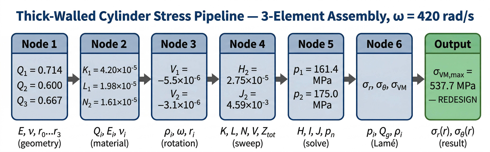
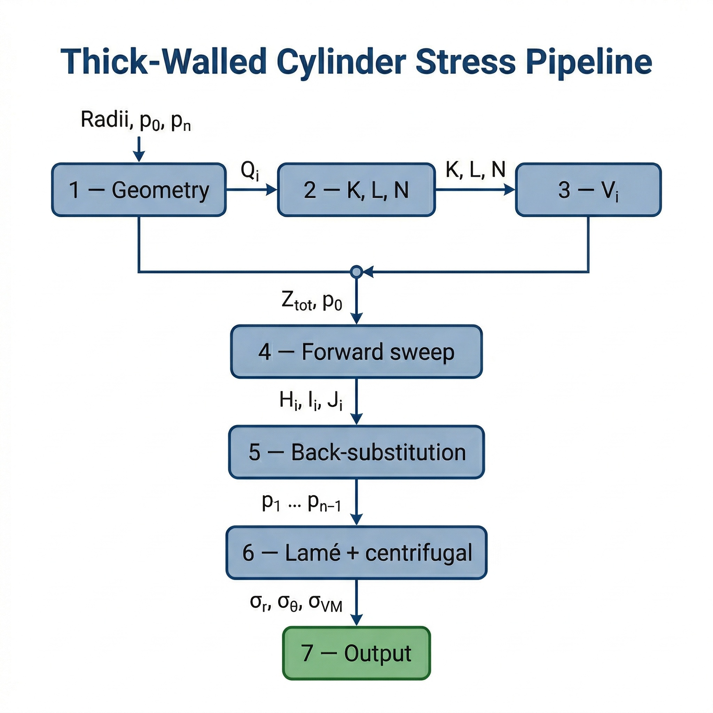
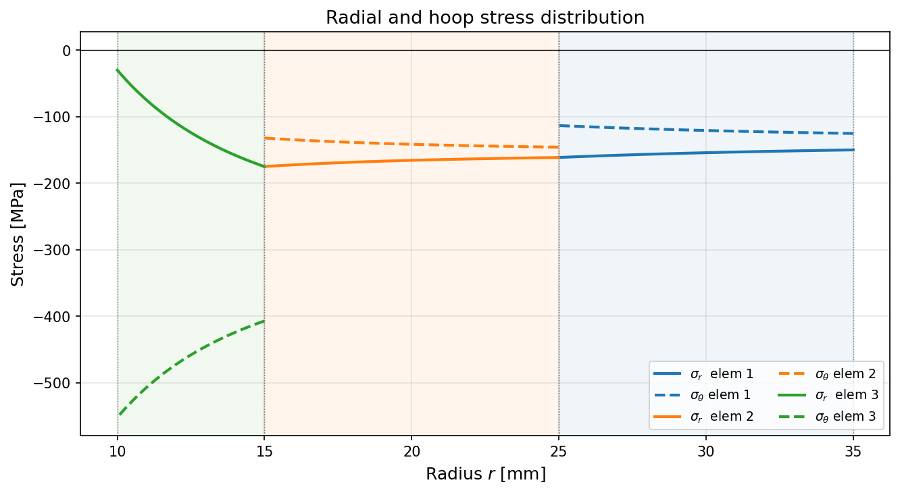

The classical Lamé equations handle a single thick-walled cylinder under internal and external pressure. Real shaft–hub assemblies are rarely that simple: multiple coaxial rings of different materials, interference fits at each interface, and a rotating load case that adds centrifugal body forces to the stress field. Croccolo & Vincenzi (2009) derived a closed-form analytical solution that covers exactly this configuration — nn
n isotropic coaxial cylinders with arbitrary interference and rotation — and validated it against finite element analysis to within 2% on all stress components.

This tool implements that solution as a seven-node calculation pipeline. The pipeline takes geometry, material properties, interferences, boundary pressures, and angular velocity as input, solves the tridiagonal compatibility system at the interfaces, and returns contact pressures and full stress distributions $\sigma_r(r)$, $\sigma_\theta(r)$, $\sigma_{VM}(r)$ across all elements. A Python notebook ready to run on Google Colab is provided alongside the derivation, so the result of every intermediate step can be verified by hand or extended to a new case.

## Quick Example

Three coaxial cylinders — steel outer ring, aluminium middle ring, steel inner shaft —
assembled with interference fits $Z_{tot,1} = 0.025\,\text{mm}$ and $Z_{tot,2} = 0.010\,\text{mm}$,
subject to external pressure $p_0 = 150\,\text{MPa}$, bore pressure $p_3 = 30\,\text{MPa}$,
and angular velocity $\omega = 420\,\text{rad/s}$.

| Parameter | Element 1 (Steel) | Element 2 (Al) | Element 3 (Steel) |
|:----------|:-----------------:|:--------------:|:-----------------:|
| $E$ (MPa) | 206 000 | 70 000 | 206 000 |
| $\nu$ | 0.29 | 0.33 | 0.29 |
| $\rho$ (kg/m³) | 7850 | 2770 | 7850 |
| $r_{ext}$ (mm) | 35.000 | 24.988 | 14.995 |
| $r_{int}$ (mm) | 24.988 | 14.995 | 10.000 |

> **Contact pressures:** $p_1 = 161.4\,\text{MPa}$, $p_2 = 175.0\,\text{MPa}$

All equivalent stresses remain below typical yield strengths ($\sigma_{y,\text{steel}} \approx 350\,\text{MPa}$
for structural steel, $\sigma_{y,\text{Al}} \approx 280\,\text{MPa}$ for 6061-T6),
except element 3 inner surface ($\sigma_{VM} = 537.7\,\text{MPa}$) which exceeds the yield limit —
**redesign needed.**

**Pipeline summary:**

| Node | Operation | Input | Output |
|:----:|:----------|:------|:-------|
| 1 | Geometric ratios | Radii $r_0 \ldots r_n$ | $Q_i = r_i / r_{i-1}$ |
| 2 | Compatibility coefficients | $Q_i$, $E_i$, $\nu_i$ | $K_i$, $L_i$, $N_{i+1}$ |
| 3 | Dynamic contribution | $\rho_i$, $\omega$, $Q_i$, $E_i$, $\nu_i$ | $V_i$ |
| 4 | Forward sweep | $K_i$, $L_i$, $N_i$, $V_i$, $p_0$, $Z_{tot,i}$ | $H_i$, $I_i$, $J_i$ |
| 5 | Interface pressures | $H_i$, $I_i$, $J_i$, $p_n$ | $p_1 \ldots p_{n-1}$ |
| 6 | Stress distributions | $p_i$, $Q_i$, $\rho_i$, $\omega$, $\nu_i$ | $\sigma_r(r)$, $\sigma_\theta(r)$, $\sigma_{VM}$ |
| 7 | Output | Stress arrays | Tables, plots |

---

## Pipeline Overview

The pipeline solves a tridiagonal compatibility system (one equation per interface)
reduced to bidiagonal form by the forward sweep (Node 4) and resolved back-to-front (Node 5).
Lamé equations and centrifugal body-force corrections (Node 6) are then applied element by element.

---

## Node 1 — Geometric Ratios

**Purpose.** Express all radial positions as dimensionless ratios relative to the outer radius
of each element.

| Symbol | Description | Unit |
|:------:|:------------|:----:|
| $r_i$ | Radius at interface $i$ | mm |

$$Q_i = \frac{r_i}{r_{i-1}}, \quad i = 1, \ldots, n$$

For a solid shaft ($r_n = 0$): $Q_n = 0$.

| Symbol | Description | Unit |
|:------:|:------------|:----:|
| $Q_i$ | Radius ratio at interface $i$ | — |

---

## Node 2 — Compatibility Coefficients K, L, N

**Purpose.** Assemble the coefficients of the displacement-compatibility equation at each
of the $n-1$ interfaces.

| Symbol | Description | Unit |
|:------:|:------------|:----:|
| $Q_i$, $Q_{i+1}$ | Radius ratios | — |
| $E_i$, $E_{i+1}$ | Young's moduli | MPa |
| $\nu_i$, $\nu_{i+1}$ | Poisson's ratios | — |

$$K_i = \frac{1}{E_i}\left[\frac{1+Q_i^2}{1-Q_i^2} + \nu_i\right] + \frac{1}{E_{i+1}}\left[1 - \nu_{i+1} + \frac{2Q_{i+1}^2}{1-Q_{i+1}^2}\right]$$

$$L_i = \frac{2}{E_i(1-Q_i^2)}, \qquad N_{i+1} = \frac{2Q_{i+1}^2}{E_{i+1}(1-Q_{i+1}^2)}$$

Special case: if $Q_{i+1} = 0$ (solid shaft bore), $N_{i+1} = 0$ and the second bracket
of $K_i$ reduces to $(1 - \nu_{i+1}) / E_{i+1}$.

| Symbol | Description | Unit |
|:------:|:------------|:----:|
| $K_i$ | Diagonal coefficient at interface $i$ | MPa⁻¹ |
| $L_i$ | Off-diagonal coefficient (outer side) | MPa⁻¹ |
| $N_{i+1}$ | Off-diagonal coefficient (inner side) | MPa⁻¹ |

---

## Node 3 — Dynamic Compatibility Contribution $V_i$

**Purpose.** Account for the centrifugal body-force term that shifts the effective interference
at each interface when the assembly rotates.

| Symbol | Description | Unit |
|:------:|:------------|:----:|
| $\rho_i$, $\rho_{i+1}$ | Densities | kg/m³ |
| $\omega$ | Angular velocity | rad/s |
| $r_{i-1}$, $r_i$ | Interface radii | mm |
| $Q_i$, $Q_{i+1}$ | Radius ratios | — |
| $E_i$, $E_{i+1}$ | Young's moduli | MPa |
| $\nu_i$, $\nu_{i+1}$ | Poisson's ratios | — |

$$V_i = \frac{\rho_{i+1}\omega^2 r_i^2 (3+\nu_{i+1})/8}{E_{i+1}}\left[1 + 2Q_{i+1}^2 - \frac{1+3\nu_{i+1}}{3+\nu_{i+1}}\right] - \frac{\rho_i\omega^2 r_{i-1}^2 (3+\nu_i)/8}{E_i}\left[2 + Q_i^2 - \frac{1+3\nu_i}{3+\nu_i}Q_i^2\right]$$

Unit note: with $\rho$ in kg/m³, $\omega$ in rad/s, $r$ in mm, and $E$ in MPa, multiply
the numerator by $10^{-12}$ to obtain $V_i$ in the same units as $Z_{tot}/r$ (dimensionless).
$V_i = 0$ for all interfaces when $\omega = 0$.

| Symbol | Description | Unit |
|:------:|:------------|:----:|
| $V_i$ | Dynamic compatibility shift at interface $i$ | — |

---

## Node 4 — Forward Sweep: H, I, J

**Purpose.** Reduce the $(n-1) \times (n-1)$ tridiagonal compatibility system to upper-bidiagonal
form by propagating boundary conditions from the outer surface inward.

| Symbol | Description | Unit |
|:------:|:------------|:----:|
| $K_i$, $L_i$, $N_{i+1}$ | Compatibility coefficients | MPa⁻¹ |
| $V_i$ | Dynamic contribution | — |
| $Z_{tot,i}$ | Total radial interference at interface $i$ | mm |
| $r_i$ | Radius at interface $i$ | mm |
| $p_0$ | External pressure | MPa |

Initialisation ($i = 1$):

$$H_1 = K_1, \quad I_2 = N_2, \quad J_1 = p_0 L_1 + \frac{Z_{tot,1}}{r_1} + V_1$$

Recursion ($i = 2, \ldots, n-1$):

$$H_i = \frac{K_i}{L_i} H_{i-1} - I_i, \quad I_{i+1} = \frac{N_{i+1}}{L_i} H_{i-1}, \quad J_i = J_{i-1} + \left(\frac{Z_{tot,i}}{r_i L_i} + \frac{V_i}{L_i}\right) H_{i-1}$$

| Symbol | Description | Unit |
|:------:|:------------|:----:|
| $H_i$ | Effective diagonal after elimination | MPa⁻¹ |
| $I_i$ | Effective off-diagonal after elimination | MPa⁻¹ |
| $J_i$ | Effective right-hand side after elimination | — |

---

## Node 5 — Interface Pressures

**Purpose.** Solve the reduced bidiagonal system by back-substitution from the innermost
interface outward.

| Symbol | Description | Unit |
|:------:|:------------|:----:|
| $H_i$, $I_i$, $J_i$ | Sweep results | MPa⁻¹, — |
| $p_n$ | Bore pressure | MPa |

$$p_{n-1} = \frac{J_{n-1} + p_n I_n}{H_{n-1}}, \qquad p_{i-1} = \frac{p_i I_i + J_{i-1}}{H_{i-1}}, \quad i = n-1, \ldots, 2$$

| Symbol | Description | Unit |
|:------:|:------------|:----:|
| $p_1 \ldots p_{n-1}$ | Contact pressures at interfaces | MPa |

---

## Node 6 — Stress Distributions

**Purpose.** Compute $\sigma_r$, $\sigma_\theta$, and $\sigma_{VM}$ at any radius within
each element by superimposing static Lamé and centrifugal contributions.

| Symbol | Description | Unit |
|:------:|:------------|:----:|
| $p_{i-1}$, $p_i$ | Bounding pressures for element $i$ | MPa |
| $Q_i$ | Radius ratio of element $i$ | — |
| $Q_g = r_g / r_{i-1}$ | Normalised evaluation radius | — |
| $\rho_i$, $\nu_i$ | Density, Poisson's ratio | kg/m³, — |
| $\omega$ | Angular velocity | rad/s |

**Static Lamé (eqs. 2):**

$$\sigma_{r,s} = -p_{i-1} + (p_i - p_{i-1})\frac{Q_i^2}{1-Q_i^2}\left(1 - \frac{1}{Q_g^2}\right)$$

$$\sigma_{\theta,s} = -p_{i-1} + (p_i - p_{i-1})\frac{Q_i^2}{1-Q_i^2}\left(1 + \frac{1}{Q_g^2}\right)$$

**Centrifugal (eq. 25), with units as in Node 3:**

$$\sigma_{r,d} = \rho_i\omega^2 r_{i-1}^2 \frac{3+\nu_i}{8}\left(1 + Q_i^2 - \frac{Q_i^2}{Q_g^2} - Q_g^2\right)$$

$$\sigma_{\theta,d} = \rho_i\omega^2 r_{i-1}^2 \frac{3+\nu_i}{8}\left(1 + Q_i^2 + \frac{Q_i^2}{Q_g^2} - \frac{1+3\nu_i}{3+\nu_i}Q_g^2\right)$$

**Von Mises (plane stress, $\sigma_z = 0$):**

$$\sigma_{VM} = \sqrt{\sigma_r^2 + \sigma_\theta^2 - \sigma_r\sigma_\theta}$$

| Symbol | Description | Unit |
|:------:|:------------|:----:|
| $\sigma_r(r)$ | Radial stress distribution | MPa |
| $\sigma_\theta(r)$ | Hoop stress distribution | MPa |
| $\sigma_{VM}$ | Von Mises equivalent stress | MPa |

---

## Numerical Case — Croccolo & Vincenzi (2009), Tables 1–3

### Input

| Element | Material | $E$ (MPa) | $\nu$ | $\rho$ (kg/m³) | $r_{ext}$ (mm) | $r_{int}$ (mm) |
|:-------:|:--------:|:---------:|:-----:|:--------------:|:--------------:|:--------------:|
| 1 | Steel | 206 000 | 0.29 | 7850 | 35.000 | 24.988 |
| 2 | Aluminium | 70 000 | 0.33 | 2770 | 24.988 | 14.995 |
| 3 | Steel | 206 000 | 0.29 | 7850 | 14.995 | 10.000 |

$Z_{tot,1} = 0.025\,\text{mm}$, $Z_{tot,2} = 0.010\,\text{mm}$, $p_0 = 150\,\text{MPa}$,
$p_3 = 30\,\text{MPa}$, $\omega = 420\,\text{rad/s}$.

### Node 1 — Geometric ratios

$$Q_1 = \frac{24.988}{35.000} = 0.71394, \quad Q_2 = \frac{14.995}{24.988} = 0.60009, \quad Q_3 = \frac{10.000}{14.995} = 0.66689$$

### Node 2 — Coefficients at interface 1 ($i=1$)

$$K_1 = \frac{1}{206000}\left[\frac{1+0.71394^2}{1-0.71394^2}+0.29\right] + \frac{1}{70000}\left[1-0.33+\frac{2\cdot0.60009^2}{1-0.60009^2}\right] = 4.2006\times10^{-5}\,\text{MPa}^{-1}$$

$$L_1 = \frac{2}{206000\,(1-0.71394^2)} = 1.9802\times10^{-5}\,\text{MPa}^{-1}$$

$$N_2 = \frac{2\cdot0.60009^2}{70000\,(1-0.60009^2)} = 1.6079\times10^{-5}\,\text{MPa}^{-1}$$

At interface 2 ($i=2$):

$$K_2 = 4.6302\times10^{-5}\,\text{MPa}^{-1}, \quad L_2 = 4.4650\times10^{-5}\,\text{MPa}^{-1}, \quad N_3 = 7.7763\times10^{-6}\,\text{MPa}^{-1}$$

### Node 3 — Dynamic contributions

For interface 1, with $\rho_2 = 2770$, $r_1 = 24.988\,\text{mm}$, $\rho_1 = 7850$,
$r_0 = 35.000\,\text{mm}$:

$$V_1 = \frac{2770\cdot420^2\cdot24.988^2\cdot10^{-12}\cdot(3+0.33)/8}{70000}\left[1+2\cdot0.60009^2-\frac{1+3\cdot0.33}{3+0.33}\right]$$
$$\quad - \frac{7850\cdot420^2\cdot35.000^2\cdot10^{-12}\cdot(3+0.29)/8}{206000}\left[2+0.71394^2-\frac{1+3\cdot0.29}{3+0.29}\cdot0.71394^2\right]$$
$$= -5.481\times10^{-6}$$

$$V_2 = -3.070\times10^{-6}$$

### Node 4 — Forward sweep

Initialisation:

$$H_1 = K_1 = 4.2006\times10^{-5}, \quad I_2 = N_2 = 1.6079\times10^{-5}$$

$$J_1 = 150\cdot1.9802\times10^{-5} + \frac{0.025}{24.988} + (-5.481\times10^{-6}) = 3.9653\times10^{-3}$$

Recursion at $i=2$:

$$H_2 = \frac{K_2}{L_2}H_1 - I_2 = \frac{4.6302\times10^{-5}}{4.4650\times10^{-5}}\cdot4.2006\times10^{-5} - 1.6079\times10^{-5} = 2.7481\times10^{-5}$$

$$I_3 = \frac{N_3}{L_2}H_1 = \frac{7.7763\times10^{-6}}{4.4650\times10^{-5}}\cdot4.2006\times10^{-5} = 7.3158\times10^{-6}$$

$$J_2 = J_1 + \frac{H_1}{L_2}\left(\frac{0.010}{14.995}+(-3.070\times10^{-6})\right) = 4.5898\times10^{-3}$$

### Node 5 — Interface pressures

$$p_2 = \frac{J_2 + p_3\,I_3}{H_2} = \frac{4.5898\times10^{-3} + 30\cdot7.3158\times10^{-6}}{2.7481\times10^{-5}} = 175.01\,\text{MPa}$$

$$p_1 = \frac{p_2\,I_2 + J_1}{H_1} = \frac{175.01\cdot1.6079\times10^{-5} + 3.9653\times10^{-3}}{4.2006\times10^{-5}} = 161.39\,\text{MPa}$$

### Node 6 — Stresses at element boundaries

All values in MPa. For brevity only boundary radii ($r = r_{int}$ and $r = r_{ext}$) are shown.

| Elem | $\sigma_{r,int}$ | $\sigma_{r,ext}$ | $\sigma_{\theta,int}$ | $\sigma_{\theta,ext}$ | $\sigma_{VM,int}$ | $\sigma_{VM,ext}$ |
|:----:|:----------------:|:----------------:|:---------------------:|:---------------------:|:-----------------:|:-----------------:|
| 1 | −161.39 | −150.00 | −113.38 | −125.31 | 143.54 | 139.31 |
| 2 | −175.00 | −161.39 | −132.17 | −145.92 | 158.01 | 154.24 |
| 3 | −30.00 | −175.01 | −552.03 | −407.13 | 537.65 | 353.74 |

FEM validation (Table 3 of the paper): maximum deviation on all stress components is below 2%.

---

## Stress Distribution

The curves are continuous across interfaces. The sharp change in slope at each interface
reflects the material discontinuity. The hoop stress in element 3 is dominated by the
centrifugal term at the inner bore, reaching −552 MPa — the governing failure mode for
this configuration.

---

## How to Use the Notebook

The Python notebook implements the full 7-node pipeline and runs directly on Google Colab
with no installation required (numpy and matplotlib are preinstalled).

[Open in Colab](https://drive.google.com/file/d/1cw7vXibglQB3qMSYmKK3bE7ARx4-TRJ1/view?usp=sharing)

Modify only the cell marked **✏️ Input**. The parameters are:

| Parameter | Symbol | Unit | Note |
|:----------|:------:|:----:|:-----|
| Number of elements | `n` | — | ≥ 2 |
| Radii, outermost first | `r` | mm | length `n+1`; set `r[n]=0` for solid shaft |
| Young's modulus | `E` | MPa | length `n` |
| Poisson's ratio | `nu` | — | length `n` |
| Density | `rho` | kg/m³ | length `n`; needed only when `omega ≠ 0` |
| Radial interference | `Z_tot` | mm | length `n-1`; set to 0 for clearance fit |
| External pressure | `p0` | MPa | applied to outermost surface |
| Bore pressure | `pn` | MPa | set to 0 for solid shaft |
| Angular velocity | `omega` | rad/s | set to 0 for static case |

**Known limitations.** The model assumes isotropic linear-elastic materials
($\sigma_{VM} < \sigma_y$ must be verified after the fact), axial symmetry, plane stress
($\sigma_z = 0$, accurate for short couplings with $L \sim D$), identical axial length for
all elements, and a single common $\omega$. No thermal loading, friction, or axial force
is accounted for.

---

## References

[1] Croccolo, D. & Vincenzi, N. (2009). A generalized theory for shaft–hub couplings.
*Proc. IMechE Part C: J. Mechanical Engineering Science*, 223, 2231–2239.

[2] Croccolo, D. & De Agostinis, M. (2013). Analytical solution of stress and strain
distributions in press fitted orthotropic cylinders.
*Int. J. Mechanical Sciences*, 71, 21–29.
