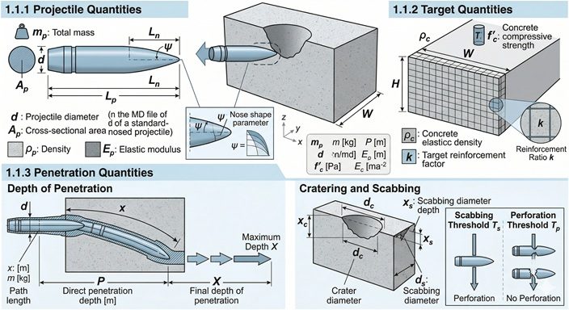
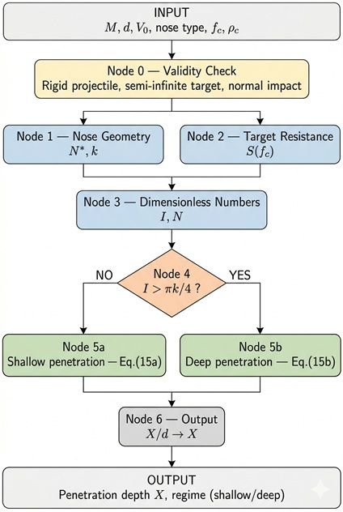
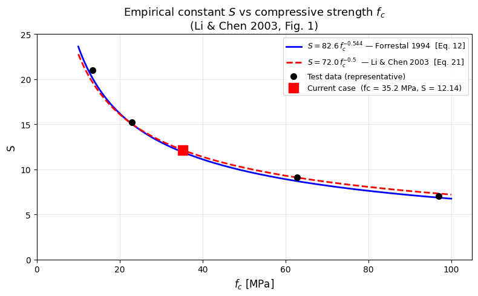
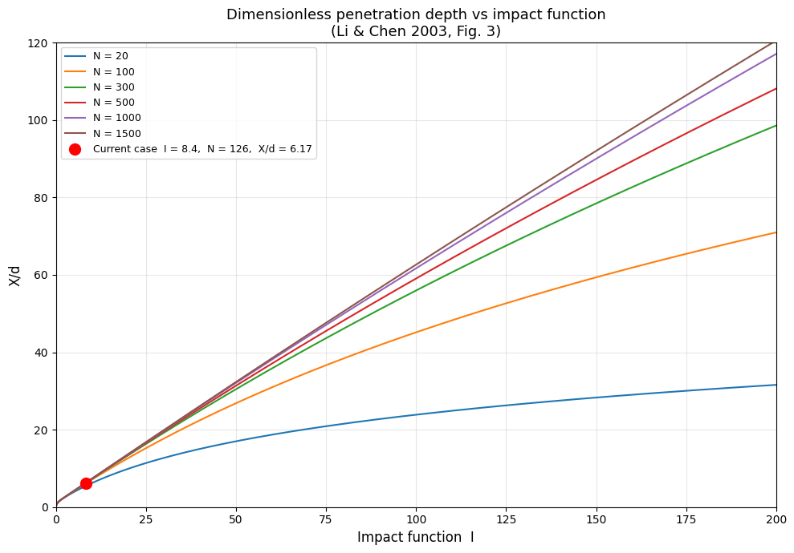
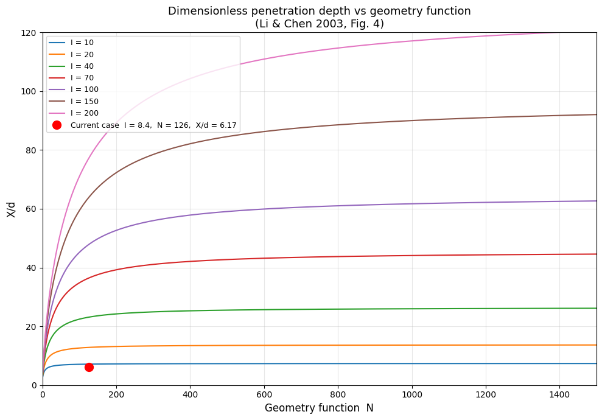

[International Journal of Impact Engineering - Dimensionless formulae for penetration depth of concrete target impacted by a non-deformable projectile](https://www.sciencedirect.com/science/article/abs/pii/S0734743X02000374?via%3Dihub)

Over six decades of ballistic testing have produced dozens of empirical formulae for concrete penetration — NDRC, Barr (UKAEA), ACE. All three share the same structural defects: unit-dependent coefficients that break when switching from SI to imperial, nose shape parameters assigned as discrete lookup values rather than computed from geometry, and calibration ranges limited to shallow impacts ($0.6 < X/d < 2.0$) that collapse at deep penetration ($X/d > 5$) with errors exceeding 20%.

Li & Chen (2003) resolved these defects by building on two independent pillars. The Buckingham Pi theorem reduces the 10 physical variables of the problem to three dimensionless groups: the impact factor $I^*$, the mass ratio $\lambda$, and the nose factor $N^*$. Dynamic cavity expansion theory (Forrestal & Luk 1988) then provides the axial force law — static confinement resistance plus inertial resistance — and introduces the empirical parameter $S$ that bridges uniaxial compressive strength to effective confined resistance. Combining the two theories recombines the three Pi groups into two operational numbers, $I$ and $N$, which govern the result entirely.

The outcome is two closed-form formulae — Eq. (15a) for shallow penetration, Eq. (15b) for deep — validated against approximately 130 data points covering $X/d$ from 0.07 to 92.8.

---

## Quick Example

4340-steel ogive projectile, CRH = 2, impacting 35 MPa concrete at 277 m/s.
Data: Forrestal et al. (1994), Table 3, shot 14.

| Input | Value |
|:------|------:|
| Mass $M$ | 0.906 kg |
| Diameter $d$ | 26.9 mm |
| Nose type | Ogive, CRH $\psi = 2$ |
| Impact velocity $V_0$ | 277 m/s |
| Compressive strength $f_c$ | 35.2 MPa |
| Concrete density $\rho_c$ | 2370 kg/m³ |

> **Penetration depth: $X = 167\,\text{mm}$** ($X/d = 6.21$, deep regime)
> Test measurement: 173 mm. Model error: **3.4%**.
> NDRC prediction: 137 mm. NDRC error: **20.5%**.

The 26.9 mm ogive projectile at 277 m/s penetrates 167 mm into 35 MPa concrete — about 6.2 calibers. At this velocity the static resistance term accounts for 94% of the retarding force; the dynamic inertia term contributes only 6%. NDRC, calibrated on shallow impacts, underestimates by a factor that grows with penetration depth.

**Pipeline summary:**

| Node | Operation | Key output |
|:----:|:----------|:-----------|
| 0 | Validity check | ✅ $V_0 = 277$ m/s $< 800$ m/s, rigid projectile |
| 1 | Nose geometry | $N^* = 0.156$, $k = 2.030$ |
| 2 | Target resistance | $S = 12$ (paper) |
| 3 | Dimensionless numbers | $I = 8.455$, $N = 125.9$ |
| 4 | Regime | $I = 8.455 > \pi k/4 = 1.571$ → deep penetration |
| 5b | Eq. (15b) | $X/d = 6.21$ |
| 6 | Dimensional output | $X = 167\,\text{mm}$ |

---

## Pipeline Overview

The pipeline is sequential with one bifurcation. Nodes 0–3 are always executed. Node 4 selects the depth formula based on whether $I$ exceeds the crater threshold $\pi k/4$. Node 5a (shallow) or 5b (deep) computes the dimensionless depth; Node 6 converts to metres or millimetres.

[📄 Download: The A4 Ballistic Pipeline — slide deck (PDF)](/engineering-tools/pdf/The_A4_Ballistic_Pipeline.pdf)

---

## Node 0 — Validity Pre-Check

**Purpose.** Verify that the model assumptions hold before computing. If a condition is violated, the pipeline emits a warning but does not block execution — the engineering judgement remains with the user.

| Input | Symbol | Unit |
|:------|:------:|:----:|
| Impact velocity | $V_0$ | m/s |
| Shank diameter | $d$ | m |
| Aggregate size (optional) | $a$ | m |

| Condition | Criterion | Reference |
|:----------|:----------|:----------|
| Rigid (non-deformable) projectile | $V_0 \lesssim 800\,\text{m/s}$ for hardened steel | Paper §2.1 |
| Semi-infinite target | thickness $\geq 3X$ — verify after calculation | Model assumption |
| Normal incidence | impact angle = 90° | Model assumption |
| Aggregate small vs. diameter | $d/a \gg 1$ (ideally $> 5$) | Paper §2.1 |
| Light or no reinforcement | $< 1.5\%$ per direction | Paper §2.1 |

| Output | Symbol |
|:-------|:------:|
| Status (pass / warning list) | — |

---

## Node 1 — Nose Geometry

**Purpose.** Compute the nose shape factor $N^*$ and the dimensionless crater depth $k$.

| Input | Symbol | Unit |
|:------|:------:|:----:|
| Nose type | — | flat / ogive / conical / spherical |
| Nose parameter | $\psi$ | — |

### Nose factor $N^*$ — Eqs. (2), (3a)–(3c)

$N^*$ is defined by a surface integral over the nose profile. For standard geometries the integral has closed form:

| Nose type | $\psi$ definition | $N^*$ formula | Range |
|:----------|:-----------------|:--------------|:------|
| Flat | — | $1.0$ | — |
| Ogive | CRH $= R/d$ | $\dfrac{1}{3\psi} - \dfrac{1}{24\psi^2}$ | $0 < N^* < 0.5$ |
| Conical | $H/d$ | $\dfrac{1}{1 + 4\psi^2}$ | $0 < N^* < 1.0$ |
| Spherical | $r/d$ | $1 - \dfrac{1}{8\psi^2}$ | $0.5 < N^* < 1.0$ |

$N^*$ is a continuous function of geometry, not a discrete lookup. A lower value means a sharper, more penetration-efficient nose: flat nose $N^* = 1.0$, hemispherical $N^* = 0.5$, ogive CRH=2 $N^* = 0.156$, ogive CRH=4.5 $N^* = 0.076$.

### Nose height $H/d$

| Nose type | $H/d$ |
|:----------|:------|
| Flat | $0$ |
| Ogive | $\sqrt{\psi - 1/4}$ |
| Conical | $\psi$ |
| Spherical | $\psi - \sqrt{\psi^2 - 1/4}$ |

### Crater depth parameter $k$ — Eq. (25)

The crater–tunnel transition depth is the sum of the Prandtl plastic slip depth for a flat punch ($0.707d$) and the nose height $H$:

$$\boxed{k = 0.707 + \frac{H}{d}}$$

| Nose | $\psi$ | $k$ |
|:-----|:------:|:---:|
| Flat | — | 0.707 |
| Hemispherical | 0.5 | 1.207 |
| Ogive CRH=2 | 2 | 2.030 |
| Ogive CRH=3 | 3 | 2.365 |
| Ogive CRH=4.5 | 4.5 | 2.769 |

| Output | Symbol | Unit |
|:-------|:------:|:----:|
| Nose shape factor | $N^*$ | — |
| Dimensionless crater depth | $k$ | — |

---

## Node 2 — Target Resistance

**Purpose.** Compute the empirical constant $S$ that scales the uniaxial compressive strength $f_c$ to the effective resistance under dynamic triaxial confinement. $S$ cannot be derived analytically; it is back-calculated from penetration tests and then fitted as a function of $f_c$.

| Input | Symbol | Unit |
|:------|:------:|:----:|
| Unconfined compressive strength | $f_c$ | MPa |

Two correlations are provided ($f_c$ in MPa for both):

**Original — Forrestal et al. (1994), Eq. (12):**

$$S_{\text{orig}} = 82.6 \; f_c^{-0.544}$$

**Simplified — Li & Chen (2003), Eq. (21):**

$$S_{\text{simpl}} = 72.0 \; f_c^{-0.5}$$

The simplified form makes $I$ proportional to $f_c^{-1/2}$, aligning with the $f_c$ dependence in NDRC, Hughes and Chang and enabling direct comparison. For $f_c > 30\,\text{MPa}$ the two correlations are practically equivalent.

| $f_c$ (MPa) | $S_{\text{orig}}$ | $S_{\text{simpl}}$ | $S$ (paper) |
|:-----------:|:-----------------:|:------------------:|:-----------:|
| 13.5 | 21.0 | 19.6 | 21 |
| 23 | 15.5 | 15.0 | 15.2 |
| 35.2 | 12.7 | 12.1 | 12 |
| 62.8 | 9.2 | 9.1 | — |
| 97 | 7.2 | 7.3 | 7 |

For shot 14 ($f_c = 35.2\,\text{MPa}$, $S = 12$ from Table 2), both correlations agree to within 0.7 units.

| Output | Symbol | Unit |
|:-------|:------:|:----:|
| Target resistance constant | $S$ | — |

---

## Node 3 — Dimensionless Numbers

**Purpose.** Compute the two numbers that govern the penetration depth.

| Input | Symbol | Unit |
|:------|:------:|:----:|
| Projectile mass | $M$ | kg |
| Impact velocity | $V_0$ | m/s |
| Shank diameter | $d$ | m |
| Compressive strength | $f_c$ | Pa |
| Concrete density | $\rho_c$ | kg/m³ |
| Nose factor (Node 1) | $N^*$ | — |
| Target resistance (Node 2) | $S$ | — |

### Intermediate quantities

Impact factor (Eq. 5):
$$I^* = \frac{M V_0^2}{d^3 f_c}$$

Mass ratio (Eq. 6):
$$\lambda = \frac{M}{\rho_c \, d^3}$$

Johnson damage number (Eq. 7, informational):
$$\Phi_J = \frac{I^*}{\lambda} = \frac{\rho_c V_0^2}{f_c}$$

$\Phi_J$ depends only on velocity and target — not on the projectile. It classifies impact severity independently of the launcher.

### Operational numbers

$$\boxed{I = \frac{I^*}{S} = \frac{M V_0^2}{S \, d^3 f_c}}$$

$I$ is the ratio of projectile kinetic energy to the concrete's effective absorption capacity (resistance under confinement, scaled by $S$, over volume $d^3$).

$$\boxed{N = \frac{\lambda}{N^*} = \frac{M}{N^* \rho_c \, d^3}}$$

$N$ combines relative projectile mass and nose sharpness. A heavy, sharp projectile has large $N$ and penetrates more for equal $I$.

| Output | Symbol | Unit |
|:-------|:------:|:----:|
| Impact function | $I$ | — |
| Geometry function | $N$ | — |
| (Intermediate) impact factor | $I^*$ | — |
| (Intermediate) mass ratio | $\lambda$ | — |
| (Intermediate) Johnson number | $\Phi_J$ | — |

---

## Node 4 — Regime Selection

**Purpose.** Determine whether the projectile stops inside the crater or advances into the tunnel.

| Input | Symbol | Unit |
|:------|:------:|:----:|
| Impact function (Node 3) | $I$ | — |
| Crater depth (Node 1) | $k$ | — |

The projectile exits the crater zone with residual velocity $V_1 > 0$ if and only if $I > \pi k / 4$:

$$\text{If } I \leq \frac{\pi k}{4} \quad \Rightarrow \quad \textbf{shallow} \text{ — projectile stops in crater, use Eq. (15a)}$$

$$\text{If } I > \frac{\pi k}{4} \quad \Rightarrow \quad \textbf{deep} \text{ — projectile enters tunnel, use Eq. (15b)}$$

| Output | — |
|:-------|:--|
| Regime: shallow or deep | |
| Threshold value $\pi k / 4$ | |

---

## Node 5a — Shallow Penetration — Eq. (15a)

**Condition:** $X/d \leq k$ (projectile stops within the crater zone)

Derived from the energy balance $X^2 = MV_0^2/c$ with the crater force constant $c$ from the continuity condition at $x = kd$:

$$\boxed{\frac{X}{d} = \sqrt{\frac{4kI}{\pi} \cdot \frac{1 + k\pi/(4N)}{1 + I/N}}}$$

**Consistency checks.** At the regime boundary $I = \pi k/4$: the formula gives $X/d = k$, matching the deep formula below. For $N \gg 1$: reduces to Eq. (16a) of the paper. For $N \gg 1$ and $I/N \ll 1$: reduces to $X/d = \sqrt{4kI/\pi}$, Eq. (17a).

**Note on shallow correction.** For $X/d < 0.5$ the formula systematically overestimates (paper Fig. 11). The empirical correction Eq. (27) — $\left(X/d\right)_{\text{corr}} = 1.628\,(X/d)^{2.789}$ — is available in the notebook as an opt-in flag. It is off by default: the correction was fitted on flat-nosed, low-energy data where scatter is large, and its applicability to other nose types is uncertain.

| Output | Symbol | Unit |
|:-------|:------:|:----:|
| Dimensionless penetration depth | $X/d$ | — |

---

## Node 5b — Deep Penetration — Eq. (15b)

**Condition:** $X/d > k$ (projectile traverses the crater and bores a tunnel)

Derived by integrating the equation of motion $MV\,dV/dx = -(\pi d^2/4)(Sf_c + N^*\rho_c V^2)$ from $x = kd$ to $x = X$, then non-dimensionalising through $I$ and $N$:

$$\boxed{\frac{X}{d} = \frac{2}{\pi} \, N \ln\!\left(\frac{1 + I/N}{1 + k\pi/(4N)}\right) + k}$$

Penetration depth grows logarithmically with $I$ at fixed $N$ — not linearly. Each additional unit of velocity buys progressively less depth.

**Consistency checks.** At the regime boundary $I = \pi k/4$: $\ln(1) = 0$, giving $X/d = k$ — exact continuity with Eq. (15a). For $N \gg 1$: reduces to Eq. (16b). For $N \gg 1$ and $I/N \ll 1$: reduces to $X/d = k/2 + 2I/\pi$, Eq. (17b).

| Output | Symbol | Unit |
|:-------|:------:|:----:|
| Dimensionless penetration depth | $X/d$ | — |

---

## Node 6 — Dimensional Output

**Purpose.** Convert $X/d$ to physical depth and summarise all intermediate values.

$$X = \frac{X}{d} \times d$$

Report also: regime, $I$, $N$, $k$, $S$, $I^*$, $\lambda$, $\Phi_J$, and the semi-infinite check ($3X$ minimum target thickness).

---

## Numerical Verification — Shot 14

Forrestal et al. (1994), Table 3. Ogive CRH=2, $f_c = 35.2\,\text{MPa}$.

### Input

| Quantity | Value |
|:---------|------:|
| $M$ | 0.906 kg |
| $d$ | 0.0269 m |
| $V_0$ | 277 m/s |
| Nose | ogive, $\psi = 2$ |
| $f_c$ | 35.2 MPa |
| $\rho_c$ | 2370 kg/m³ |

### Node 1

$$N^* = \frac{1}{3 \times 2} - \frac{1}{24 \times 4} = \frac{1}{6} - \frac{1}{96} = \frac{15}{96} = 0.15625 \quad (\text{paper: } 0.156) \checkmark$$

$$\frac{H}{d} = \sqrt{2 - 0.25} = \sqrt{1.75} = 1.3229 \qquad k = 0.707 + 1.323 = 2.030$$

Note: paper Tables 2–4 use $k = 2$ (empirical value from Forrestal 1994). The tool uses $k = 2.030$ from Eq. (25). For this verification, $k = 2$ is used to reproduce the paper tables.

### Node 2

$$S_{\text{simpl}} = 72.0 \times 35.2^{-0.5} = 12.13 \qquad S_{\text{paper}} = 12$$

### Node 3

$$I^* = \frac{0.906 \times 277^2}{(0.0269)^3 \times 35.2 \times 10^6} = \frac{69\,537}{684.6} = 101.46 \quad (\text{paper: } 101.46) \checkmark$$

$$\lambda = \frac{0.906}{2370 \times (0.0269)^3} = \frac{0.906}{0.04609} = 19.65 \quad (\text{paper: } 19.64) \checkmark$$

$$I = \frac{101.46}{12} = 8.455 \quad (\text{paper: } 8.45) \checkmark \qquad N = \frac{19.64}{0.156} = 125.9 \quad (\text{paper: } 125.9) \checkmark$$

$$\Phi_J = \frac{101.46}{19.64} = 5.17 \quad (\Phi_J \gg 1 \text{: fully dynamic regime})$$

### Node 4

$$\frac{\pi k}{4} = \frac{\pi \times 2}{4} = 1.571 \qquad I = 8.455 > 1.571 \quad \Rightarrow \quad \textbf{deep penetration}$$

### Node 5b

$$\frac{I}{N} = \frac{8.455}{125.9} = 0.06716 \qquad \frac{k\pi}{4N} = \frac{2\pi}{4 \times 125.9} = 0.01248$$

$$\frac{1 + I/N}{1 + k\pi/(4N)} = \frac{1.06716}{1.01248} = 1.05400 \qquad \ln(1.05400) = 0.05261$$

$$\frac{2}{\pi} N = \frac{2}{\pi} \times 125.9 = 80.15 \qquad \frac{X}{d} = 80.15 \times 0.05261 + 2 = 4.217 + 2 = 6.217$$

Paper Table 2, shot 14: $X/d_{\text{anal}} = 6.21$ ✓ — $X/d_{\text{test}} = 6.43$ — $X/d_{\text{NDRC}} = 5.11$

### Node 6

$$X = 6.217 \times 26.9\,\text{mm} = \mathbf{167.2\,\text{mm}}$$

Test: 173 mm. Error: 3.4%. Semi-infinite check: $3X = 502\,\text{mm}$ minimum target thickness.

---

## Figures

For fixed $N$, $X/d$ grows logarithmically with $I$ in the deep regime. The shallow-to-deep transition (knee of each curve) shifts with $k$ and $N$. The current case is marked in red.

For fixed $I$, deeper penetration results from a heavier, sharper projectile (large $N$). The sensitivity to $N$ decreases as $I/N \to 0$ — for shot 14 ($I/N = 0.067$) geometry contributes marginally and $X/d$ is driven almost entirely by $I$.

---

## How to Use the Notebook

The Python notebook implements the full pipeline (Nodes 0–6) and runs directly on Google Colab. No installation required: numpy and matplotlib are preinstalled.

[Open in Colab](https://colab.research.google.com/github/endofwave/engineering-tools/blob/main/static/notebooks/A4_penetration_depth.ipynb)

Modify only the **INPUT PARAMETERS** cell. Parameters:

| Parameter | Variable | Unit | Note |
|:----------|:--------:|:----:|:-----|
| Projectile mass | `M` | kg | |
| Shank diameter | `d` | m | |
| Impact velocity | `V0` | m/s | |
| Nose type | `nose_type` | — | `"flat"`, `"ogive"`, `"conical"`, `"spherical"` |
| Nose parameter | `psi` | — | CRH for ogive, $H/d$ for conical, $r/d$ for spherical |
| Compressive strength | `fc` | Pa | e.g. `35.2e6` for 35.2 MPa |
| Concrete density | `rho_c` | kg/m³ | |
| $S$ correlation | `S_correlation` | — | `"simplified"` (default) or `"original"` |
| Shallow correction | `apply_shallow_correction` | — | `False` (default); enable for $X/d < 0.5$ |

Each node prints its full output — all intermediate values are visible.

**Known limitations.** The model requires: rigid (non-deformable) projectile — erosion becomes significant above ~800 m/s for hardened steel; semi-infinite target — rear boundary effects (scabbing, perforation) not modelled, verify thickness $\geq 3X$; normal incidence — oblique impact not covered; unreinforced or lightly reinforced concrete ($< 1.5\%$ per direction); aggregate size small relative to diameter ($d/a > 5$ recommended, continuum assumption breaks down below $d/a \approx 2$).

---

## References

[1] Li QM, Chen XW (2003). Dimensionless formulae for penetration depth of concrete target impacted by a non-deformable projectile. *Int. J. Impact Eng.* 28, 93–116.

[2] Forrestal MJ, Altman BS, Cargile JD, Hanchak SJ (1994). An empirical equation for penetration depth of ogive-nose projectiles into concrete targets. *Int. J. Impact Eng.* 15(4), 395–405.

[3] Forrestal MJ, Luk VK (1988). Dynamic spherical cavity-expansion in a compressible elastic-plastic solid. *ASME J. Appl. Mech.* 55, 275–279.

[4] Sliter GE (1980). Assessment of empirical concrete impact formulas. *ASCE J. Struct. Div.* 106(ST5), 1023–1045.
