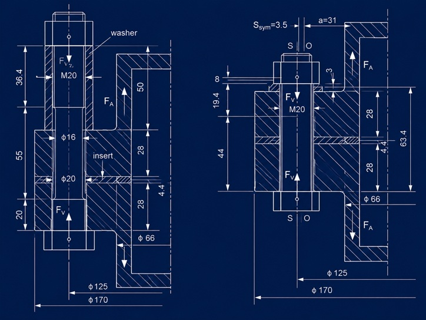
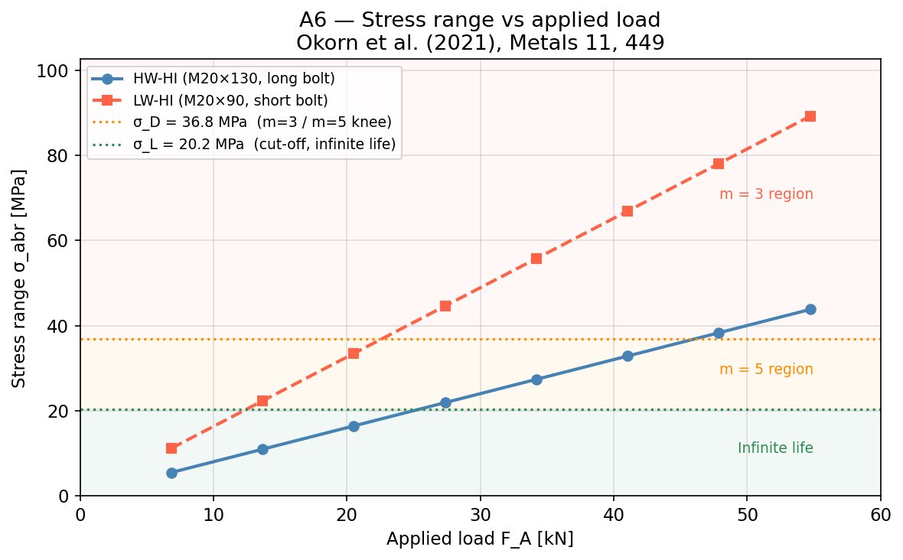
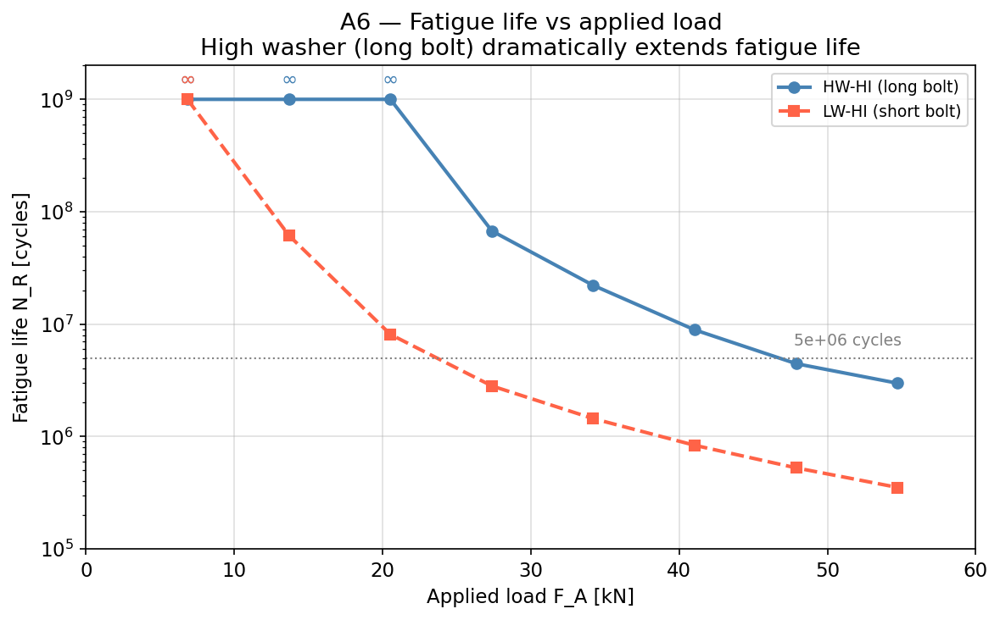
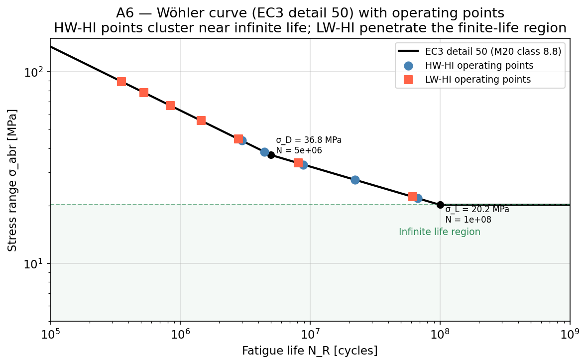
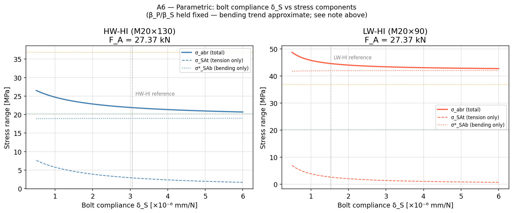

## Node 0 — Why the washer height matters more than you think

Before any formula: think about what happens when a cyclic axial load hits a flanged bolted joint off-center.

The bolt sees two stress components. One is the familiar axial tension — a fraction of the external load that sneaks past the clamp. The other is bending, caused by the eccentricity between the bolt axis and the line of action of the external force. In a typical flange geometry, this bending component is **6 to 18 times larger** than the tension component. It dominates the fatigue damage.

Now consider what a taller washer does. It makes the bolt longer. A longer bolt is more compliant — it stretches more per unit force. This has two effects: it reduces the fraction of external load that reaches the bolt (lower $\varphi^*_{en}$), and it reduces the bending stiffness ratio ($\beta_P / \beta_S$). Both effects shrink the stress range. The result is dramatic: swapping from a standard washer to a high washer can multiply fatigue life by **8 to 24 times**.

Ignoring eccentricity — treating the bolt as if it only sees axial tension — produces a severely non-conservative estimate. The pipeline below quantifies exactly how much.

---

## Quick Example

**Setup:** DN40 flange, M20×2.5 bolt (class 8.8), preload $F_V = 50$ kN, applied cyclic load $F_A = 27.37$ kN.

| Config | Bolt | σ\_abr | N\_R |
|:-------|:-----|:-------|:-----|
| **HW-HI** (high washer) | M20×130 | 21.8 MPa | 6.93 × 10⁷ cycles |
| **LW-HI** (low washer) | M20×90 | 44.0 MPa | 2.94 × 10⁶ cycles |

Same bolt, same load, same flange — 24× difference in fatigue life, driven almost entirely by bending.

The notebook walks through every intermediate value. The pipeline has six nodes.

---

## Pipeline Overview

```
Input                    Node 1         Node 2          Node 3
───────────────────────────────────────────────────────────────
Bolt geometry     ──►  δ_S (bolt   ──►  δ_P, δ_P*,  ──►  φ*_en
Material props          compliance)     δ_P** (clamp     (eccentric
Clamp stack                             compliance)      load factor)

Node 4           Node 5              Node 6
───────────────────────────────────────────────────────────────
F_SA          ──►  σ_abr = σ_t    ──►  N_R
(additional        + σ_b               (fatigue life,
bolt force)        (stress range)       EC3 detail 50)
```

---

## Node 1 — Bolt compliance δ\_S

The bolt is modelled as springs in series — each cylindrical section contributes its own compliance. The VDI 2230 formula adds empirical head and nut correction terms ($0.4d$ and $0.5d$):

$$
\delta_S = \frac{1}{E_S}\left(\frac{0.4d}{A_N} + \sum_i \frac{l_i}{A_i} + \frac{l_{\mathrm{Gew}}}{A_3} + \frac{0.5d}{A_3} + \frac{0.4d}{A_N}\right)
$$

The longer the bolt (more clamped material, or a taller washer), the higher $\delta_S$. This is the key geometric lever for fatigue.

| Config | Bolt length | δ\_S [mm/N] |
|:-------|:------------|:------------|
| HW-HI | M20×130 | 3.06 × 10⁻⁶ |
| LW-HI | M20×90 | 1.53 × 10⁻⁶ |

The long bolt is twice as compliant as the short one.

---

## Node 2 — Clamp compliance δ\_P, δ\_P\*, δ\_P\*\*

The clamped parts (flanges, washers, inserts) form the other spring in the system. Under eccentric loading, the compliance depends on the load path. VDI 2230 defines three variants:

- $\delta_P$ — axial (concentric) compliance
- $\delta_P^*$ — corrected for preload eccentricity $s_{\mathrm{sym}}$
- $\delta_P^{**}$ — corrected for external load eccentricity $a$

For the HW-HI configuration (symmetric load introduction), all three coincide: $\delta_P = \delta_P^* = \delta_P^{**} = 1.07 \times 10^{-6}$ mm/N.

For LW-HI, they diverge: $\delta_P = 3.19 \times 10^{-7}$, $\delta_P^* = 1.29 \times 10^{-7}$, $\delta_P^{**} = 1.31 \times 10^{-7}$ mm/N. The stiffer clamp stack channels more load into the bolt.

---

## Node 3 — Eccentric load factor φ\*\_en

This is the fraction of the external load that reaches the bolt, corrected for eccentricity:

$$
\varphi^*_{en} = n \cdot \frac{\delta_P^{**}}{\delta_S + \delta_P^*}
$$

where $n$ is the load introduction factor from VDI 2230 tables (depends on where the external force enters the joint relative to the bolt axis and the clamp interface).

| Config | n | φ\*\_en (calc) | φ\*\_en (paper) |
|:-------|:--|:---------------|:----------------|
| HW-HI | 0.10 | 0.0259 | 0.026 |
| LW-HI | 0.30 | 0.0237 | 0.021 |

The HW configuration has a load introduction factor 3× lower ($n = 0.10$ vs $0.30$) — the load enters farther from the bolt interface. Combined with the higher compliance, only 2.6% of $F_A$ reaches the bolt as additional axial force.

> **Note:** The LW-HI calculated value (0.024) deviates ~13% from the paper value (0.021). This is traced to the $\delta_P^*$ and $\delta_P^{**}$ values used — the paper's supplementary Excel contains the exact compliance breakdown that would resolve this. The impact on the total stress range is dampened by the dominant bending component (~5% on $N_R$). See the notebook for details.

---

## Node 4 — Additional bolt force F\_SA

$$
F_{SA} = \varphi^*_{en} \cdot F_A
$$

At $F_A = 13.6$ kN: $F_{SA}(\mathrm{HW}) = 352$ N, $F_{SA}(\mathrm{LW}) = 322$ N.

The additional axial force is small in both cases — but it is not the main driver of fatigue. That role belongs to bending.

---

## Node 5 — Stress range σ\_abr

The total stress range combines tension and bending:

$$
\sigma_{SA,t} = \frac{F_{SA}}{A_S}
$$

$$
\sigma^*_{SA,b} = \frac{\beta_P}{\beta_S}\left(1 - \frac{s_{\mathrm{sym}}}{a}\,\varphi^*_{en}\right)\frac{F_A \cdot a}{W_S}
$$

$$
\sigma_{abr} = \sigma_{SA,t} + \sigma^*_{SA,b}
$$

The ratio $\beta_P / \beta_S$ is the bending compliance ratio — it controls how much of the external bending moment is transferred to the bolt. Values: 0.01213 (HW-HI) and 0.02678 (LW-HI).

At the reference load $F_A = 13.6$ kN:

| Component | HW-HI | LW-HI |
|:----------|:------|:------|
| σ\_SAt (tension) | 1.44 MPa | 1.31 MPa |
| σ\*\_SAb (bending) | 9.44 MPa | 20.85 MPa |
| **σ\_abr (total)** | **10.88 MPa** | **22.16 MPa** |
| Bending / tension | 6.5× | 15.9× |

Bending dominates. The parametric plot below (Figure 4) shows this decomposition across the full $\delta_S$ range.

---

## Node 6 — Fatigue life N\_R (Eurocode 3, detail 50)

For M20 class 8.8 bolts, Eurocode 3 assigns detail category 50 ($\Delta\sigma_C = 50$ MPa at $N = 2 \times 10^6$ cycles). The S-N curve has two slopes and a cut-off:

$$
N_R = \begin{cases}
\dfrac{C_3}{\sigma_{abr}^3} & \sigma_{abr} \geq \sigma_D = 36.84\ \mathrm{MPa} \\[6pt]
\dfrac{C_5}{\sigma_{abr}^5} & \sigma_L \leq \sigma_{abr} < \sigma_D \\[6pt]
\infty & \sigma_{abr} < \sigma_L = 20.23\ \mathrm{MPa}
\end{cases}
$$

The transition points:

| Parameter | Value | Derivation |
|:----------|:------|:-----------|
| σ\_D | 36.84 MPa | $50 \cdot (2 \times 10^6 / 5 \times 10^6)^{1/3}$ |
| σ\_L | 20.23 MPa | $36.84 \cdot (5 \times 10^6 / 10^8)^{1/5}$ |
| C₃ | 2.5 × 10¹¹ | $50^3 \times 2 \times 10^6$ |
| C₅ | 3.39 × 10¹⁴ | $36.84^5 \times 5 \times 10^6$ |

At $F_A = 27.37$ kN:
- HW-HI: $\sigma_{abr} = 21.77$ MPa → $N_R = 6.93 \times 10^7$ cycles (in the $m = 5$ region, just above the cut-off)
- LW-HI: $\sigma_{abr} = 43.98$ MPa → $N_R = 2.94 \times 10^6$ cycles (in the $m = 3$ region)

At low loads ($F_A \leq 20.5$ kN), the HW-HI configuration falls below $\sigma_L$ and reaches **theoretically infinite life**. The LW-HI configuration never reaches infinite life in the tested range.

---

## Numerical verification

The notebook computes $\sigma_{abr}$ and $N_R$ at eight load levels from Tables 4–5 of Okorn (2021). All HW-HI values match within 3%. LW-HI shows a systematic ~5% offset on $N_R$ traced to the $\delta_P^*$ / $\delta_P^{**}$ input values (see Node 3 note).

| F\_A [kN] | σ\_abr HW (calc / paper) | σ\_abr LW (calc / paper) |
|:----------|:-------------------------|:-------------------------|
| 6.84 | 5.44 / 5.44 | 11.00 / 11.00 |
| 13.68 | 10.88 / 10.89 | 22.16 / 22.01 |
| 20.53 | 16.33 / 16.33 | 33.16 / 32.99 |
| 27.37 | 21.77 / 21.77 | 43.98 / 43.98 |
| 34.20 | 27.22 / 27.22 | 54.98 / 54.98 |
| 41.05 | 32.66 / 32.66 | 65.97 / 65.97 |
| 47.89 | 38.10 / 38.10 | 76.97 / 76.97 |
| 54.74 | 43.55 / 43.55 | 87.96 / 87.96 |

Every number is traceable to the paper.

---

## Results — Figures from the notebook

### Figure 1 — Stress range vs applied load



The stress range grows linearly with $F_A$. The three background regions correspond to the EC3 S-N curve: $m = 3$ (high stress, short life), $m = 5$ (intermediate), and infinite life below $\sigma_L$. The LW-HI configuration enters the $m = 3$ zone at about $F_A = 30$ kN; HW-HI stays in the $m = 5$ zone until $F_A \approx 47$ kN.

### Figure 2 — Fatigue life vs applied load



Semi-log scale. The ∞ symbols mark loads where the stress range is below the cut-off ($\sigma_L = 20.23$ MPa) — theoretically infinite life. The HW-HI configuration has three infinite-life points; LW-HI has none above $F_A = 6.84$ kN. At every finite-life load level, HW-HI outlasts LW-HI by one to two orders of magnitude.

### Figure 3 — Wöhler curve with operating points



The standard S-N curve for detail category 50, with the calculated operating points plotted. HW-HI points (blue) cluster near the infinite-life boundary. LW-HI points (red) penetrate deep into the finite-life region. This is the most compact way to see the effect of bolt length on fatigue.

### Figure 4 — Parametric: bolt compliance vs stress components



Sweeping $\delta_S$ from $0.5 \times 10^{-6}$ to $6.0 \times 10^{-6}$ mm/N at a fixed load of $F_A = 27.37$ kN. The bending component ($\sigma^*_{SAb}$, dotted) is nearly flat — it barely depends on $\delta_S$. The tension component ($\sigma_{SAt}$, dashed) drops with increasing $\delta_S$. The total stress range is dominated by bending in both configurations; the difference between HW and LW is primarily the $\beta_P/\beta_S$ ratio, not the compliance itself.

---

## How to use the notebook

📓 **[Open in Google Colab](https://colab.research.google.com/github/endofwave/engineering-tools/blob/main/static/notebooks/a6_bolt_fatigue_vdi2230.ipynb)** — run the calculation with your own bolt and flange data.

**Requirements:** Google account. No installation needed — the notebook uses only `numpy` and `matplotlib`.

**What you can change:**
- Bolt diameter $d$, pitch $P$, material $E_S$
- Compliance values $\delta_S$, $\delta_P$, $\delta_P^*$, $\delta_P^{**}$ (compute from VDI 2230 or take from your FEM model)
- Load introduction factor $n$, eccentricity $a$, preload eccentricity $s_{\mathrm{sym}}$
- Bending compliance ratio $\beta_P / \beta_S$
- Applied load levels $F_A$
- Preload $F_V$

**What this tool does not do:**
- It does not compute compliances from geometry — you supply $\delta_S$ and $\delta_P$ as inputs. VDI 2230 provides the formulae; the Okorn 2021 supplementary Excel implements them for standard flange configurations.
- It does not cover bolt yielding, clamp loss, or self-loosening under transverse loads.
- The fatigue criterion is Eurocode 3 detail category 50. If your bolt class or detail category differs, modify the S-N parameters in Cell 5.

**Limitations:**
- The model assumes elastic behaviour throughout. No plasticity, no gasket relaxation.
- The bending compliance ratio $\beta_P / \beta_S$ is geometry-specific. Okorn back-calculated it from FEM; for a new geometry, you need your own FEM or the VDI 2230 procedure.
- Valid for M16–M30 bolts in standard metric flanges. Outside this range, verify against VDI 2230.

---

## References

1. Okorn, I.; Nagode, M.; Klemenc, J.; Oman, S. *Analysis of Additional Load and Fatigue Life of Preloaded Bolts in a Flange Joint Considering a Bolt Bending Load.* Metals **2021**, 11, 449. [doi:10.3390/met11030449](https://doi.org/10.3390/met11030449)

2. Okorn, I.; Nagode, M.; Klemenc, J.; Oman, S. *A Review of Bolt Tightening Force and Bolt Bending Effect on the Fatigue Life of a Preloaded Bolted Connection.* Metals **2024**, 14, 883. [doi:10.3390/met14080883](https://doi.org/10.3390/met14080883)

3. VDI 2230 Part 1 (2015). *Systematic calculation of highly stressed bolted joints — Joints with one cylindrical bolt.*

4. EN 1993-1-9 (Eurocode 3). *Design of steel structures — Part 1-9: Fatigue.*
