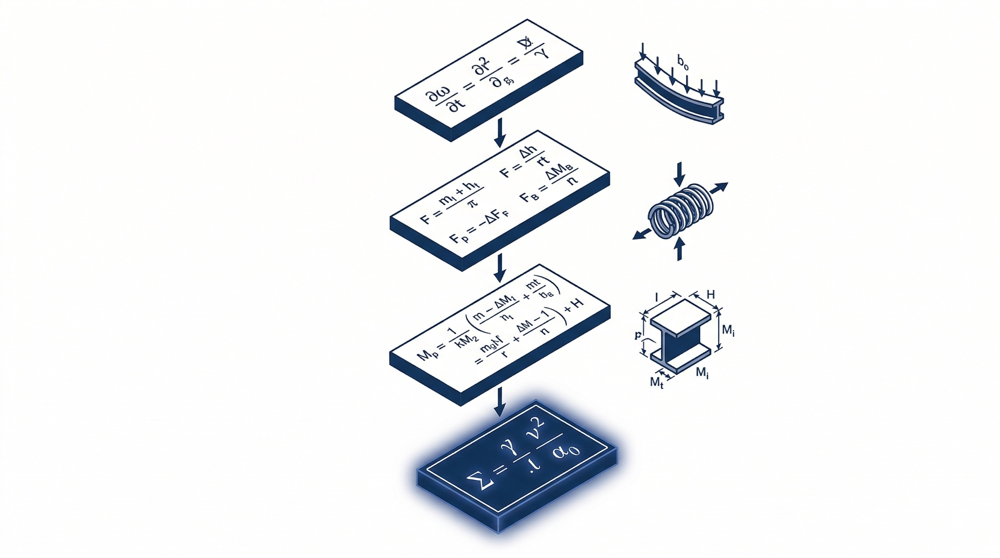

## Open Formula

Structural formulas are used daily and derived rarely. This series opens them up.

Each derivation starts from a physical hypothesis — plane sections remain plane, small deformations, linear elasticity — and reaches the final boxed result through a chain of numbered equations. Every step carries its validity limits alongside the formula, not buried in a footnote or left to the reader's memory. Cross-references are explicit: "(3) into (7)" tells you exactly which equations combine and where.

The derivations close with the assumptions listed in the order they entered the pipeline, each tied to its equation number. If any one fails, the formula does not hold — and you know which one broke it.

The tone is dry and technical. The reader is an engineer who needs to verify where a formula comes from, check its limits, or trace an assumption back to its origin. Not a textbook, not a tutorial — a reference.
