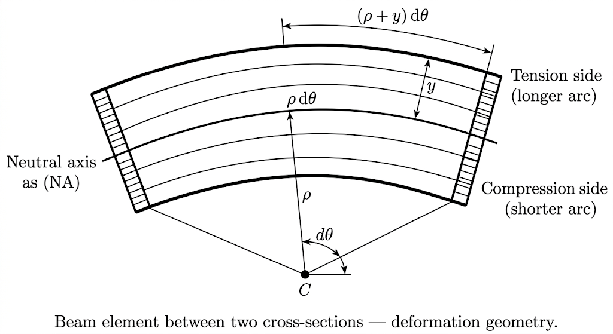
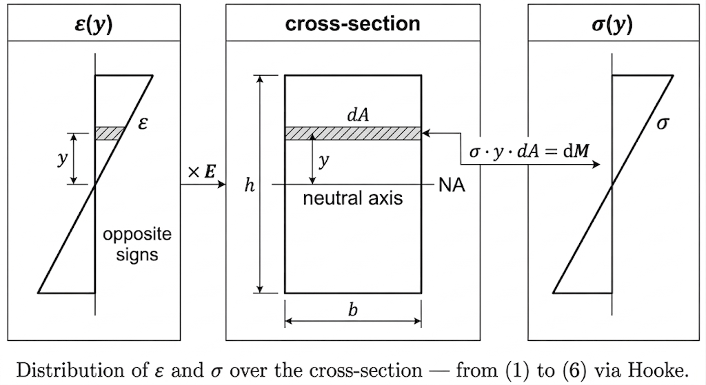
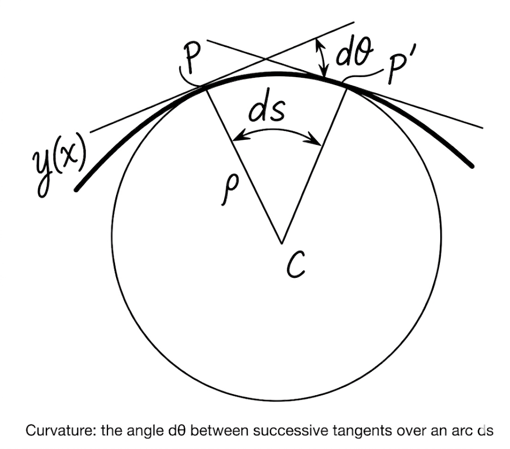

## Derivation of EI · y″ = M(x)

A straight beam is subjected to bending. We want a relation between the bending moment at a cross-section and the curvature of the beam axis.

$y$ is the vertical axis of the cross-section, origin on the neutral axis. $\rho$ is the radius of curvature of the deformed axis. $x$ runs along the beam.

If cross-sections remain plane after deformation, a section rotating by $d\theta$ produces between two adjacent sections a relative displacement $y \, d\theta$ over an arc $\rho \, d\theta$:

$$\varepsilon(y) = \frac{y}{\rho} \tag{1}$$

Breaks down for beams with depth-to-span ratio above roughly 1/5, where shear deformation is no longer negligible.

Hooke's law ($\sigma = E\varepsilon$) applied to (1):

$$\sigma(y) = \frac{Ey}{\rho} \tag{2}$$

Requires homogeneous material with no fibre beyond the elastic limit.

No net axial force acts on the section. Integrating (2) over the area:

$$N = \int_A \sigma \, dA = \frac{E}{\rho}\int_A y \, dA = 0 \tag{3}$$

$E/\rho \neq 0$, so $\int_A y \, dA = 0$: the neutral axis passes through the centroid of the section. This anchors the origin of $y$.

Each strip $dA$ at distance $y$ from the neutral axis carries a force $\sigma \, dA$ with lever arm $y$:

$$dM = \sigma(y) \cdot y \cdot dA \tag{4}$$

Integrating (4) over the section and substituting (2):

$$M = \int_A \sigma(y) \cdot y \, dA = \frac{E}{\rho} \int_A y^2 \, dA \tag{5}$$

$E$ and $\rho$ do not depend on position over the section and come out of the integral. $\int_A y^2 \, dA = I$, a purely geometric property of the section. For a rectangle $b \times h$:

$$I = \int_{-h/2}^{h/2} y^2 \cdot b \, dy = b \left[\frac{y^3}{3}\right]_{-h/2}^{h/2} = \frac{bh^3}{12} \tag{6}$$

The cube of $h$ comes from integrating $y^2$ over a domain of width $h$.

(5) with $I$:

$$\frac{1}{\rho} = \frac{M}{EI} \tag{7}$$

The exact curvature of a plane curve $y(x)$:

$$\frac{1}{\rho} = \frac{y''}{\left(1 + y'^2\right)^{3/2}} \tag{8}$$

Where it comes from: the tangent angle is $\theta = \arctan(y')$, giving $d\theta/dx = y''/(1+y'^2)$. The arc length element is $ds = \sqrt{1+y'^2}\,dx$. Curvature is $d\theta/ds = (d\theta/dx)/(ds/dx)$, which yields (8).

For small deformations $y'^2 \ll 1$, the denominator tends to 1:

$$\frac{1}{\rho} \approx y'' \tag{9}$$

Approximation within 1% for slopes below 6° ($y' < 0.1$).

(9) into (7):

$$\boxed{EI \cdot y''(x) = M(x)} \tag{10}$$

Assumptions, in the order they entered: plane sections (1), linear elastic material (2), no net axial force (3), section geometry known (6), small deformations (9). If any one fails, (10) does not hold.