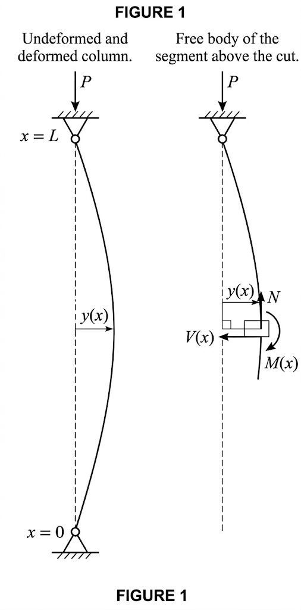
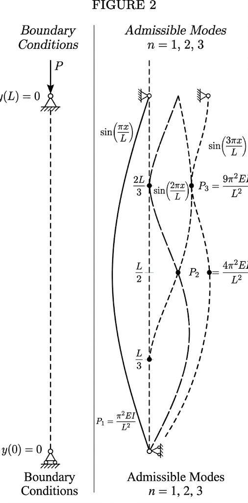

## Where $P_{cr} = \dfrac{\pi^2 EI}{L^2}$ comes from

Straight column, centred axial load, pinned at both ends. The goal is the value of $P$ at which the straight configuration ceases to be the only equilibrium shape and the column can sustain a laterally deflected one — the critical load.

Axis $x$ along the column, origin at the lower pin, $x = L$ at the upper pin. Axis $y$ perpendicular, in the plane of buckling. $P > 0$ denotes compression.

The column is in equilibrium in the straight configuration under any $P$. The question is whether a $P$ exists for which a slightly deflected configuration $y(x) \neq 0$ is also an equilibrium.

Cut the column at a generic point $x$. Consider the segment from $x$ to $L$. In the deflected configuration the section at $x$ is displaced laterally by $y(x)$ with respect to the line of action of $P$. That displacement is the lever arm of the moment.

Equilibrium on the deflected geometry (second-order analysis) gives the bending moment at section $x$:

$$M(x) = -P \cdot y(x) \tag{1}$$

Sign: $P$ acting on a positive lateral displacement $y$ produces a moment that curves the column back toward $y = 0$ — negative under the convention $y'' > 0$ for concavity toward positive $y$.

*Validity of (1): the moment is written on the deflected geometry, but the lever arm $y(x)$ does not account for the axial shortening of the column. This is consistent as long as rotations are small, $y'^2 \ll 1$.*

The Euler-Bernoulli moment–curvature relation, with linearised curvature ($\kappa \approx y''$, curvature of the deformed axis, valid for $y'^2 \ll 1$; hypothesis: plane sections remain plane and perpendicular to the deformed axis):

$$EI \cdot y''(x) = M(x) \tag{2}$$

$E$ is the Young's modulus (linear elastic material, $\sigma = E\varepsilon$); $I$ is the second moment of area of the cross-section.

(1) into (2), rearranging:

$$EI \cdot y''(x) + P \cdot y(x) = 0 \tag{3}$$

The cross-section is constant along $x$, so $EI$ in (3) is a constant coefficient.

Define:

$$k^2 = \frac{P}{EI} \tag{4}$$

with $k > 0$ (real, since $P > 0$ and $EI > 0$). Dividing (3) by $EI$:

$$y''(x) + k^2 \, y(x) = 0 \tag{5}$$

(5) is a linear, homogeneous, second-order ODE with constant coefficients. Characteristic equation $\lambda^2 + k^2 = 0$, roots $\lambda = \pm ik$. General solution:

$$y(x) = A \sin(kx) + B \cos(kx) \tag{6}$$

$A$ and $B$ are constants fixed by the boundary conditions.

Boundary condition at the lower pin — zero displacement:

$$y(0) = 0 \tag{7}$$

(7) into (6): $A \sin(0) + B \cos(0) = B = 0$. There remains:

$$y(x) = A \sin(kx) \tag{8}$$

Boundary condition at the upper pin — zero displacement:

$$y(L) = 0 \tag{9}$$

(9) into (8):

$$A \sin(kL) = 0 \tag{10}$$

(10) is satisfied if $A = 0$ or $\sin(kL) = 0$.

$A = 0$ gives $y(x) = 0$ for all $x$: the straight configuration, which is a solution for every $P$.

For a deflected configuration ($A \neq 0$):

$$\sin(kL) = 0 \tag{11}$$

(11) requires $kL = n\pi$ with $n = 1, 2, 3, \ldots$ ($n = 0$ gives $k = 0$, i.e. $P = 0$; negative $n$ adds no independent solutions).

Hence:

$$k = \frac{n\pi}{L} \tag{12}$$

(12) into (4), solving for $P$:

$$P_n = \frac{n^2 \pi^2 EI}{L^2}, \qquad n = 1, 2, 3, \ldots \tag{13}$$

(13) is an infinite sequence of loads, each associated with a buckling mode of $n$ half-sine-waves over $[0, L]$. The corresponding deflected shape follows from (8) and (12):

$$y_n(x) = A \sin\!\left(\frac{n\pi x}{L}\right) \tag{14}$$

The amplitude $A$ remains undetermined: the linearised stability analysis identifies *at which load* the column buckles, not *by how much*. (14) defines the shape, not the amplitude.

*Validity of (13)–(14): the entire derivation assumes small rotations. As $A$ grows, the linearisation of curvature breaks down and the exact (elliptic-integral) elastica governs.*

The critical load is the lowest in the sequence, $n = 1$:

$$\boxed{P_{cr} = \frac{\pi^2 EI}{L^2}} \tag{15}$$

with associated deflected shape:

$$y_{cr}(x) = A \sin\!\left(\frac{\pi x}{L}\right) \tag{16}$$

*Validity of (15): the critical stress $\sigma_{cr} = P_{cr}/A_{s}$ (where $A_s$ is the cross-sectional area) must remain below the yield stress $f_y$. Substituting (15): $\sigma_{cr} = \pi^2 E / \lambda^2$, where $\lambda = L / \sqrt{I/A_s}$ is the slenderness ratio. For stocky columns ($\lambda$ below the limiting value $\lambda_{lim} = \pi\sqrt{E/f_y}$), material yielding precedes buckling and (15) overestimates the actual failure load. This is the domain where the Euler hyperbola is replaced by empirical or semi-empirical column curves (Johnson parabola, EC3 curves a/b/c/d).*

The reason $n = 1$ governs: in a real column the load increases from zero. $P_1$ is the first value of $P$ that admits a deflected equilibrium. Higher modes ($n \geq 2$) require higher loads and are not reached unless intermediate restraints prevent the lower modes.

## Assumptions, in the order they entered

| Assumption | Where it entered | Formula |
|---|---|---|
| Equilibrium written on the deflected geometry (second-order analysis) | Lever arm proportional to $y(x)$ | (1) |
| Small rotations ($y'^2 \ll 1$) | Linearised curvature $\kappa \approx y''$; consistency of the lever arm in (1) | (1), (2) |
| Plane sections remain plane and perpendicular to the deformed axis (Euler-Bernoulli) | Moment–curvature relation | (2) |
| Linear elastic material ($\sigma = E\varepsilon$) | $E$ constant in the constitutive law | (2) |
| Constant cross-section along $x$ ($I = \text{const}$) | $EI$ treated as a constant coefficient | (3) |
| Pinned supports at both ends | $y(0) = 0$, $y(L) = 0$ | (7), (9) |
| Column sufficiently slender ($\sigma_{cr} < f_y$) | Elastic buckling precedes yielding | (15) |

If any of these fails, (15) does not hold. Changed end restraints (fixed-free, fixed-pinned, fixed-fixed) replace $kL = n\pi$ with a different transcendental equation and alter the numerical coefficient $\pi^2$ in (15) — conventionally expressed through the effective length $L_0$. If $EI$ varies along $x$, (5) has non-constant coefficients and the solution is no longer sinusoidal. If rotations are not small, the exact curvature $\kappa = y''/(1+y'^2)^{3/2}$ replaces $y''$ and (5) becomes nonlinear.