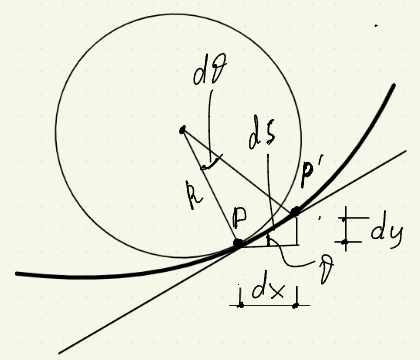
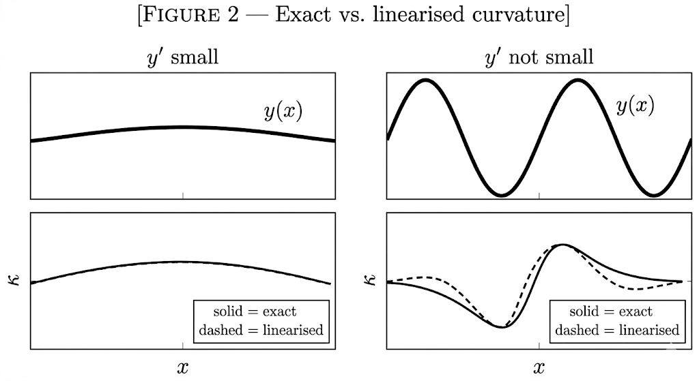

## Curvature of a plane curve: $\kappa = \dfrac{y''}{(1 + y'^2)^{3/2}}$

A smooth curve $y(x)$ lies in a plane. We want an expression for the curvature $\kappa$ at a generic point, in terms of the derivatives of $y$, and then the conditions under which $\kappa$ reduces to $y''$ alone.

Coordinates: $x$ horizontal, $y$ vertical, $y(x)$ single-valued and at least twice differentiable in the interval of interest.

At every point the tangent makes an angle $\theta$ with the $x$-axis. The curvature is the rate at which $\theta$ rotates per unit arc length:

$$\kappa = \frac{d\theta}{ds} \tag{1}$$

This is a definition, not an approximation. It is equivalent to $\kappa = 1/R$, where $R$ is the radius of the osculating circle. (1) holds for any smooth plane curve described by any parametrisation; what follows specialises it to the Cartesian form $y(x)$.

Since $y(x)$ is single-valued, the tangent angle at any point is

$$\theta = \arctan(y') \tag{2}$$

where $y' = dy/dx$. (2) requires the curve to be expressible as a function of $x$ — it fails at vertical tangents, where $y' \to \pm\infty$.

Differentiating (2) with respect to $x$ by the chain rule:

$$\frac{d\theta}{dx} = \frac{y''}{1 + y'^2} \tag{3}$$

The derivative of $\arctan(u)$ is $1/(1 + u^2)$; composed with $u = y'$, the numerator picks up $dy'/dx = y''$.

The arc-length element along $y(x)$ satisfies

$$ds = \sqrt{1 + y'^2}\; dx \tag{4}$$

which is Pythagoras on the infinitesimal triangle $(dx, dy, ds)$: $ds^2 = dx^2 + dy^2 = (1 + y'^2) \, dx^2$.

Now (1) can be rewritten as a ratio of rates with respect to $x$. Dividing (3) by $ds/dx$ from (4):

$$\kappa = \frac{d\theta/dx}{ds/dx} = \frac{y''}{(1 + y'^2)^{3/2}} \tag{5}$$

The exponent $3/2$ comes from the product of $(1 + y'^2)$ in the denominator of (3) and $(1 + y'^2)^{1/2}$ from (4). (5) is exact for any twice-differentiable single-valued curve $y(x)$. No approximation has been made; the only restriction is that $y'$ must be finite (no vertical tangent).

The sign convention: with the axes oriented as above, $\kappa > 0$ means the curve is concave upward (centre of curvature above the curve), $\kappa < 0$ concave downward. This follows from the sign of $y''$.

When the slope of the curve is small — specifically, when

$$y'^2 \ll 1 \tag{6}$$

the term $(1 + y'^2)^{3/2}$ in the denominator of (5) tends to 1. The curvature becomes

$$\kappa \approx y'' \tag{7}$$

To see how fast the approximation degrades: at $y' = 0.1$, the denominator is $(1.01)^{3/2} \approx 1.015$ — error below 2%. At $y' = 0.3$, the denominator is $(1.09)^{3/2} \approx 1.14$ — error around 13%. At $y' = 1$ (45° slope), the denominator is $2\sqrt{2} \approx 2.83$ — the linearised curvature overestimates the true value by a factor of nearly 3.

(7) is the curvature that enters the Euler–Bernoulli beam equation $EI \cdot y'' = M(x)$. Every derivation that starts from "curvature equals $y''$" is using (7), not (5), and therefore carries the restriction (6): the beam slope must remain small everywhere along the span. For ordinary structural members this is satisfied by wide margins; for cables, arches, or post-buckled configurations it is not.

> **Exact curvature:**
> $$\boxed{\kappa = \frac{y''}{(1 + y'^2)^{3/2}}}$$

> **Linearised curvature (small slopes):**
> $$\boxed{\kappa \approx y''}$$

Definitions and restrictions, in the order they entered the pipeline: smooth curve $y(x)$ with finite slope (2), geometric definition of curvature as $d\theta/ds$ (1), Cartesian arc-length element (4), small-slope assumption $y'^2 \ll 1$ (6). The exact formula (5) requires only the first three. The linearised formula (7) requires all four. If (6) fails, (7) is invalid but (5) still holds.

This is the $\kappa$ that, multiplied by $EI$, gives the bending moment in the [Euler–Bernoulli derivations](/engineering-tools/series-b/b1-euler-bernoulli/).