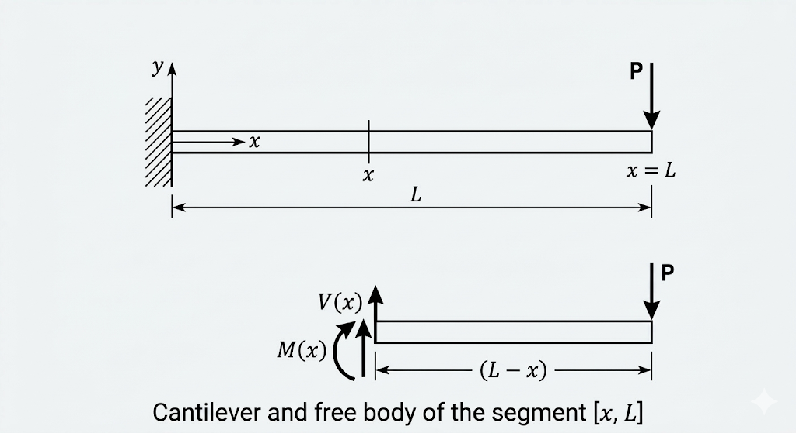
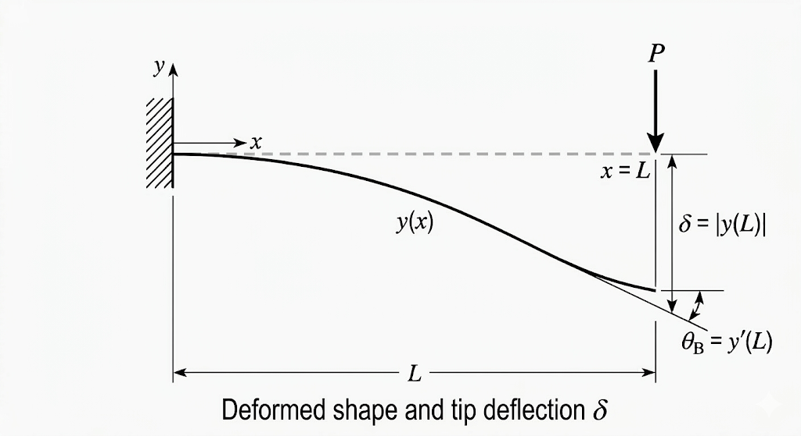

## Where $\delta = \dfrac{PL^3}{3EI}$ comes from

Cantilever beam, concentrated load $P$ at the free end. The goal is the vertical displacement of the tip, starting from the moment–curvature relation $EI \cdot y'' = M(x)$.

Axis $x$ along the beam, origin at the fixed end, $x = L$ at the free end. Axis $y$ vertical, positive upward. $P > 0$ is the magnitude of the load, directed downward.

Cut at a generic section $x$. Free body of the segment from $x$ to $L$: the only external force is $P$ downward, applied at distance $(L - x)$ from the section. Moment equilibrium about the cut, $M(x)$ drawn in the assumed positive sense:

$$M(x) = -P(L - x) \tag{1}$$

Sign: $P$ downward with positive lever arm $(L - x)$ produces concavity downward — negative under the convention $y'' > 0$ for upward concavity.

The moment is written on the undeformed geometry (first-order analysis). Consistent with the small-deformation hypothesis already embedded in $EI \cdot y'' = M(x)$.

(1) into $EI \cdot y'' = M(x)$:

$$EI \cdot y''(x) = -P(L - x) \tag{2}$$

$EI$ constant along $x$: the cross-section does not change. (2) is a second-order, linear, non-homogeneous ODE with a first-degree polynomial forcing term.

Integrating (2) with respect to $x$:

$$EI \cdot y'(x) = -P\!\left(Lx - \frac{x^2}{2}\right) + C_1 \tag{3}$$

At the fixed end the section does not rotate:

$$y'(0) = 0 \tag{4}$$

(4) into (3): $C_1 = 0$. There remains:

$$EI \cdot y'(x) = -P\!\left(Lx - \frac{x^2}{2}\right) \tag{5}$$

Integrating (5) with respect to $x$:

$$EI \cdot y(x) = -P\!\left(\frac{Lx^2}{2} - \frac{x^3}{6}\right) + C_2 \tag{6}$$

At the fixed end the displacement is zero:

$$y(0) = 0 \tag{7}$$

(7) into (6): $C_2 = 0$. Full deflection curve:

$$y(x) = -\frac{P}{EI}\left(\frac{Lx^2}{2} - \frac{x^3}{6}\right) \tag{8}$$

A cubic polynomial in $x$. The third degree comes from a moment that is linear in $x$ (first degree), integrated twice.

$x = L$ in (8):

$$y(L) = -\frac{P}{EI}\left(\frac{L \cdot L^2}{2} - \frac{L^3}{6}\right) = -\frac{P}{EI}\cdot\frac{L^3}{3} \tag{9}$$

The algebra: $L \cdot L^2/2 - L^3/6 = L^3(3 - 1)/6 = L^3/3$. The $L^3$ factor is $L$ from the moment arm times $L^2$ from the double integration. The $1/3$ factor is the combination $1/2 - 1/6$.

The tip deflection is the absolute value of $y(L)$:

$$\boxed{\delta = \frac{PL^3}{3EI}} \tag{10}$$

Assumptions, in the order they entered: plane sections, linear elastic material, small deformations (all three from [$EI \cdot y'' = M(x)$](/engineering-tools/series-b/b1-euler-bernoulli/), the starting point), moment on the undeformed geometry (1), $EI$ constant along $x$ (2), perfect fixed end — zero rotation (4) and zero displacement (7). If any one fails, (10) does not hold.