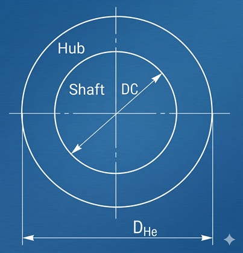
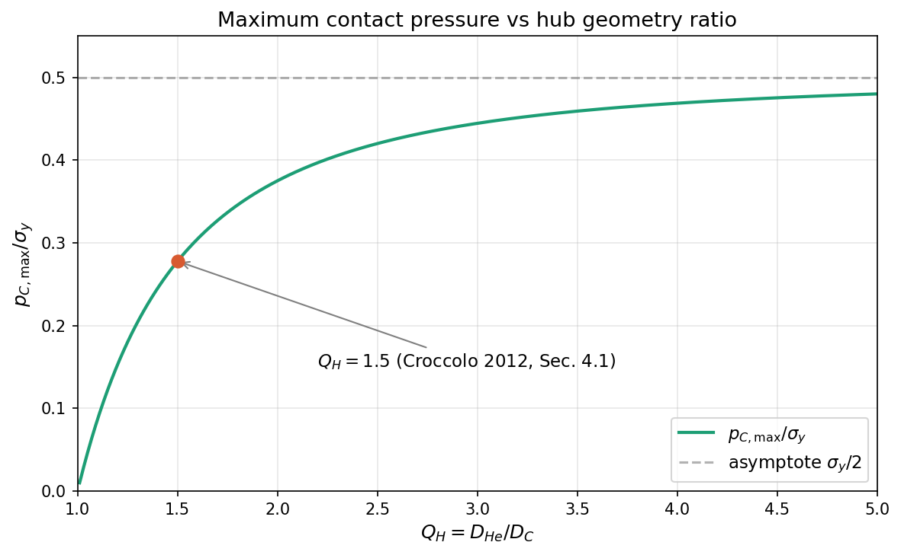

A shrink-fit hub on a shaft must transmit torque without yielding. Lamé's equations give the stress state as a function of the contact pressure $p_C$ and the geometry. One question remains: beyond what $p_C$ does the hub yield?

Tresca's criterion answers this by reducing a 3D stress state to a single scalar comparable to the uniaxial yield strength. The combination of Lamé and Tresca produces a closed-form expression for the maximum allowable contact pressure as a function of the hub geometry ratio $Q_H$ and the yield strength $\sigma_y$ alone.

---

## Pipeline

### (1) Stress state at the hub inner surface

Axial symmetry makes the stress tensor diagonal in cylindrical coordinates $(r, \theta, z)$:

$$\tau_{r\theta} = \tau_{rz} = \tau_{\theta z} = 0 \tag{1}$$

The diagonal components are principal stresses. Lamé's equations for a hollow cylinder under internal pressure $p_C$, evaluated at the inner radius $r = D_C/2$:

$$\sigma_r\Big|_{r=D_C/2} = -p_C \tag{2}$$

$$\sigma_\theta\Big|_{r=D_C/2} = p_C \cdot \frac{Q_H^2 + 1}{Q_H^2 - 1} \tag{3}$$

with:

$$Q_H \equiv \frac{D_{He}}{D_C}, \qquad Q_H > 1 \tag{4}$$

where $D_{He}$ is the hub outer diameter and $D_C$ the contact diameter. The axial stress $\sigma_z$ lies between $\sigma_r$ and $\sigma_\theta$ for both plane-stress ($\sigma_z = 0$) and plane-strain ($\sigma_z = \nu(\sigma_r + \sigma_\theta)$) configurations.



### (2) Ordering of principal stresses

With convention $\sigma_1 \ge \sigma_2 \ge \sigma_3$:

$$\sigma_1 = \sigma_\theta > 0, \qquad \sigma_2 = \sigma_z, \qquad \sigma_3 = \sigma_r = -p_C < 0 \tag{5}$$

### (3) Critical Mohr circle

The governing Mohr circle is $C_{13}$, built on the $(\sigma_1, \sigma_3)$ pair:

$$\tau_{max} = \frac{\sigma_1 - \sigma_3}{2} = \frac{\sigma_\theta + p_C}{2} \tag{6}$$

The intermediate stress $\sigma_z$ does not appear: Tresca is insensitive to $\sigma_2$.


<p style="margin: 12px 0 4px 0; font-style: italic; color: #666; font-size: 0.9em;">
Move the slider to rotate the face normal in physical space. Watch the corresponding point trace an arc on the Mohr circle. The maximum shear stress is reached at $2\theta = 90°$ from the principal direction — that is, at $\theta = 45°$ in physical space.
</p>
<iframe src="/widgets/B5_mohr_explorer_v3.html"
        width="100%" height="640" frameborder="0"
        style="border-radius: 8px; margin: 12px 0 24px 0;">
</iframe>


### (4) Tresca criterion

Uniaxial tension at yield: $\sigma_1 = \sigma_y$, $\sigma_3 = 0$, hence $\tau_{max}^{(tension)} = \sigma_y/2$. Equating to (6):

$$\sigma_\theta + p_C = \sigma_y \tag{8}$$

Tresca equivalent stress:

$$\sigma_{Tresca} = \sigma_1 - \sigma_3 = \sigma_\theta + p_C \tag{9}$$

### (5) Substitution and simplification

Inserting (3) into (9):

$$\sigma_{Tresca} = p_C \cdot \frac{2\, Q_H^2}{Q_H^2 - 1} \tag{10}$$

### (6) Maximum allowable contact pressure

Imposing $\sigma_{Tresca} \le \sigma_y$ and inverting:

$$\boxed{\,p_{C,\max} = \sigma_y \cdot \frac{Q_H^2 - 1}{2\, Q_H^2}\,} \tag{11}$$

---

## Closing

**Final formula.** $p_{C,\max} = \sigma_y (Q_H^2 - 1) / (2 Q_H^2)$.

**Assumptions (in order of appearance):**

1. Axial symmetry (coaxial shaft and hub, $\theta$-independent loading) — eq. (1)
2. Lamé validity: homogeneous, isotropic, linear-elastic material, small strains — eqs. (2), (3)
3. $\sigma_z$ intermediate between $\sigma_r$ and $\sigma_\theta$ — eq. (5)
4. Tresca criterion (ductile material, slip-dominated failure) — eq. (8)
5. Unity safety factor; substitute $\sigma_y \to \sigma_y / n_s$ in design
6. No friction shear on coupling surface ($\tau = 0$). The full formulation including friction $\tau = \mu p_C + \tau_{ad}$ is in Croccolo et al. (2012), Eq. (12). Formula (11) is the $\mu = 0$, $\tau_{ad} = 0$ limit, which overestimates $p_{C,\max}$ by about 2–3% for typical friction coefficients.

**Numerical validity limits:**

- $Q_H \to 1^+$: $p_{C,\max} \to 0$ (vanishingly thin hub)
- $Q_H \to \infty$: $p_{C,\max} \to \sigma_y / 2$ (semi-infinite body)
- $p_C > p_{C,\max}$: incipient yielding at inner surface; progressive plastification not covered by elastic Lamé

**Practical use.** Equation (11) sets the upper bound on the interference $Z$: torque transmission requires $Z \ge Z_{\min}$; hub strength requires $p_C \le p_{C,\max}$, hence $Z \le Z_{\max}$. If $Z_{\min} > Z_{\max}$, increase $Q_H$, choose a stronger hub material, or add adhesive.

---

## Maximum contact pressure vs hub geometry ratio



```python
import numpy as np
import matplotlib.pyplot as plt

Q = np.linspace(1.01, 5.0, 400)
ratio = (Q**2 - 1) / (2 * Q**2)

fig, ax = plt.subplots(figsize=(8, 5))
ax.plot(Q, ratio, linewidth=2, color='#1D9E75', label=r'$p_{C,max}/\sigma_y$')
ax.axhline(0.5, linestyle='--', color='gray', alpha=0.6, label=r'asymptote $\sigma_y/2$')
ax.scatter([1.5], [(1.5**2 - 1)/(2*1.5**2)], color='#D85A30', zorder=5, s=60)
ax.annotate(r'$Q_H = 1.5$ (Croccolo 2012, Sec. 4.1)',
            xy=(1.5, (1.5**2-1)/(2*1.5**2)), xytext=(2.2, 0.15),
            arrowprops=dict(arrowstyle='->', color='gray'))
ax.set_xlabel(r'$Q_H = D_{He} / D_C$')
ax.set_ylabel(r'$p_{C,max} / \sigma_y$')
ax.set_title('Maximum contact pressure vs hub geometry ratio')
ax.grid(True, alpha=0.3)
ax.legend()
plt.tight_layout()
plt.savefig('pc_max_vs_qh.png', dpi=150, bbox_inches='tight')
```

---

## Numerical example — Croccolo, De Agostinis & Vincenzi (2012), Section 4.1

Data from the paper's scenario 2: hollow steel shaft (39NiCrMo3, $Q_S = 0.7$) press-fitted into an aluminium hub (EN-AW6082), no adhesive. The paper computes $p_C = 82$ MPa as the Tresca-limited maximum pressure including friction ($\mu = 0.4$).

| Parameter | Symbol | Value |
|:----------|:-------|:------|
| Contact diameter | $D_C$ | 28 mm |
| Hub outer diameter | $D_{He}$ | 42 mm |
| Hub geometry ratio | $Q_H$ | $42/28 = 1.5$ |
| Shaft aspect ratio | $Q_S$ | 0.7 |
| Hub material | — | EN-AW6082 aluminium |
| Hub yield strength | $\sigma_y$ | 304 MPa |
| Contact pressure (paper, with friction) | $p_C$ | 82 MPa |

**Calculations.**

From eq. (3):

$$\sigma_\theta = 82 \cdot \frac{1.5^2 + 1}{1.5^2 - 1} = 82 \cdot \frac{3.25}{1.25} = 82 \times 2.6 = 213.2 \text{ MPa}$$

From eq. (2): $\sigma_r = -82$ MPa.

From eq. (10):

$$\sigma_{Tresca} = 82 \cdot \frac{2 \times 2.25}{1.25} = 82 \times 3.6 = 295.2 \text{ MPa}$$

Cross-check: $\sigma_\theta + p_C = 213.2 + 82 = 295.2$ MPa ✓

Safety factor: $n_s = 304 / 295.2 = 1.03$.

From eq. (11):

$$p_{C,\max} = 304 \cdot \frac{1.25}{4.5} = 304 \times 0.278 = 84.4 \text{ MPa}$$

**Interpretation.** The simplified formula (11) gives $p_{C,\max} = 84.4$ MPa. The paper reports 82 MPa from the full Tresca criterion including friction ($\mu = 0.4$). The 2.9% difference confirms that friction has a modest effect on the yield limit. The safety factor $n_s = 1.03$ indicates that 82 MPa is essentially at the Tresca limit — as expected, since the paper computed it as the maximum allowable pressure.

For a case with a more comfortable margin: at $p_C = 67$ MPa (the paper's hybrid scenario with adhesive), $\sigma_{Tresca} = 67 \times 3.6 = 241.2$ MPa and $n_s = 304/241.2 = 1.26$.

---

## References

1. Croccolo D., De Agostinis M., Vincenzi N. (2012), "Design and optimization of shaft–hub hybrid joints for lightweight structures: Analytical definition of normalizing parameters", *Int. J. Mechanical Sciences*, **56**, 77–85.
2. Croccolo D., Vincenzi N. (2009), "A generalized theory for shaft–hub couplings", *Proc. IMechE Part C*, **223**, 2231–2239.
3. Timoshenko S., Goodier J.N. (1970), *Theory of Elasticity*, McGraw-Hill, 3rd ed.

---

**Related:** [Thick-Walled Cylinder Stress Analysis (Croccolo 2009)]()

<!-- TODO: cover.png — chiedere a Giovanni / Nano Banana -->
<!-- TODO: copiare mohr_explorer_v3.html in static/widgets/ -->
