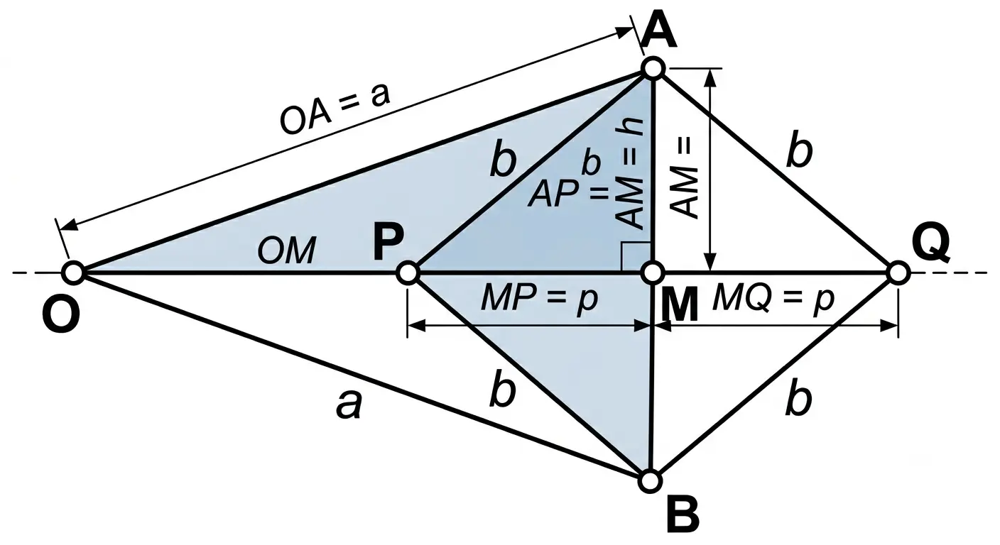
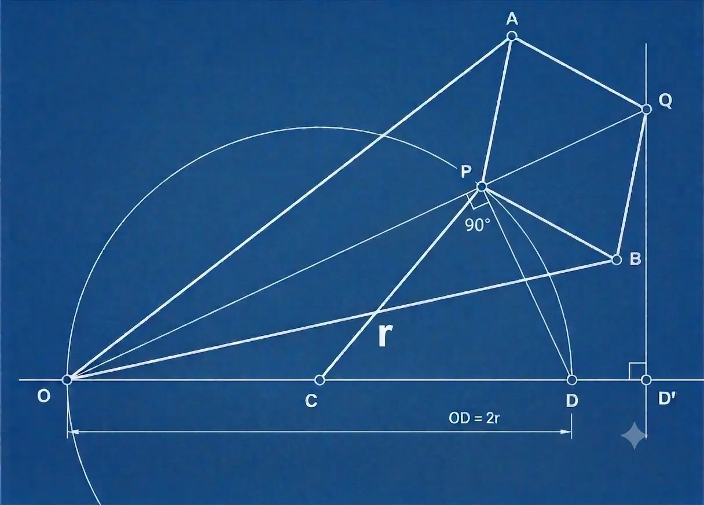

The Peaucellier linkage is an articulated device that holds the product of two distances constant. However its bars move, two of its points — $P$ and $Q$ — stay bound by $\overline{OP}\cdot\overline{OQ} = \text{const}$. It is an inversor: it mechanically realizes circular inversion. Everything else follows from this single property, including the result it is known for — that it can trace an exact straight line.

The argument runs in two steps. First, the geometry of the articulated rhombus forces the constant product: the inversor property. Then, constraining the input to a circle that passes through $O$, the output is a straight line: the line as a special case of the inversion.

## 1. The inversor cell

The inversor cell is built from **six rigid bars**:

- two **arms** $OA = OB = a$;
- four **rhombus sides** $PA = PB = QA = QB = b$.

$O$ is the **fixed pivot**, the center of inversion. $A$ and $B$ are the rhombus vertices tied to $O$; $P$ and $Q$ are the opposite vertices, $P$ inner and $Q$ outer. $P$ is the inversor's input, $Q$ its output.

The three points $O$, $P$, $Q$ are collinear. $O$ is equidistant from $A$ and $B$ because $OA = OB$; $P$ and $Q$ are equidistant from $A$ and $B$ because the rhombus sides are equal. All three therefore lie on the perpendicular bisector of $AB$, which carries the rhombus diagonal $PQ$. Call this line the **median axis**: $\overline{OP}$ and $\overline{OQ}$ are measured along it.

The cell alone leaves $P$ free in the plane. To drive the inversor, $P$ is constrained by a **crank** $CP$ — the seventh bar — as shown in §3. Counting the **frame** that anchors the pivots $O$ and $C$, the kinematic members are eight; the physical bars to build are seven.

## 2. The inversor property — $\overline{OP}\cdot\overline{OQ}=a^2-b^2$

Let $M$ be the center of the rhombus, where the diagonals $AB$ and $PQ$ cross. The diagonals of a rhombus are perpendicular and bisect each other: $M$ is the midpoint of $PQ$ and the angle at $M$ is right. Along the median axis the points lie in the order $O,\,P,\,M,\,Q$. Set $MP = MQ = p$ and $AM = h$. Then:

$$\overline{OP} = \overline{OM} - p, \qquad \overline{OQ} = \overline{OM} + p \tag{1}$$

Pythagoras on the two right triangles at $M$ — $OMA$ and $AMP$ — which share the leg $AM = h$:

$$a^2 = \overline{OM}^2 + h^2 \tag{2}$$

$$b^2 = p^2 + h^2 \tag{3}$$

Subtracting $(3)$ from $(2)$ removes $h^2$:

$$a^2 - b^2 = \overline{OM}^2 - p^2 \tag{4}$$

The right side of $(4)$ is the difference of squares $(\overline{OM}-p)(\overline{OM}+p)$, which by $(1)$ is the product $\overline{OP}\cdot\overline{OQ}$. Hence:

$$\boxed{\;\overline{OP}\cdot\overline{OQ} = a^2 - b^2\;} \tag{5}$$

> *Valid for* $a > b$; otherwise $a^2-b^2 \le 0$ and the cell is not an inversor.

The lengths $a$ and $b$ belong to rigid bars: they do not change in any configuration. The product $\overline{OP}\cdot\overline{OQ}$ is therefore constant in every position of the mechanism.

This is the inversor property. Two points on the same ray from $O$, with a constant product of distances, are **inverse points** with respect to a circle centered at $O$: relation $(5)$ is **circular inversion** with constant $a^2-b^2$. Given the input $P$, the mechanism builds its output $Q$ as the inverse. Everything that follows is a consequence of $(5)$.

## 3. The straight line as a special case — the inverse of a circle through $O$

Now a specific input is imposed. The crank $CP$, hinged at a second fixed pivot $C$ on the axis, turns $P$ on a circle of radius $r = \overline{OC}$ — the **motor circle**. Since $\overline{OC}=r$, the circle passes through $O$.

### Geometric route

Let $D$ be the far end of the diameter from $O$, on the axis:

$$\overline{OD} = 2r \tag{6}$$

$OD$ is a diameter and $P$ lies on the circle, so by Thales' theorem:

$$\angle OPD = 90^\circ \tag{7}$$

Let $D'$ be the inverse of $D$: the point on the axis with $\overline{OD}\cdot\overline{OD'} = a^2-b^2$. It is fixed, since $D$ and $a^2-b^2$ are. By $(5)$ and the definition of $D'$, the two products coincide:

$$\overline{OP}\cdot\overline{OQ} = \overline{OD}\cdot\overline{OD'}
\quad\Longrightarrow\quad
\frac{\overline{OP}}{\overline{OD'}} = \frac{\overline{OD}}{\overline{OQ}} \tag{8}$$

Triangles $OPD$ and $OD'Q$ share the angle at $O$ and, by $(8)$, the sides enclosing it are proportional: they are similar by the side-angle-side criterion. The right angle at $P$ — relation $(7)$ — transfers to its counterpart at $D'$:

$$\angle OD'Q = 90^\circ \tag{9}$$

So $Q$ lies on the line through $D'$ perpendicular to the axis $OD$. Since $D'$ is fixed, this line does not depend on the position of $P$: it is the same for every point of the motor circle.

### Trigonometric check

The same result analytically. With $O$ at the origin and the axis $OD$ as the $x$-axis, a point $P$ on the motor circle (center $C=(r,0)$, radius $r$) has the polar equation:

$$\rho_P(\theta) = \overline{OP} = 2r\cos\theta \tag{10}$$

where $\theta$ is the polar angle of $P$. By $(5)$, the output $Q$ is at distance:

$$\rho_Q(\theta) = \overline{OQ} = \frac{a^2-b^2}{\rho_P(\theta)} = \frac{a^2-b^2}{2r\cos\theta} \tag{11}$$

The $x$-coordinate of $Q$ is $\rho_Q\cos\theta$:

$$x_Q = \rho_Q(\theta)\cos\theta = \frac{a^2-b^2}{2r\cos\theta}\cos\theta = \frac{a^2-b^2}{2r} \tag{12}$$

independent of $\theta$. The two routes agree: the locus of $Q$ is the vertical line

$$\boxed{\;x = \dfrac{a^2-b^2}{2r}\;}$$

This is the equation of a vertical line — the one case that cannot be written as $y=f(x)$, since a vertical has every $y$ over a single $x$. The fixed value is only the $x$-coordinate of $Q$; the $y$-coordinate, $y_Q = \rho_Q\sin\theta = \tfrac{a^2-b^2}{2r}\tan\theta$, sweeps the line as $\theta$ runs over $(-90^\circ, +90^\circ)$.

The geometric route shows *why* (Thales plus inversion send the circle to a line); the trigonometric check confirms it by computation. Equation $(10)$ — the chord $\rho_P = 2r\cos\theta$ — is itself Thales: $\overline{OP}$ is the leg of the right triangle inscribed in the diameter $2r$.

As the crank turns $P$ on the motor circle, $Q$ runs along this fixed line: the inversor turns the rotational motion of its input into the rectilinear motion of its output.

## Result

$$\boxed{\;\overline{OP}\cdot\overline{OQ} = a^2-b^2 \;\xrightarrow{\;P \text{ on circle through } O\;}\; Q \in \text{straight line},\quad x = \frac{a^2-b^2}{2r}\;}$$

**Assumptions, in the order they entered:**

1. Rigid bars, ideal hinges — §1
2. Equal arms $OA = OB = a$ — §1
3. Rhombus of equal sides $PA = PB = QA = QB = b$ — §1
4. $a > b$ (so that $a^2-b^2 > 0$) — §2
5. Crank $CP = r$ with $\overline{OC} = r$, forcing $P$ onto the motor circle through $O$ ($\overline{OD}=2r$) — §3

## Limits of validity

- **Exact line, finite stroke.** The locus of $Q$ is a line, but $Q$ travels only a segment of it: the stroke is bounded by the bar geometry.
- **Singular configurations.** Positions where the rhombus collapses (bars collinear) or the mechanism changes assembly mode are excluded; there the inversion relation loses physical meaning.
- **$a > b$ required**, from $(5)$.
- **Pure kinematics, zero speed.** The property is geometric, true even at rest. Dynamics, friction, and elasticity are outside this document.

<iframe class="wide-tool" src="/calculators/B6_peaucellier_inversor_explorer.html"
        style="width:100%; height:820px; border:0;" loading="lazy"></iframe>

---
The linkage is due to Charles-Nicolas Peaucellier (1864) and, independently, to Lippman Lipkin (1871): the first exact straight-line linkage built from hinges alone.
