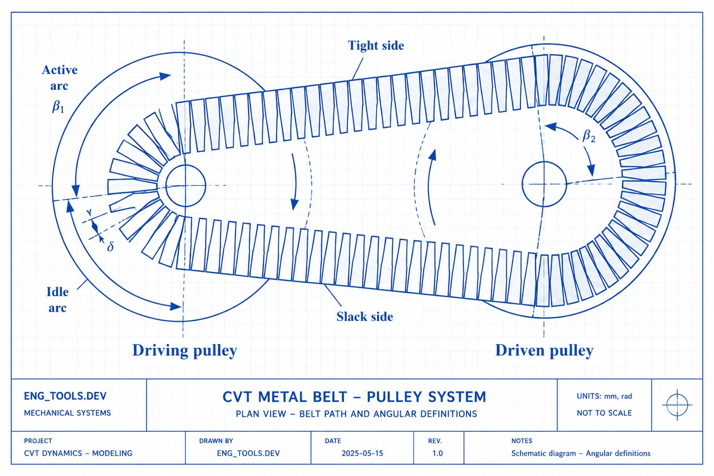
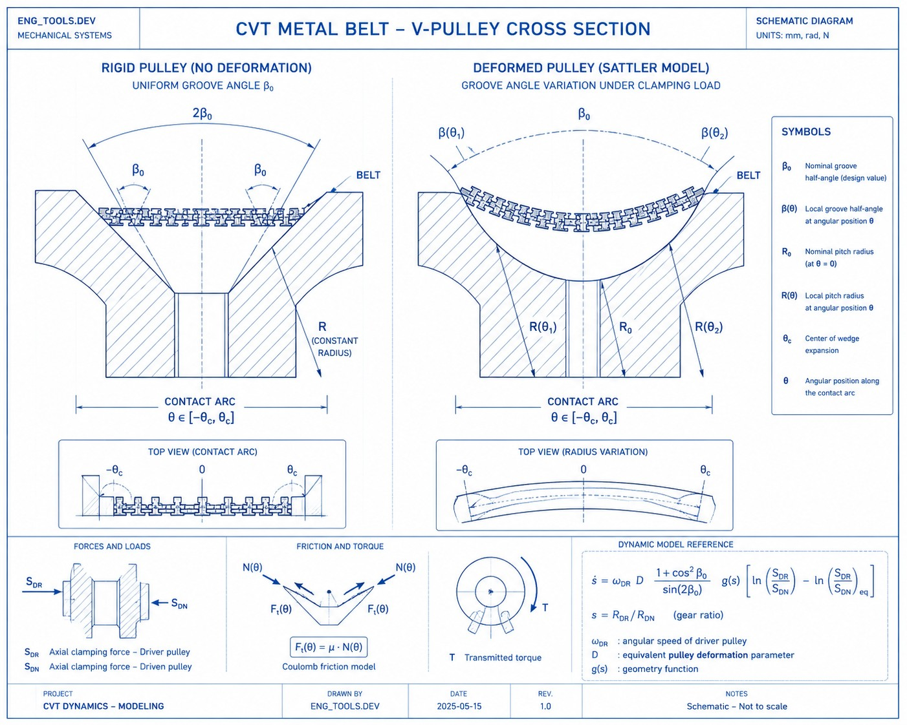
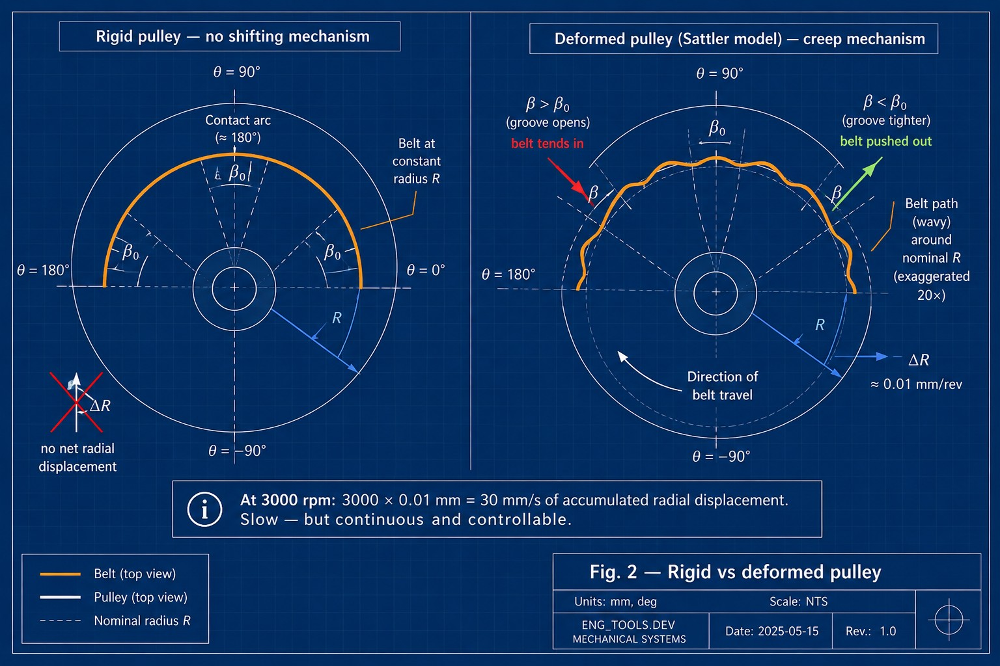
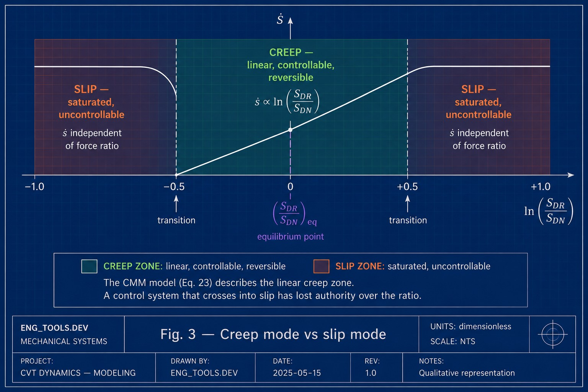

> *In a metal-belt CVT, the belt does not slip to a new radius — it creeps there, one fraction of a millimeter per revolution, driven by the elastic bending of the pulley. The rate of creep follows a logarithm.*

**Serie E — Engineering Essays**

Based on: Carbone G., Mangialardi L., Bonsen B., Tursi C., Veenhuizen P.A.,
*CVT dynamics: Theory and experiments*, Mechanism and Machine Theory, 42 (2007), 409–428.

---

## §1 — A transmission with no gears

A continuously variable transmission (CVT) provides an infinite number of gear ratios between two finite limits, with no discrete steps. Two pulleys — a *driver* (connected to the engine) and a *driven* (connected to the wheels) — are linked by a metal belt. Each pulley is made of two conical halves. A hydraulic system squeezes each pair of halves together with a clamping force: $S_{DR}$ on the driver, $S_{DN}$ on the driven. Squeeze harder and the belt rides at a larger radius; release and it drops. The gear ratio is:

$$
s = \frac{R_{DR}}{R_{DN}}
$$

where $R_{DR}$ and $R_{DN}$ are the running radii of the belt on the two pulleys.

The belt itself is not a rubber band. In the Van Doorne design — the most common in production vehicles — it consists of hundreds of thin steel segments threaded onto two flexible steel bands. The segments transmit force by *pushing* against each other, not by pulling.

*Adapted from Sensors 2022, 22(6), 2131 — CC BY 4.0*

*Fig. 1 — Two variable-radius pulleys connected by a metal push belt. The axial clamping forces $S_{DR}$ and $S_{DN}$ control the belt's running radius on each pulley.*

The principle is clear enough. What is far less obvious is the answer to a mechanical question that sits at the center of CVT design: **when the control system changes the balance of clamping forces, how does the belt physically move from one radius to another?**

---

## §2 — The belt creeps — it does not slip

### The naive picture and its problem

The intuitive answer is kinematic: increase $S_{DR}$ relative to $S_{DN}$, the driver pulley squeezes harder, the belt is pushed outward. Simple. But if you take this picture seriously, there are only two possible outcomes:

- The force imbalance is too small to overcome friction — nothing happens.
- The force imbalance overcomes friction — the belt slips suddenly to a new radius.

There is no middle ground. A rigid pulley and an inextensible belt give you either static equilibrium or abrupt slip. Neither is what happens in a real CVT during a controlled gear change.

### What actually happens: elastic deformation drives radial creep

The key insight of the Carbone–Mangialardi–Mantriota (CMM) model is that the pulleys are not rigid. Under clamping load, the conical halves bend slightly — like a plate under distributed pressure. The bending is described by the Sattler model:

$$
\beta(\theta) = \beta_0 + \frac{\Delta}{2} \sin\left(\theta - \theta_c + \frac{\pi}{2}\right)
$$

where $\beta_0$ is the nominal half-angle of the groove (11° in the tested CVT), $\Delta \approx 10^{-3}$ rad is the amplitude of the deformation, $\theta$ is the angular position along the contact arc, and $\theta_c$ is the center of the wedge expansion.

The number $\Delta$ is tiny — about one thousandth of a radian. But its consequence is decisive. The groove angle is no longer uniform around the contact arc. At one point the groove opens slightly wider than nominal; at another it is slightly tighter. At every revolution, the belt is nudged radially: pushed outward where the groove is tight, allowed to drop inward where it opens. The net displacement is a fraction of a millimeter per revolution — but at thousands of revolutions per minute, these displacements accumulate into a measurable rate of ratio change.

This is **creep mode**: the belt creeps radially, slowly and continuously, driven by the non-uniform groove geometry produced by elastic bending. It is the normal operating mode during every controlled shifting maneuver.

*Fig. 2 — Left: rigid pulley — the groove angle $\beta_0$ is uniform and the belt sits at constant radius. Right: deformed pulley (Sattler model) — the groove angle varies along the contact arc. This non-uniformity drives the creep-mode shifting mechanism.*

### What the deformation parameter controls

The amplitude $\Delta$ is not a fixed property of the pulley — it depends on the clamping force. A higher clamping force bends the pulley more, increasing $\Delta$. The paper fits this with a simple linear relation:

$$
\Delta = \left[1 + 0.02 \, (S_{DN} - 20)\right] \times 10^{-3}
$$

with $S_{DN}$ in kN. If $\Delta = 0$ — a perfectly rigid pulley — the shifting speed $\dot{s}$ is exactly zero regardless of the applied forces. **No deformation, no shifting.** This is the single most important prediction of the CMM model: the elastic compliance of the pulley is not a parasitic effect to be minimized — it is the engine of ratio change.

*Why $S_{DN}$ and not $S_{DR}$? In the test protocol, the driven clamping force is held constant during each shifting experiment while $S_{DR}$ is varied to produce the ratio change. This makes $S_{DN}$ the stable baseline that characterizes the pulley's structural state. Parametrizing $\Delta$ on the control variable $S_{DR}$ — which changes continuously during a maneuver — would not give the control engineer a useful reference.*

### The driven pulley follows by constraint

The belt has a fixed length. When the belt climbs on the driver pulley, it must descend on the driven. The coupling is purely kinematic:

$$
\frac{\dot{R}_{DN}}{\dot{R}_{DR}} = -h(s)
$$

where $h(s)$ is a positive function that depends on the gear ratio, belt length, and center-to-center distance. The negative sign confirms that the two radii move in opposite directions. The driver pulley *commands* the creep; the driven pulley *accommodates* it.

### Creep vs slip

The distinction between the two regimes is now a consequence, not a definition:

- **Creep mode:** the force imbalance is small, the belt displaces by fractions of a millimeter per revolution, and the rate of ratio change $\dot{s}$ responds predictably to the applied forces. The deformation-driven mechanism is in control.
- **Slip mode:** the force imbalance exceeds a critical threshold. Friction can no longer channel the belt into the gradual radial creep — the belt breaks free and slides abruptly on the pulley surface. In this regime the clamping force ratio has no influence on $\dot{s}$: the system is saturated and uncontrollable.

A well-designed CVT control system operates entirely in creep mode. The CMM model gives it the mathematical tool to stay there.

*Fig. 3 — Creep mode (center): the shifting speed $\dot{s}$ responds linearly to the logarithm of the clamping force ratio. Slip mode (edges): the belt slides uncontrollably and the force ratio has no influence. The CMM model describes the creep zone only.*

---

## §3 — The clamping force dilemma

The creep mechanism explains *how* the belt moves. The engineering problem is *how much* to push it.

The clamping forces $S_{DR}$ and $S_{DN}$ serve two functions simultaneously: they hold the belt in place (preventing slip under torque load) and they govern the shifting speed (through the deformation they produce). These two functions conflict:

- **Too little clamping force:** the belt enters slip mode. Torque capacity drops, the belt and pulley surfaces wear rapidly, and the control system loses authority over the gear ratio.
- **Too much clamping force:** contact pressures become excessive, friction losses increase, the hydraulic pump consumes more engine power, and the pulley deformation grows beyond the range where the model is reliable.

The control engineer needs a quantitative relationship: given a current gear ratio $s$ and a target shifting speed $\dot{s}$, what ratio $S_{DR}/S_{DN}$ should the hydraulic system apply — and how far can it push before the belt leaves the creep zone?

This is the question that Carbone et al. (2007) answer. Their result is a first-order differential equation where the shifting speed depends on the *logarithm* of the clamping force ratio — not on the ratio itself. The logarithm is not an empirical fit: it emerges from the exponential mechanics of friction on a curved surface, the same physics behind the capstan equation that every engineer meets in a first course on statics.

That equation is the subject of §4.

---

## §4 — The capstan equation returns

Why does the shifting speed depend on the *logarithm* of the clamping force ratio, rather than on the ratio itself?

The answer lies in a piece of classical mechanics that every engineer meets in a first course on statics: the capstan equation, also known as the Euler–Eytelwein formula. When a belt wraps around a cylinder with friction, the tension varies exponentially along the contact arc:

$$
\frac{T_1}{T_2} = e^{\mu \alpha}
$$

where $\mu$ is the friction coefficient and $\alpha$ is the wrap angle. The variable that linearizes this exponential relationship is the logarithm: $\ln(T_1/T_2) = \mu \alpha$.

The same physics operates in a CVT. The belt wraps around each pulley over a contact arc with friction. The pressure distribution, the tension distribution, and — crucially — the force balance that determines shifting all follow from this exponential mechanics. When you take the natural variable of the problem, the logarithm of the force ratio emerges as the quantity that relates linearly to the shifting speed.

The previous model by Ide (1995, 1996) assumed a linear relationship between $\dot{s}$ and the direct ratio $S_{DR}/S_{DN}$. Experimental data show that this approximation works reasonably well when $s > 1$ — which is the regime where $\ln(x) \approx x - 1$ is an acceptable approximation. But for $s < 1$, the Ide model deviates significantly from the measured data, while the logarithmic CMM model remains accurate across the full range.

This is not a mathematical curiosity. For a control engineer calibrating a CVT, using the wrong functional form means systematic errors in the force commands — errors that translate into slower shifting, higher losses, or belt slip.

---

## §5 — The equation in five pieces

The central result of the paper is a first-order ordinary differential equation for the gear ratio:

$$
\dot{s} = \omega_{DR} \cdot D \cdot \frac{1 + \cos^2\beta_0}{\sin(2\beta_0)} \cdot g(s) \cdot \left[\ln\frac{S_{DR}}{S_{DN}} - \ln\left(\frac{S_{DR}}{S_{DN}}\right)_{eq}\right]
$$

Each factor has a clear physical meaning.

**Factor 1 — $\omega_{DR}$ (primary angular velocity).** The faster the driver pulley spins, the more revolutions the belt makes per unit time, and the more the per-revolution radial creep accumulates. The relationship is directly proportional, confirmed experimentally by doubling the speed from 1000 to 2000 rpm and observing a doubling of the shifting speed.

**Factor 2 — $D$ (pulley deformation parameter).** This is the amplitude of the Sattler sinusoid from §2. If $D = 0$ — perfectly rigid pulleys — the equation gives $\dot{s} = 0$ regardless of the applied forces. No deformation, no shifting. The parameter $D$ grows linearly with the clamping force; a simple empirical fit from the experiments gives $D = [1 + 0.02(S_{DN} - 20)] \times 10^{-3}$, with $S_{DN}$ in kN.

**Factor 3 — $\frac{1 + \cos^2\beta_0}{\sin(2\beta_0)}$ (groove geometry).** A fixed number once the pulley design is chosen. For $\beta_0 = 11°$ it evaluates to approximately 2.7. It captures the geometric amplification between groove angle change and radial belt displacement.

**Factor 4 — $g(s)$ (variator geometry function).** This function depends on the current gear ratio $s$, the belt length $L$, and the center-to-center distance $d$ of the pulleys. It accounts for the fact that the wrapped angles on the two pulleys change with the gear ratio, and that the kinematic constraint (inextensible belt) couples the radial velocities of the two pulleys.

**Factor 5 — the square bracket (force error).** This is the control-theoretic heart of the equation. It is the difference between the current logarithmic force ratio and its equilibrium value. When the two are equal, the bracket is zero and $\dot{s} = 0$ — the variator holds its ratio. To shift, you must *unbalance* the forces away from equilibrium. The direction of the unbalance determines whether the ratio increases or decreases; the magnitude determines how fast.

Read as a whole, the equation says: **the CVT is a first-order dynamic system where the gear ratio evolves in response to a force error signal, amplified by the engine speed, the pulley compliance, and the variator geometry.**

---

## §6 — How well does it work, and where does it break

The model was validated on a power-loop test rig at Eindhoven University of Technology, using a production Van Doorne pushing-belt CVT (belt length 703 mm, center-to-center distance 168 mm, groove angle 11°, estimated friction coefficient 0.09).

### What was confirmed

**The logarithmic law holds.** In shifting experiments at fixed $\dot{s}$, $S_{DN}$, and $\omega_{DR}$, the measured relationship between $\dot{s}$ and $\ln(S_{DR}/S_{DN})$ is linear for each value of the gear ratio $s$. This was tested across a range of speed ratios from 0.6 to 1.8.

**Speed proportionality holds.** Doubling $\omega_{DR}$ from 1000 to 2000 rpm doubled the slope of the $\dot{s}$ vs $\ln(S_{DR}/S_{DN})$ curves, confirming the direct proportionality predicted by the model.

**Clamping force affects $D$.** Increasing $S_{DN}$ from 20 to 30 kN steepened the shifting curves, consistent with a larger pulley deformation at higher loads.

**Steady-state equilibrium is a master curve.** Under no-load conditions, the equilibrium force ratio $(S_{DR}/S_{DN})_{eq}$ depends only on the gear ratio $s$, not on the absolute level of clamping force or the angular velocity. All experimental points collapse onto a single curve, as predicted.

### Where it breaks

**Creep mode only.** The model does not cover rapid shifting (slip mode), which involves a qualitatively different regime where the force ratio becomes independent of the shifting speed.

**Constant friction coefficient.** The assumption $\mu = 0.09$ everywhere, at all times, is the most significant simplification. In reality, the CVT operates in oil and the local friction depends on contact pressure and sliding speed. Some experimental deviations — particularly a small sensitivity of the steady-state curves to $S_{DN}$ and $\omega_{DR}$ under load — are attributed to this.

**No band–segment interaction.** The belt is treated as a smooth continuum. An anomalous step observed in the experimental curves at $s = 1$ is attributed to the discrete nature of the Van Doorne belt, which breaks the theoretical symmetry of the model.

**No shifting under load validation.** The model predicts the effect of torque load on the equilibrium force ratio, but the test rig did not allow safe shifting experiments under load. This prediction remains unverified in this paper.

**Semi-empirical deformation parameter.** The value of $D$ is fitted from experimental data, not calculated from a structural model of the pulley. It works for the tested CVT, but would need recalibration for a different design.

*Note: subsequent work by Yildiz, Piccininni, Bottiglione & Carbone (2018, Proc. IMechE Part C) validated the CMM model under load, confirming it as fully self-consistent and predictive without experimental recalibration.*

---

## §7 — Interactive explorer

Explore the CMM shifting equation interactively. Adjust the clamping forces and pulley speed to see how the shifting speed $\dot{s}$ responds — and compare the logarithmic CMM model with the linear Ide approximation.

<iframe src="/calculators/E1_CVT_explorer.html" width="100%" height="750" style="border: none; border-radius: 6px;" loading="lazy"></iframe>

**What to try:**
- Set $s < 1$ (underdrive) and compare the CMM and Ide curves — the divergence is largest here.
- Double $\omega_{DR}$ and watch the slope double (Factor 1).
- Increase $S_{DN}$ from 20 to 30 kN and see the curves steepen (the deformation parameter $D$ grows).
- Move $S_{DR}$ to match the equilibrium point — $\dot{s}$ goes to zero regardless of all other settings.

---

## References

1. Carbone G., Mangialardi L., Bonsen B., Tursi C., Veenhuizen P.A., *CVT dynamics: Theory and experiments*, Mechanism and Machine Theory, 42 (2007), 409–428.
2. Carbone G., Mangialardi L., Mantriota G., *The influence of pulley deformations on the shifting mechanisms of MVB-CVT*, ASME Journal of Mechanical Design, 127 (2005), 103–113.
3. Sattler H., *Efficiency of metal chain and V-belt CVT*, Proceedings of CVT'99 Congress, Eindhoven, 1999, 99–104.
4. Ide T., Udagawa A., Kataoka R., *Simulation approach to the effect of the ratio changing speed of a metal V-belt CVT on the vehicle response*, Vehicle System Dynamics, 24 (1995), 377–388.
5. Ide T., Uchiyama H., Kataoka R., *Experimental investigation on shift speed characteristics of a metal V-belt CVT*, JSAE paper 9636330, 1996.
6. Yildiz A., Piccininni A., Bottiglione F., Carbone G., *Modeling chain continuously variable transmission for direct implementation in transmission control*, Proc. IMechE Part C, 232 (2018), 3189–3205.

---

*Published on [eng-tools.dev](https://eng-tools.dev) — Engineering calculations, fully explained.*

*This essay presents an engineering interpretation of the cited work. It is not a reproduction of the original paper. For the complete derivation and experimental data, consult the original publication.*
