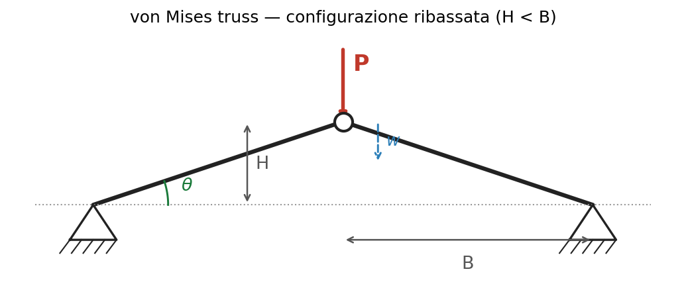
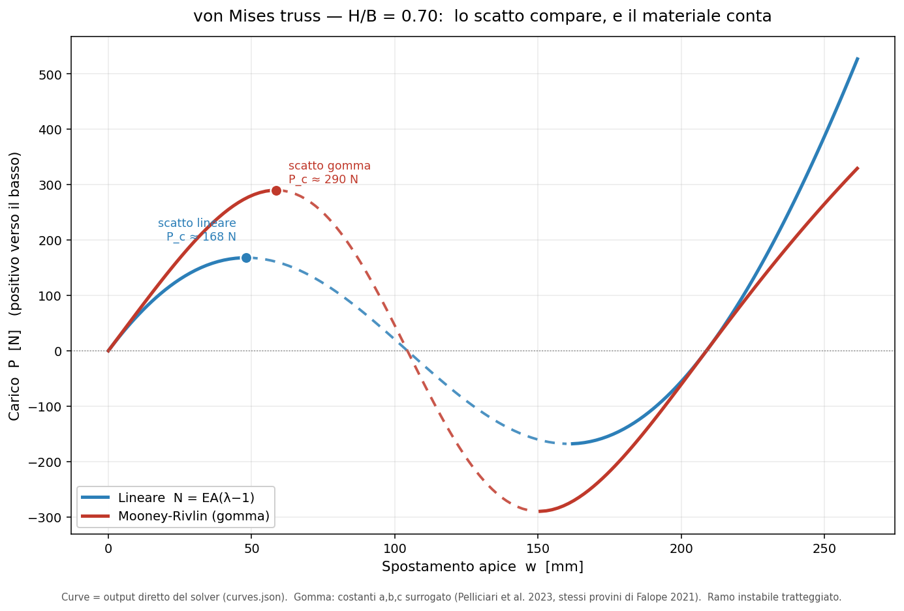

# Geometric instability: snap-through of the von Mises truss

## 1. Two distinct instabilities

A structure can lose stability in qualitatively different ways. Two limiting cases:

**Euler bifurcation.** A slender compressed column stays straight up to the critical
load $P_E = \pi^2 EI / L^2$, then finds a second equilibrium path and bends. It
depends on geometry *and* material ($E$, $I$, $L$ all appear).

**Limit point (snap-through).** A shallow structure loaded transversely reaches a
load maximum and jumps to a distant configuration, without bifurcating and without
the bars bending. As shown below, the jump point depends on geometry alone.

The von Mises truss is the minimal system that isolates the second mechanism in pure
form. This essay builds its reduced model, proves its purely geometric character,
and simulates the passage through instability.

  <iframe src="/calculators/e3_vonmises_explorer.html"
          style="width:100%; height:900px; border:0;"
          loading="lazy" title="von Mises truss snap-through explorer"></iframe>

## 2. The system

Two identical bars, pin-jointed at the outer supports and to each other at the apex.
The apex is initially at height $H$ above the support line; the half-span is $B$. A
vertical load $P$ acts downward at the apex; $w$ is the downward vertical
displacement of the apex.

A single degree of freedom: $w$.

## 3. Reduced 0D model

**Geometry.** Bar length at rest and in the deformed configuration:
$$ L_0 = \sqrt{B^2 + H^2}, \qquad \ell(w) = \sqrt{B^2 + (H-w)^2} $$
Lever arm (vertical component of the bar direction):
$$ \sin\theta(w) = \frac{H-w}{\ell(w)} $$
Notable cases: $\ell(0)=L_0$; $\ell(H)=B$ (minimum, apex aligned); $\ell(2H)=L_0$
(symmetric inverted apex). The lever arm vanishes at $w=H$.

**Axial law.** Stretch $\lambda(w) = \ell(w)/L_0$. Axial force in the bar, tension
positive. Linear case:
$$ N(\lambda) = EA\,(\lambda - 1) $$
Finite-deformation case (rubber): $N(\lambda)$ is derived from the compressible
Mooney-Rivlin strain energy, in the Ciarlet-Geymonat (1982) form, as a function of
the deformation invariants $I_1,I_2,I_3$:
$$ \omega(I_1,I_2,I_3) = a\,(I_1-3) + b\,(I_2-3) + c\,(I_3-1) - (a+2b+c)\ln I_3 $$
with $a,b,c$ positive material constants (pressure units). Imposing the uniaxial
stress state in the bar (traction-free lateral surface) yields $N(\lambda)$ in closed
form — the derivation is in Appendix B. The model structure does not change, only the
function $N(\lambda)$; the linear law is its small-strain limit.

**Equilibrium.** With two bars, vertical equilibrium of the apex:
$$ P + 2\,N(w)\sin\theta(w) = 0 \;\;\Longrightarrow\;\;
\boxed{\,P(w) = -2\,N(w)\,\frac{H-w}{\ell(w)}\,} $$
A single scalar function. It contains material $N(w)$ and geometry $(H-w)/\ell(w)$.

**Behaviour.** In the range $0 < w < 2H$ the bar is shorter than at rest
($\ell<L_0$): compression. Two opposing effects: $|N|$ grows, but the lever arm
decays. The product $P(w)$ has a maximum (upper limit point, $K_T=dP/dw=0$), then
decreases, crosses zero at $w=H$, reaches a minimum (lower limit point), and rises
again. At $w=2H$ the apex is inverted, $\ell=L_0$, and the compression vanishes. For
$w>2H$ the bars elongate ($\ell>L_0$): growing tension, monotonic load.

**Tangent stiffness.** $K_T=dP/dw$: positive (stable) on the two outer branches,
negative (unstable) on the central segment between the two limit points. Under load
control the $K_T<0$ branch cannot be traversed: on reaching the maximum, the
structure jumps to the inverted branch.

## 4. The limit point is purely geometric

Linear case, closed form. From $P(w)=2EA\,\dfrac{L_0-\ell}{L_0}\sin\theta$, setting
$c=H-w$ and imposing $dP/dc=0$ (full derivation in the appendix):
$$ \ell_{cr} = (B^2 L_0)^{1/3} $$
The result **contains neither $E$ nor $A$**. The location of the limit point —
*where* the structure gives way — depends on geometry alone. The material sets *how
large* the critical load $P_c$ is, not whether or where the snap occurs.

Operational corollary: there is a geometric threshold in $H/B$ separating the regime
with a limit point (bistable) from the monotonic regime (no snap). This is the object
of the simulation.

## 5. Distinction from Euler

The truss snap-through is a limit point of the assembly, not a bifurcation of the
bars. The bars remain straight and compressed; they need not buckle. A truss with
short, stocky bars — which as Euler columns would never bifurcate — snaps all the
same.

Pi, Bradford & Uy (2002, *Int. J. Solids Struct.* 39, 105) classify, for the
continuous shallow arch, which mechanism dominates as a function of a modified
slenderness: low value → limit point; high value → Euler-like bifurcation before the
limit point; beyond a certain value, no instability. The discrete truss isolates the
first case, without the bending of the continuous arch. This is why it must be
treated as a two-bar system, not as an arch.

## 6. Simulation

The relation $P(w)$ is the pointwise law. Producing its results requires three things
the solver provides and the formula alone does not:

1. **Evaluating $N(\lambda)$ in the rubber case.** Mooney-Rivlin requires solving,
   for each $\lambda$, the transverse equilibrium of the bar (lateral contraction) —
   a closed-form quadratic, verified against an independent numerical minimization.
2. **Tracing the whole curve, unstable branch included.** Arc-length continuation
   (Riks): it follows the $K_T<0$ segment that load control would skip.
3. **Mapping the results.** Limit-point location and $P_c(H/B)$ for linear vs
   Mooney-Rivlin; identification of the $H/B$ threshold beyond which snap disappears.

Validity checks (all passed, explicit deltas in the solver outputs): linear case
against the closed form $\ell_{cr}=(B^2L_0)^{1/3}$ (error $<10^{-9}$); Mooney-Rivlin
self-check, two independent methods ($<5\times10^{-9}$); demonstration of load-control
failure at the limit point.

<!-- CLICK FIGURE: insert figura_click_HB070.png with the caption below -->

*__P(w) curve, shallow case H/B = 0.70.__ With geometry and material held equal, the
comparison isolates the effect of the constitutive law. The initial stable branch
(solid) rises to the upper limit point — the snap load: 168 N with the linear law
N = EA(λ−1), 290 N with Mooney-Rivlin — where dP/dw = 0. Beyond it, the unstable
branch (dashed, dP/dw < 0) cannot be traversed under load control: the structure
jumps. The curve recrosses zero and rises again in the inverted configuration. The
gap between the two curves (+73 % on the critical load) measures how much material
nonlinearity weighs. Constants a, b, c: surrogate values (Pelliciari et al. 2023,
same specimens as Falope 2021); no number is taken from the original paper.*

## 7. Result

The snap regime is governed by geometry: below an $H/B$ threshold the structure is
bistable, above it monostable. The material law shifts the value of the critical load
and the threshold, but not the geometric character of the mechanism. The linear model
$F=kx$ misses the phenomenon: lacking a maximum and an unstable branch, it predicts
monotonically increasing resistance and no snap.

## 8. Corroboration

**Falope, F. O., Pelliciari, M., Lanzoni, L., Tarantino, A. M. (2021).**
*Snap-through and Eulerian buckling of the bi-stable von Mises truss in nonlinear
elasticity: A theoretical, numerical and experimental investigation.*
International Journal of Non-Linear Mechanics, 134, 103739.
DOI: 10.1016/j.ijnonlinmec.2021.103739.

Model of the rubber von Mises truss developed in finite Mooney-Rivlin elasticity,
parameters calibrated on uniaxial tests via genetic algorithm, snap-through observed
experimentally. Role: motivation and qualitative corroboration of the mechanism; not
a numerical target. Access to the original article was not available at this stage:
the material constants used in the solver come from a later work by the same group
(Pelliciari et al. 2023, Eur. J. Mech. A/Solids 97, 104825, same specimens and rig
rotated 90°), declared as surrogate. The maximum compressive strain reported for the
2021 experiment is on the order of 4%, used by the solver only as an order-of-magnitude
cross-check.

---

## Sources and provenance (reference block)

Everything that feeds the essay, with what each entry provides. Verified against the
real records.

**Motivation and physical corroboration — primary (NOT used for numbers)**
- Falope, F. O.; Pelliciari, M.; Lanzoni, L.; Tarantino, A. M. (2021).
  *Snap-through and Eulerian buckling of the bi-stable von Mises truss in nonlinear
  elasticity.* Int. J. Non-Linear Mechanics, **134**, 103739, pp. 1-11.
  ISSN 0020-7462. DOI: 10.1016/j.ijnonlinmec.2021.103739.
  Record: iris.unimore.it/handle/11380/1244761 — access: paywall, no associated file
  (confirmed).
  → Provides: the real phenomenon observed on rubber; the physical justification for
  finite elasticity; the principle "material matters".

**Surrogate source — material constants actually used**
- Pelliciari, M.; Falope, F. O.; Lanzoni, L.; Tarantino, A. M. (2023).
  *Theoretical and experimental analysis of the von Mises truss subjected to a
  horizontal load using a new hyperelastic model with hardening.*
  Eur. J. Mechanics - A/Solids, **97**, 104825.
  DOI: 10.1016/j.euromechsol.2022.104825. Open access (IRIS UNIMORE).
  → Provides: geometry (θ₀=63°, L=182, Lm=90, Lr=46 mm) and Mooney-Rivlin constants
  (a=310, b=461, c=48095 kPa), same specimens/rig as Falope 2021 — declared
  surrogate. Also provides the Euler threshold cited in §5/§8.

**Constitutive law**
- Ciarlet, P. G.; Geymonat, G. (1982). Form of the compressible Mooney-Rivlin energy
  ω(I₁,I₂,I₃) used in the solver.
  → Provides: the analytical form of N(λ) for the hyperelastic branch.

**Snap vs bifurcation map**
- Pi, Y.-L.; Bradford, M. A.; Uy, B. (2002). *In-plane stability of arches.*
  Int. J. Solids and Structures, 39(1), 105-125. In addition, Pelliciari et al. 2023
  for the experimental Euler threshold.
  → Provides: the conceptual landscape of the two mechanisms (bounds the scope).

**Artifacts produced by us — clean provenance (solver output)**
- `snap_vonmises.py` (solver, arc-length, two laws), `MODEL_SPEC.md` (equation
  specification for the explorer), `SOURCES.md` (data provenance).
- `curves.json` / `snap_points.json` / `sweep.json` → feed the figure and explorer.
- `gate1_validation.json`, `mr_selfcheck.json`, `naive_load_control_demo.json` →
  check outcomes with explicit deltas.
- `figura_click_HB070.png` → main figure.

**Transparency note.** No numerical value in this essay comes from Falope 2021
(inaccessible). The material constants are surrogate (Pelliciari 2023). All curves
and critical loads are solver output, verified in the gates. Gate 2 (comparison
against the original 2021 experimental data) remains open due to lack of access to
the primary source.

---

## Appendix A — Derivation of the limit point (linear case)

We derive the limit-point location $\ell_{cr}=(B^2 L_0)^{1/3}$ of §4, and show it does
not depend on the material.

**Starting point.** The limit point is the maximum of $P(w)$, where the slope
vanishes: $dP/dw=0$. With the linear law
$N=EA(\lambda-1)=EA\!\left(\dfrac{\ell}{L_0}-1\right)$ and $\sin\theta=(H-w)/\ell$, the
load is
$$ P = -2N\sin\theta = -2EA\left(\frac{\ell}{L_0}-1\right)\frac{H-w}{\ell}
   = -2EA\left(\frac{H-w}{L_0} - \frac{H-w}{\ell}\right). $$

**Change of variable.** Set $c=H-w$ (apex height above the support line). Since
$c=H-w$, $dP/dw = -\,dP/dc$; imposing $dP/dw=0$ is equivalent to $dP/dc=0$. With
$\ell=\sqrt{B^2+c^2}$:
$$ P = -2EA\left(\frac{c}{L_0} - \frac{c}{\ell}\right). $$

**Derivatives.** First term: $\dfrac{d}{dc}\dfrac{c}{L_0}=\dfrac{1}{L_0}$ ($L_0$
constant). The second needs $\dfrac{d\ell}{dc}=\dfrac{c}{\ell}$; then, by the quotient
rule,
$$ \frac{d}{dc}\!\left(\frac{c}{\ell}\right)
   = \frac{\ell - c\cdot(c/\ell)}{\ell^2} = \frac{\ell^2-c^2}{\ell^3}. $$
Using the geometric identity $\ell^2=B^2+c^2$, i.e. $\ell^2-c^2=B^2$:
$$ \frac{d}{dc}\!\left(\frac{c}{\ell}\right) = \frac{B^2}{\ell^3}. $$

**Limit-point condition.**
$$ \frac{dP}{dc} = -2EA\left(\frac{1}{L_0}-\frac{B^2}{\ell^3}\right)=0
   \;\Longrightarrow\; \frac{1}{L_0}=\frac{B^2}{\ell^3}
   \;\Longrightarrow\; \boxed{\ \ell_{cr}=(B^2 L_0)^{1/3}\ } $$

The factor $-2EA$ cancels when imposing the condition: **the result contains neither
$E$ nor $A$**. *Where* the structure reaches the limit point is purely geometric; the
material only sets the *value* of the critical load $P_c=P(\ell_{cr})$.

**From $\ell_{cr}$ to displacements.** From $\ell^2=B^2+c^2$ one gets
$c_{cr}=\pm\sqrt{\ell_{cr}^2-B^2}$ and $w_{cr}=H-c_{cr}$. The two roots are the two
symmetric limit points (upper and lower) about $w=H$.

**Numerical check** (Gate-1 academic geometry: $B=1000$, $H=200$ mm).
$L_0=\sqrt{1000^2+200^2}=1019.80$; $\ell_{cr}=(1000^2\cdot1019.80)^{1/3}=1006.56$;
$c_{cr}=\sqrt{1006.56^2-1000^2}=114.71$; $w_{cr}=200-114.71=85.29$ mm. Matches the
solver value ($w=85.2856$ mm, `gate1_validation.json`), deviation $<10^{-9}$.

<!-- ASSEMBLY NOTE: if preferred, Appendix A can be moved to a separate explainer
     page instead of sitting at the end of the index. -->

---

## Appendix B — Derivation of $N(\lambda)$ from the Mooney-Rivlin law

We derive the axial force $N(\lambda)$ from the energy $\omega$ of §3, for a bar in a
uniaxial stress state. All steps are in closed form (no root-finding); their
implementation is verified in the solver against an independent numerical minimization
(`mr_selfcheck.json`, deviation $<5\times10^{-9}$).

**Bar kinematics.** Prescribed axial stretch $\lambda$ (along the bar axis); equal
transverse stretches by symmetry, $\mu=\lambda_x=\lambda_y$, unknown. The invariants,
with $x=\mu^2$:
$$ I_1 = 2x + \lambda^2, \qquad I_2 = x^2 + 2\lambda^2 x, \qquad I_3 = x^2\lambda^2. $$

**Transverse equilibrium.** The lateral surface of the bar is free: the transverse
nominal stress is zero, a condition equivalent to stationarity of $\omega$ with
respect to $x$ at fixed $\lambda$, $\partial\omega/\partial x = 0$. Carrying this out,
the condition reduces **exactly** to a quadratic in $x$:
$$ (b + c\lambda^2)\,x^2 + (a + b\lambda^2)\,x - (a+2b+c) = 0 $$
with the only physically admissible (positive) root:
$$ x(\lambda) = \frac{-(a+b\lambda^2) + \sqrt{(a+b\lambda^2)^2 + 4(b+c\lambda^2)(a+2b+c)}}{2(b+c\lambda^2)}. $$

**Axial nominal stress.** By the envelope theorem, evaluating the axial
Piola-Kirchhoff stress $P_1=\partial\omega/\partial\lambda$ at transverse equilibrium
$x(\lambda)$. With $I_3=x^2\lambda^2$ and
$\partial\omega/\partial I_3 = c - (a+2b+c)/I_3$:
$$ P_1(\lambda) = \underbrace{a\,(2\lambda)}_{\partial I_1/\partial\lambda\ \text{term}}
   + \underbrace{b\,(4\lambda x)}_{\partial I_2/\partial\lambda\ \text{term}}
   + \left[c - \frac{a+2b+c}{I_3}\right](2x^2\lambda). $$

**Bar force.** With $A_0$ the reference cross-section area:
$$ N(\lambda) = A_0\,P_1(\lambda). $$

**Linear limit.** As $\lambda\to 1$, expanding, $N(\lambda)$ tends to the form
$EA_{eq}(\lambda-1)$ with $EA_{eq}=dN/d\lambda|_{\lambda=1}$: this is the tangent
stiffness used as the linear comparator in the sweep, so that the comparison isolates
the effect of material nonlinearity alone.

**References.** Energy form: Ciarlet & Geymonat (1982). Constant values $a=310$,
$b=461$, $c=48095$ kPa: Pelliciari et al. (2023), surrogate of the Falope et al.
(2021) specimens — see the Sources block.
