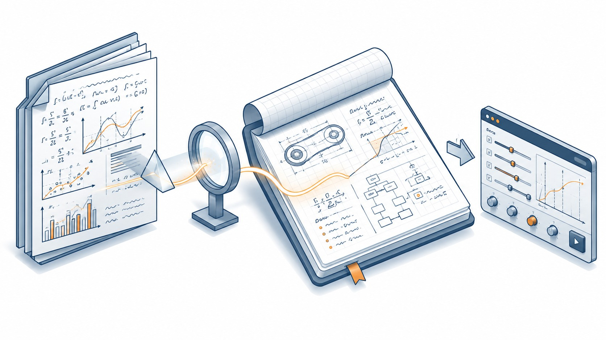

## Essays

Engineering stories for curious engineers, built on peer-reviewed papers.

Each essay starts from a real engineering problem and uses a technical paper as the lens to examine it. The goal is not to reproduce the paper — it is to extract the insight that matters to a working engineer and present it in a way that builds intuition.

The format is narrative, not pipeline. Where Series A exposes every node of a calculation chain and Series B derives every step of a formula, Series E tells the story: what problem does this model solve, what assumptions does it rest on, what breaks when you push it, and why should you care.

Where useful, an interactive explorer accompanies the essay — not a full calculator, but a tool to build intuition about how the key parameters interact.
